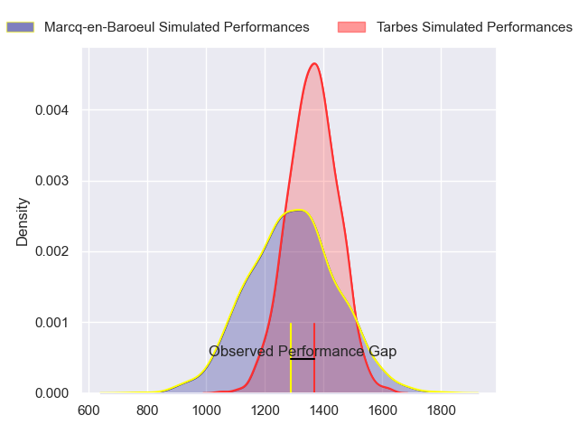
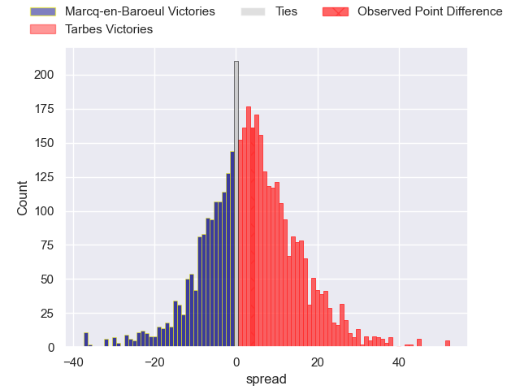
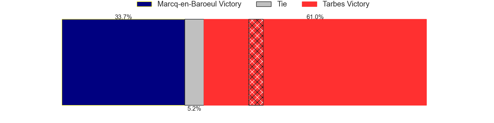
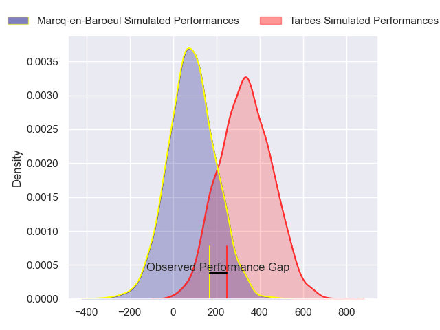
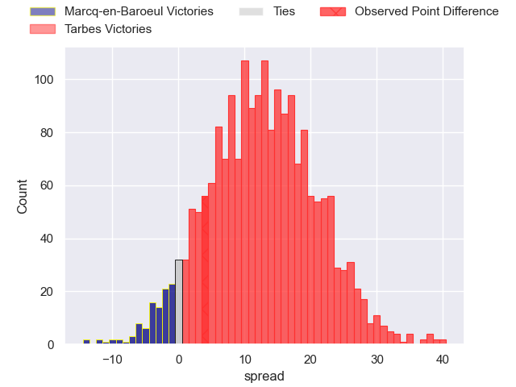
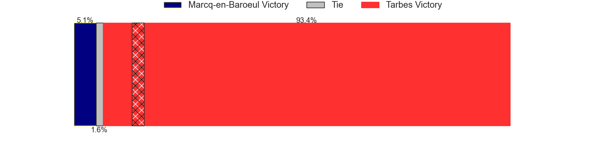

---  
layout: page  
title: Marcq-en-Baroeul at Tarbes; 16-20  
date: 2024-11-15 18:00:00 -0500  
categories: "Nationale 2024" match review  
---
# Marcq-en-Baroeul at Tarbes; 16-20

# Club Level Predictions

The first set of predictions treats a club as the smallest object, as the club develops its members, organizes a gameplan, and deploys its players as needed for each match. This club model has a prediction of 0.583, which translates to predicting Tarbes to win by 3.2.

Our Over/Under is 53.5 - and combined with the spread above, we have a predicted scoreline of 25 to 28

Each club has a rating and a rating deviation (similar to a Glicko rating), and expected performances can be generated. This allows for simulated matches and spreads like the ones below.
## Projected Performances - Club Model

## Projected Spreads - Club Model

## Projected Results - Club Model

# Player Level Predictions

Treating teams instead as an entity made up of the currently active players, I have ratings for each player in an altogether different system. These can be combined to form team ratings once teamsheets are announced, weighting starters a bit higher than the reserves. After the match is played, players can be weighted by their minutes on the field, allowing for an accurate measure of the team's composition. With these compiled team ratings, we can make predictions, measure inaccuracy, and update the individual player ratings.
## Prediction without Player Minutes: Tarbes by 10.9

Tarbes by 0.3 on a neutral pitch

## Projected Performances - Player Model

## Projected Spreads - Player Model

## Projected Results - Player Model

|   Away Minutes | Away Player                  |   Away Percentile |   Number |   Home Percentile | Home Player         |   Home Minutes |
|---------------:|:-----------------------------|------------------:|---------:|------------------:|:--------------------|---------------:|
|             24 | Charles-Edouard Ekwah Elimby |             50.45 |        1 |             36.81 | Enzo Baggiani       |             80 |
|              0 | Joseph Reynaud               |             44.28 |        2 |             35.51 | Vincent Dolier      |             75 |
|              0 | Lewys Jones                  |             46.54 |        3 |             42.02 | Luka Véa            |             35 |
|              0 | Antoine Delaporte            |             49.26 |        4 |             45.94 | Léo Saint-Guilhem   |             24 |
|              0 | Maselino Paulino             |             47.95 |        5 |             47.07 | Mathieu Soufflet    |             18 |
|              0 | Joachim Beaumont             |             49.41 |        6 |             44.27 | Jules Bousquet      |             36 |
|              0 | Joachim Beaumont             |             49.41 |        6 |             44.27 | Jules Bousquet      |             11 |
|              0 | Arthur Bruges                |             48.52 |        7 |             47.92 | Alexis Armary       |              8 |
|              0 | Otilo Kafotamaki             |             49    |        8 |             45.3  | Filipe Manu         |             35 |
|             71 | Geoffrey Cazanave            |             56.05 |        9 |             39.97 | Matias Brocal       |             49 |
|             80 | Paul Decavel                 |             53.11 |       10 |             33.85 | Alexandre Perez     |             50 |
|             18 | Dany Antunès                 |             49.33 |       11 |             38.89 | Jonathan Duffau     |             71 |
|             28 | Louis Decavel                |             44.11 |       12 |             34.15 | Maile Mamao         |             74 |
|             80 | Mark Erasmus                 |             51.18 |       13 |             35.78 | Johan Paulet        |             58 |
|             62 | Hugues Crespo                |             54.23 |       14 |             39.13 | Jone Tuva           |             70 |
|             45 | Serafin Bordoli              |             49.81 |       15 |             37.27 | Amona Artaud        |             70 |
|             62 | Matéo Saint-Germain          |            nan    |       16 |            nan    | Florian Lamothe     |             80 |
|             80 | Éli Serra                    |             44.83 |       17 |            nan    | Lasha Mirtskhulava  |             80 |
|             44 | Lucio Anconetani             |            nan    |       18 |            nan    | Baptiste Peytavi    |             80 |
|             32 | Thomas Simonet               |             48.26 |       19 |            nan    | Joeli Matalaweru    |             33 |
|             69 | Maxime Danton                |            nan    |       20 |            nan    | Thomas Millet       |              0 |
|             80 | Dylan Nocète                 |             43.95 |       21 |            nan    | Savenaca Rawaca     |             33 |
|             80 | Mathias Ortiz                |             40.13 |       22 |            nan    | Osea Waqaninavatu   |             80 |
|             72 | Sive Mazosiwe                |             45.92 |       23 |            nan    | Irakli Mirtskhulava |             52 |
|             72 | Sive Mazosiwe                |             45.92 |       23 |            nan    | Irakli Mirtskhulava |             50 |

