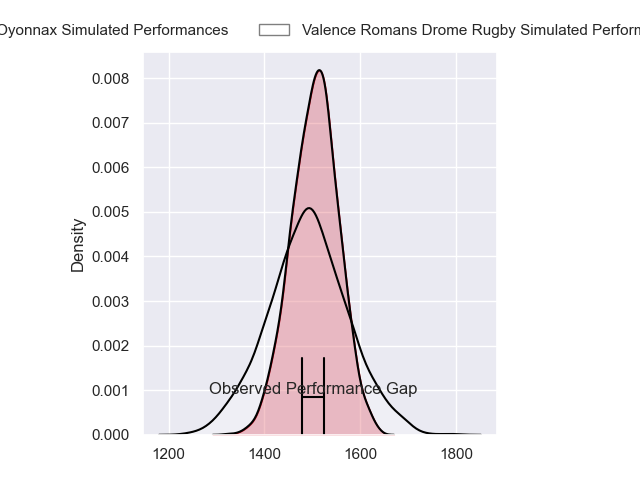
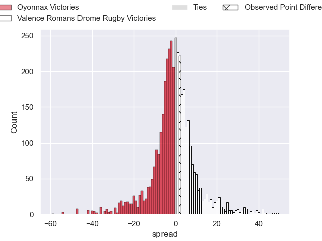
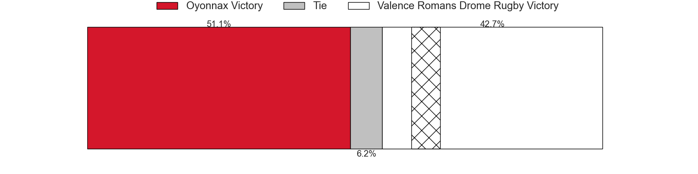
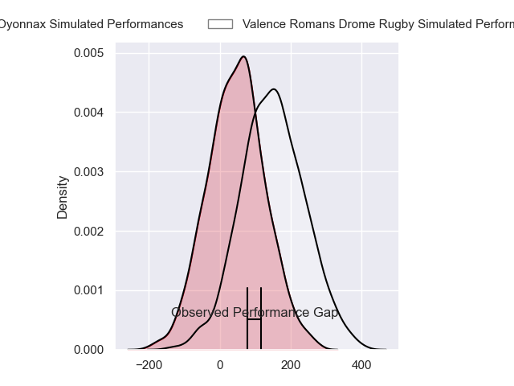
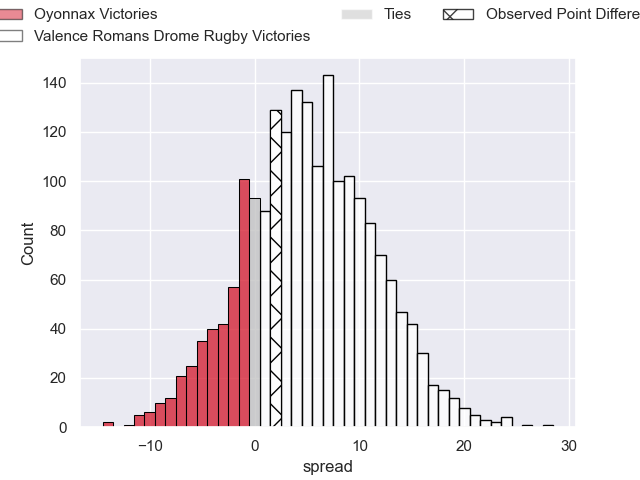
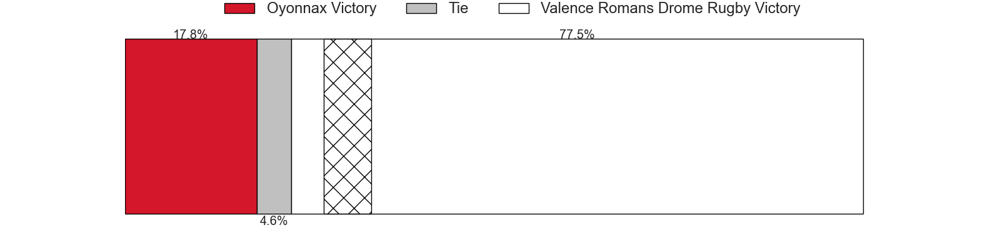

---  
layout: page  
title: Oyonnax at Valence Romans Drome Rugby; 16-18  
date: 2024-11-15 18:00:00 -0500  
categories: "Pro D2 2024" match review  
---
# Oyonnax at Valence Romans Drome Rugby; 16-18

# Club Level Predictions

The first set of predictions treats a club as the smallest object, as the club develops its members, organizes a gameplan, and deploys its players as needed for each match. This club model has a prediction of 0.48, which translates to predicting Oyonnax to win by 0.7.

Our Over/Under is 44.5 - and combined with the spread above, we have a predicted scoreline of 23 to 22

Each club has a rating and a rating deviation (similar to a Glicko rating), and expected performances can be generated. This allows for simulated matches and spreads like the ones below.
## Projected Performances - Club Model

## Projected Spreads - Club Model

## Projected Results - Club Model

# Player Level Predictions

Treating teams instead as an entity made up of the currently active players, I have ratings for each player in an altogether different system. These can be combined to form team ratings once teamsheets are announced, weighting starters a bit higher than the reserves. After the match is played, players can be weighted by their minutes on the field, allowing for an accurate measure of the team's composition. With these compiled team ratings, we can make predictions, measure inaccuracy, and update the individual player ratings.
## Prediction without Player Minutes: Valence Romans Drome Rugby by 5.7

Valence Romans Drome Rugby by 2.0 on a neutral pitch

## Projected Performances - Player Model

## Projected Spreads - Player Model

## Projected Results - Player Model

|   Away Minutes | Away Player         |   Away Percentile |   Number |   Home Percentile | Home Player       |   Home Minutes |
|---------------:|:--------------------|------------------:|---------:|------------------:|:------------------|---------------:|
|             29 | Antoine Abraham     |             60.88 |        1 |             41.28 | Anthony Aléo      |             80 |
|             35 | Teddy Durand        |              9.32 |        2 |             45.27 | Cyril Deligny     |             20 |
|             14 | Ali Oz              |             14.84 |        3 |             43.59 | Vincent Vial      |             29 |
|             35 | Kevin Kornath       |             20.34 |        4 |             49.87 | Ryan Mccauley     |             20 |
|             35 | Antonin Corso       |             54.02 |        5 |             49.6  | Florian Goumat    |             23 |
|              2 | Kevin Lebreton      |             21.05 |        6 |             48.65 | Axel Bruchet      |             20 |
|              0 | Wandrille Picault   |             79.04 |        7 |             45.5  | Sven Girlando     |             80 |
|             32 | Rory Grice          |             35.75 |        8 |             40.78 | Matthieu Vachon   |             19 |
|             25 | Yvan David          |             48.92 |        9 |             45.52 | Thomas Lhuséro    |             21 |
|             68 | Chris William Smith |             33.92 |       10 |             41.18 | Lucas Méret       |             59 |
|             29 | Karim Qadiri        |             49.92 |       11 |             47.97 | Mosese Mawalu     |             14 |
|             18 | Lucas Mensa         |             24.28 |       12 |             42.54 | Louis Marrou      |              5 |
|             80 | Eddie Sawailau      |             48.47 |       13 |             42.08 | Mathieu Guillomot |             19 |
|             80 | Maxime Salles       |             25.93 |       14 |             47.57 | Adam Vargas       |             18 |
|             40 | Darren Sweetnam     |             69.77 |       15 |             87.79 | Joris De Moura    |             18 |
|             35 | Benjamin Geledan    |             29.14 |       16 |            nan    | Dorian Marco-Pena |             21 |
|             22 | Rémi Di Pietro      |            nan    |       17 |            nan    | Esteban Chouteau  |             57 |
|             18 | Phoenix Battye      |             95.76 |       18 |            nan    | Éloi Massot       |             80 |
|             21 | Hugo Hermet         |             12.49 |       19 |            nan    | Thembelani Bholi  |             57 |
|              0 | Zack Holmes         |             76.47 |       20 |            nan    | Mattéo Rodor      |             50 |
|             35 | David Odiase (2)    |            nan    |       21 |            nan    | Anatole Pauvert   |             70 |
|             35 | Chris Farrell       |             11.86 |       22 |            nan    | Adrien Roux       |             30 |
|             21 | Paulo Tafili        |             65.06 |       23 |            nan    | Kévin Goze        |              0 |

