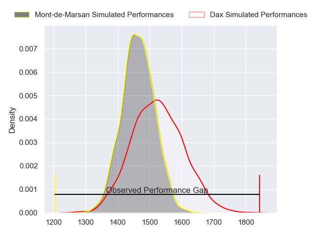
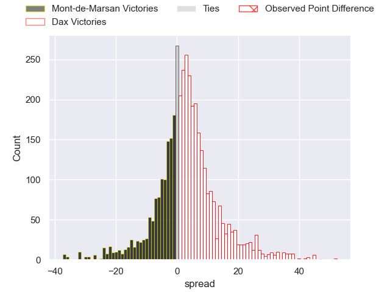
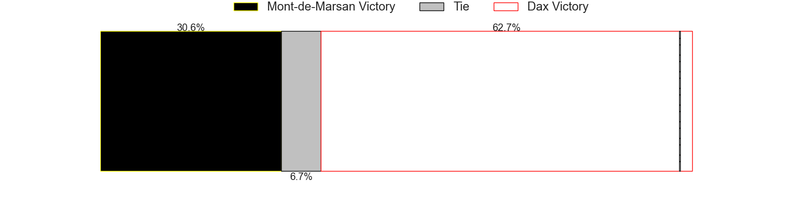
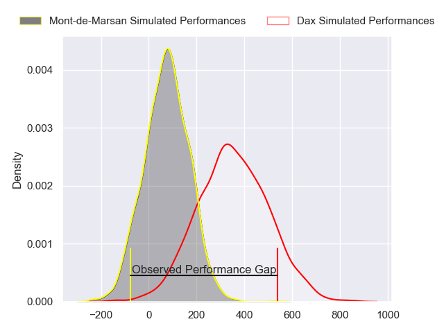
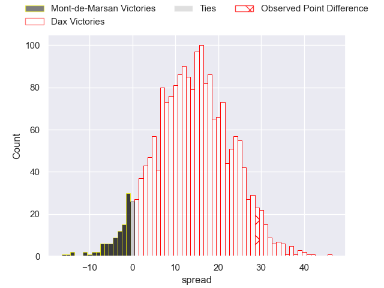
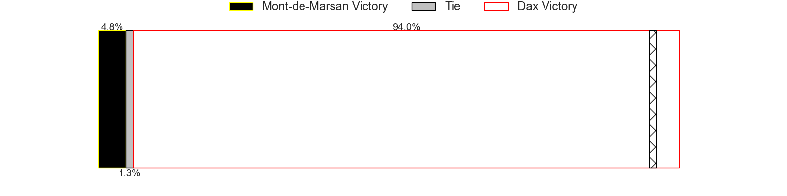

---  
layout: page  
title: Mont-de-Marsan at Dax; 11-40  
date: 2024-11-16 18:00:00 -0500  
categories: "Pro D2 2024" match review  
---
# Mont-de-Marsan at Dax; 11-40

# Club Level Predictions

The first set of predictions treats a club as the smallest object, as the club develops its members, organizes a gameplan, and deploys its players as needed for each match. This club model has a prediction of 0.587, which translates to predicting Dax to win by 3.1.

Our Over/Under is 51.5 - and combined with the spread above, we have a predicted scoreline of 24 to 27

Each club has a rating and a rating deviation (similar to a Glicko rating), and expected performances can be generated. This allows for simulated matches and spreads like the ones below.
## Projected Performances - Club Model

## Projected Spreads - Club Model

## Projected Results - Club Model

# Player Level Predictions

Treating teams instead as an entity made up of the currently active players, I have ratings for each player in an altogether different system. These can be combined to form team ratings once teamsheets are announced, weighting starters a bit higher than the reserves. After the match is played, players can be weighted by their minutes on the field, allowing for an accurate measure of the team's composition. With these compiled team ratings, we can make predictions, measure inaccuracy, and update the individual player ratings.
## Prediction without Player Minutes: Dax by 13.0

Dax by 0.9 on a neutral pitch

## Projected Performances - Player Model

## Projected Spreads - Player Model

## Projected Results - Player Model

|   Away Minutes | Away Player          |   Away Percentile |   Number |   Home Percentile | Home Player           |   Home Minutes |
|---------------:|:---------------------|------------------:|---------:|------------------:|:----------------------|---------------:|
|             39 | Luka Goginava        |             49.14 |        1 |             44.55 | Dino Casadeï          |             80 |
|             18 | Samuel Lagrange      |             42.05 |        2 |             43.24 | Iban Hiriart-Urruty   |             80 |
|             29 | Anthony Alves        |              7.61 |        3 |             48.32 | Nephi Leatigaga       |             80 |
|             18 | Romain Durand        |             44.89 |        4 |             69    | Brice Ferrer          |             51 |
|             29 | Myles Edwards        |             47.69 |        5 |             48.82 | Jean-Baptiste Singer  |             22 |
|             18 | Aurélien Lafforgue   |             51.15 |        6 |             26.21 | Jean-Baptiste Barrère |             57 |
|             18 | Raphaël Robic        |             46.9  |        7 |             56.06 | Paul Arnaud Ausset    |             61 |
|             14 | Ioane Iashagashvili  |             49.92 |        8 |             44.07 | Sam Wasley            |             43 |
|             79 | Nicolas Darquier     |             42.11 |        9 |             44.1  | Sylvère Réteau        |             80 |
|             51 | Willie Du Plessis    |             45.14 |       10 |             39.88 | Romuald Séguy         |             80 |
|             80 | Pierre Sayerse       |             56.13 |       11 |             55.85 | Jope Naseara (2)      |             80 |
|             28 | Nacani Wakaya        |             46.38 |       12 |             29.26 | Noah Nene             |             54 |
|             32 | Semi Lagivala (2)    |             39.04 |       13 |             39.49 | Bastien Daguerre      |             61 |
|              4 | Alexandre de Nardi   |             41.66 |       14 |             55.85 | Théo Gatelier         |             80 |
|              7 | Théo Cortes          |             47.94 |       15 |             47    | Maxime Oltmann        |             80 |
|             27 | Florian Dufour       |            nan    |       16 |             42.2  | Louis Barrère         |             80 |
|             21 | Thomas Bultel        |            nan    |       17 |            nan    | Louis Mary            |             76 |
|             54 | Aston Fortuin        |            nan    |       18 |            nan    | Etienne Loiret        |             80 |
|             17 | Waël Ponpon          |             47.07 |       19 |            nan    | Genesis Mamea Lemalu  |             80 |
|             55 | Christophe Loustalot |             43.8  |       20 |            nan    | Paul Ravier           |             62 |
|             52 | Patricio Fernandez   |             39.69 |       21 |              2.54 | Jale Vatubua          |             80 |
|             80 | Yann Bréthous        |            nan    |       22 |            nan    | Théo Duprat           |             80 |
|             55 | Gheorghe Gajion      |             67.31 |       23 |             62.85 | David Lolohea         |             80 |

