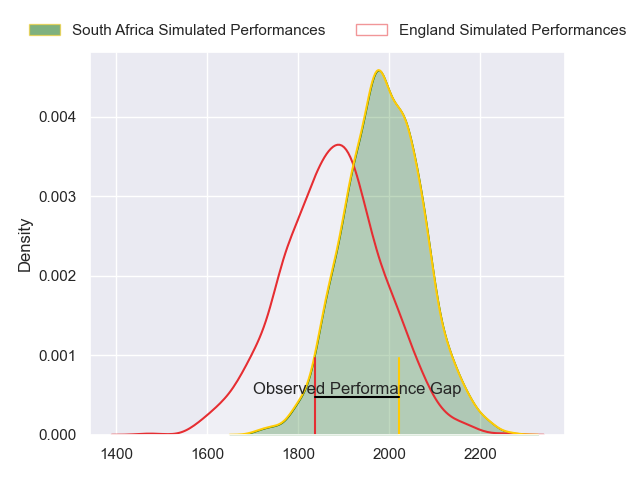
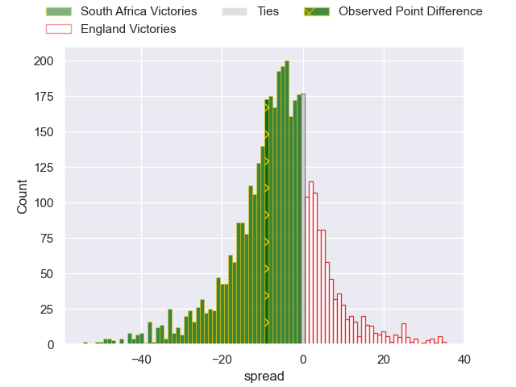
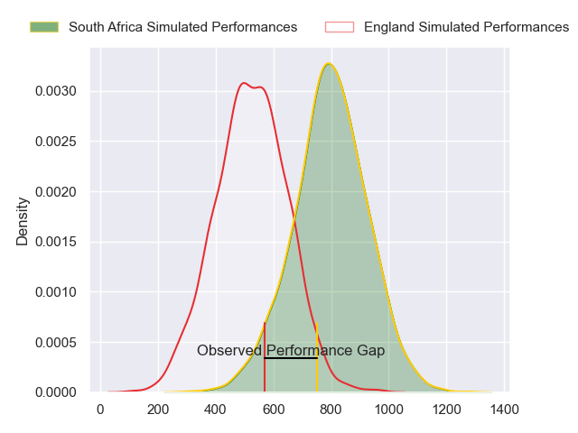
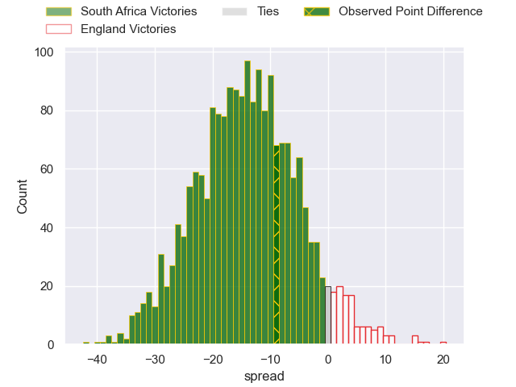
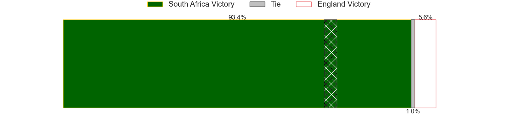

---  
layout: page  
title: South Africa at England; 29-20  
date: 2024-11-16 18:00:00 -0500  
categories: "International Test Match 2024" match review  
---
# South Africa at England; 29-20

# Club Level Predictions

The first set of predictions treats a club as the smallest object, as the club develops its members, organizes a gameplan, and deploys its players as needed for each match. This club model has a prediction of 0.351, which translates to predicting South Africa to win by 5.5.

Our Over/Under is 56.5 - and combined with the spread above, we have a predicted scoreline of 31 to 26

Each club has a rating and a rating deviation (similar to a Glicko rating), and expected performances can be generated. This allows for simulated matches and spreads like the ones below.
## Projected Performances - Club Model

## Projected Spreads - Club Model

## Projected Results - Club Model

# Player Level Predictions

Treating teams instead as an entity made up of the currently active players, I have ratings for each player in an altogether different system. These can be combined to form team ratings once teamsheets are announced, weighting starters a bit higher than the reserves. After the match is played, players can be weighted by their minutes on the field, allowing for an accurate measure of the team's composition. With these compiled team ratings, we can make predictions, measure inaccuracy, and update the individual player ratings.
## Prediction without Player Minutes: South Africa by 8.7

South Africa by 14.8 on a neutral pitch

## Projected Performances - Player Model

## Projected Spreads - Player Model

## Projected Results - Player Model

|   Away Minutes | Away Player          |   Away Percentile |   Number |   Home Percentile | Home Player               |   Home Minutes |
|---------------:|:---------------------|------------------:|---------:|------------------:|:--------------------------|---------------:|
|           80   | Ox Nche              |             98.27 |        1 |             80.98 | Ellis Genge               |              7 |
|           35   | Bongi Mbonambi       |             96.89 |        2 |             97.49 | Jamie George              |             27 |
|           48   | Wilco Louw           |             97.12 |        3 |             40.06 | Will Stuart               |             21 |
|           31.5 | Eben Etzebeth        |             99.73 |        4 |             97.7  | Maro Itoje                |             54 |
|           80   | RG Snyman            |             99.91 |        5 |             96.46 | George Martin             |             17 |
|           80   | Siya Kolisi          |             93.62 |        6 |             56.51 | Chandler Cunningham-South |             55 |
|           20   | Pieter-Steph du Toit |             95.2  |        7 |             95.81 | Sam Underhill             |             52 |
|           80   | Jasper Wiese         |             85.1  |        8 |             99.44 | Ben Earl                  |             80 |
|           60   | Grant Williams       |             83.64 |        9 |             81.17 | Jack van Poortvliet       |             80 |
|           54   | Manie Libbok         |             79.22 |       10 |             67.25 | Marcus Smith              |             66 |
|           54   | Kurt-Lee Arendse     |             97.08 |       11 |             25.04 | Ollie Sleightholme        |             80 |
|           40   | Damian de Allende    |             98.05 |       12 |             95.83 | Henry Slade               |             39 |
|           80   | Jesse Kriel          |             96.85 |       13 |             90.73 | Ollie Lawrence            |             70 |
|           25   | Cheslin Kolbe        |             98.62 |       14 |             97.16 | Tommy Freeman             |             66 |
|           23   | Aphelele Fassi       |             93.02 |       15 |             12.98 | Freddie Steward           |             73 |
|           78   | Malcolm Marx         |             97.63 |       16 |             17.16 | Luke Cowan-Dickie         |             74 |
|           78   | Gerhard Steenekamp   |             89.12 |       17 |             20.53 | Fin Baxter                |             60 |
|           58   | Vincent Koch         |             64.05 |       18 |             30.98 | Dan Cole                  |             60 |
|           23   | Elrigh Louw          |             96.59 |       19 |             93.9  | Nick Isiekwe              |             45 |
|           80   | Kwagga Smith         |             88.64 |       20 |             84.73 | Alex Dombrandt            |             80 |
|           80   | Cobus Reinach        |             93.67 |       21 |             96.14 | Harry Randall             |             68 |
|           32   | Handre Pollard       |             90.39 |       22 |             92.35 | George Ford               |             80 |
|           80   | Lukhanyo Am          |             86.84 |       23 |             22.2  | Tom Roebuck               |             80 |

