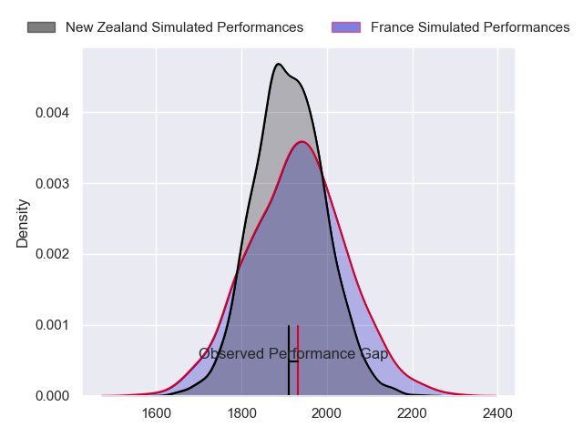
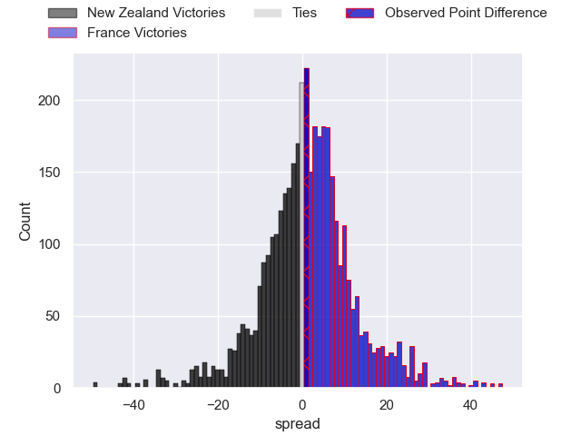
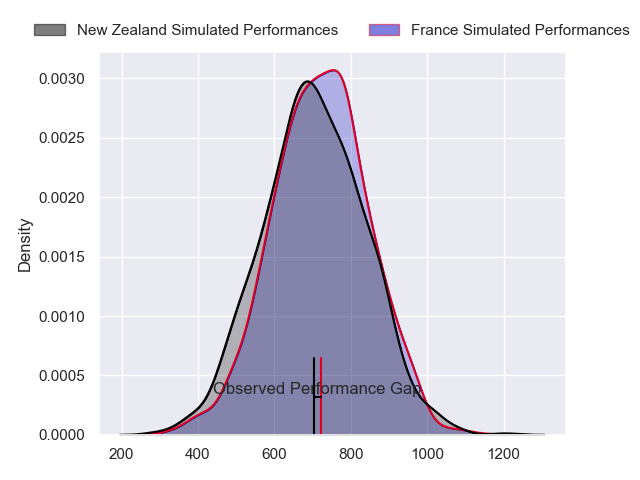
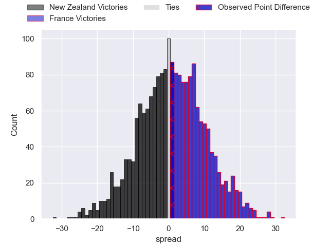

---  
layout: page  
title: New Zealand at France; 29-30  
date: 2024-11-16 18:00:00 -0500  
categories: "International Test Match 2024" match review  
---
# New Zealand at France; 29-30

# Club Level Predictions

The first set of predictions treats a club as the smallest object, as the club develops its members, organizes a gameplan, and deploys its players as needed for each match. This club model has a prediction of 0.532, which translates to predicting France to win by 1.1.

Our Over/Under is 56.5 - and combined with the spread above, we have a predicted scoreline of 28 to 29

Each club has a rating and a rating deviation (similar to a Glicko rating), and expected performances can be generated. This allows for simulated matches and spreads like the ones below.
## Projected Performances - Club Model

## Projected Spreads - Club Model

## Projected Results - Club Model

# Player Level Predictions

Treating teams instead as an entity made up of the currently active players, I have ratings for each player in an altogether different system. These can be combined to form team ratings once teamsheets are announced, weighting starters a bit higher than the reserves. After the match is played, players can be weighted by their minutes on the field, allowing for an accurate measure of the team's composition. With these compiled team ratings, we can make predictions, measure inaccuracy, and update the individual player ratings.
## Prediction without Player Minutes: New Zealand by 1.4

New Zealand by 7.6 on a neutral pitch

## Projected Performances - Player Model

## Projected Spreads - Player Model

## Projected Results - Player Model

|   Away Minutes | Away Player         |   Away Percentile |   Number |   Home Percentile | Home Player           |   Home Minutes |
|---------------:|:--------------------|------------------:|---------:|------------------:|:----------------------|---------------:|
|             80 | Tamaiti Williams    |             93.83 |        1 |             97.4  | Jean-Baptiste Gros    |             26 |
|             29 | Codie Taylor        |             97.33 |        2 |             92.27 | Peato Mauvaka         |             72 |
|             45 | Tyrel Lomax         |             89.86 |        3 |             95.82 | Tevita Tatafu         |             49 |
|             20 | Scott Barrett       |             95.9  |        4 |             95.2  | Thibaud Flament       |             29 |
|             53 | Tupou Vaa'i         |             99.39 |        5 |             85.68 | Emmanuel Meafou       |             62 |
|             20 | Tupou Vaa'i         |             99.39 |        5 |             85.68 | Emmanuel Meafou       |             62 |
|             82 | Samipeni Finau      |             98.39 |        6 |             10.69 | Paul Boudehent        |             78 |
|             54 | Ardie Savea         |             99.32 |        7 |             98.56 | Alexandre Roumat      |             82 |
|             81 | Wallace Sititi      |             92.45 |        8 |             97.07 | Gregory Alldritt      |             70 |
|             20 | Cam Roigard         |             48.24 |        9 |             99.69 | Antoine Dupont        |             82 |
|             82 | Beauden Barrett     |             99.61 |       10 |             95.14 | Thomas Ramos          |             33 |
|             27 | Caleb Clarke        |             83.95 |       11 |             88.06 | Louis Bielle-Biarrey  |             55 |
|             27 | Jordie Barrett      |             84.69 |       12 |             83.61 | Yoram Moefana         |             33 |
|             27 | Rieko Ioane         |             86.23 |       13 |             97.28 | Gael Fickou           |             22 |
|             73 | Sevu Reece          |             86.56 |       14 |             88.77 | Gabin Villiere        |             55 |
|             53 | Will Jordan         |             99.06 |       15 |             97.57 | Romain Buros          |             82 |
|             78 | Asafo Aumua         |             95.39 |       16 |             96.29 | Julien Marchand       |             82 |
|             54 | Ofa Tu'ungafasi     |             98.49 |       17 |             90.34 | Reda Wardi            |             37 |
|             61 | Pasilio Tosi        |             43.66 |       18 |             10.56 | Georges-Henri Colombe |             62 |
|             54 | Patrick Tuipulotu   |              4.72 |       19 |             41.22 | Romain Taofifenua     |              2 |
|             61 | Patrick Tuipulotu   |              4.72 |       19 |             41.22 | Romain Taofifenua     |              2 |
|             20 | Patrick Tuipulotu   |              4.72 |       19 |             41.22 | Romain Taofifenua     |              2 |
|              8 | Peter Lakai         |             97.38 |       20 |             66.03 | Mickael Guillard      |             62 |
|             81 | Cortez Ratima       |             83.46 |       21 |             99.41 | Charles Ollivon       |             82 |
|             81 | Anton Lienert-Brown |             96.2  |       22 |             86.22 | Nolann Le Garrec      |             82 |
|             27 | Damian McKenzie     |             98.05 |       23 |             73.19 | Emilien Gailleton     |             82 |

