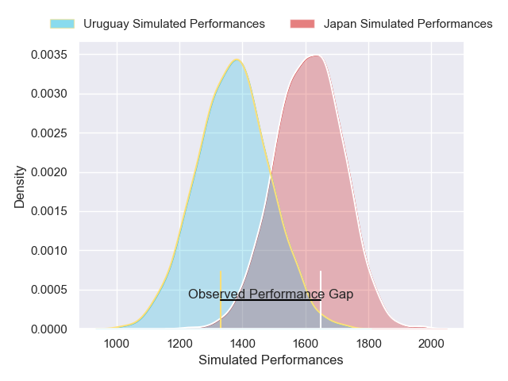
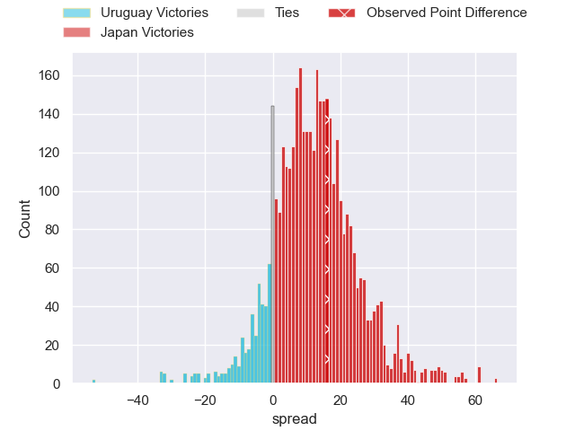
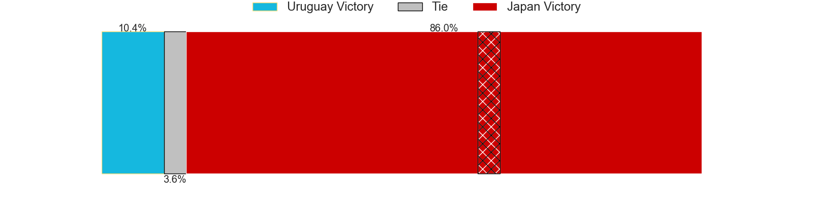
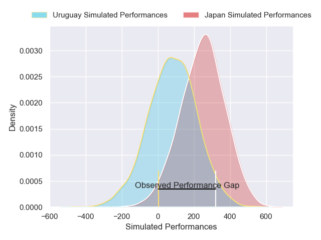
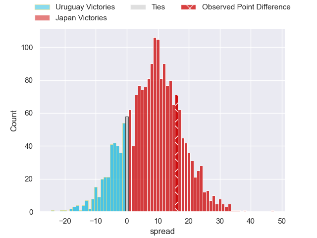
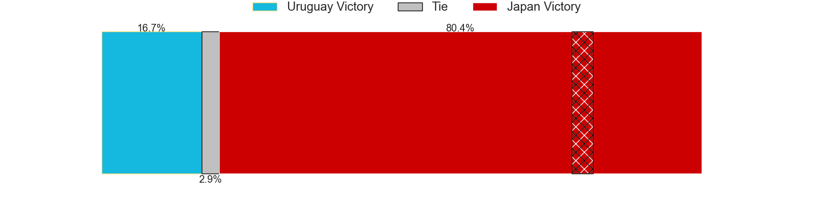

---  
layout: page  
title: Uruguay at Japan; 20-36  
date: 2024-11-16 18:00:00 -0500  
categories: "International Test Match 2024" match review  
---
# Uruguay at Japan; 20-36

# Club Level Predictions

The first set of predictions treats a club as the smallest object, as the club develops its members, organizes a gameplan, and deploys its players as needed for each match. This club model has a prediction of 0.78, which translates to predicting Japan to win by 11.7.

Our Over/Under is 55.5 - and combined with the spread above, we have a predicted scoreline of 22 to 34

Each club has a rating and a rating deviation (similar to a Glicko rating), and expected performances can be generated. This allows for simulated matches and spreads like the ones below.
## Projected Performances - Club Model

## Projected Spreads - Club Model

## Projected Results - Club Model

# Player Level Predictions

Treating teams instead as an entity made up of the currently active players, I have ratings for each player in an altogether different system. These can be combined to form team ratings once teamsheets are announced, weighting starters a bit higher than the reserves. After the match is played, players can be weighted by their minutes on the field, allowing for an accurate measure of the team's composition. With these compiled team ratings, we can make predictions, measure inaccuracy, and update the individual player ratings.
## Prediction without Player Minutes: Japan by 8.4

Japan by 4.7 on a neutral pitch

## Projected Performances - Player Model

## Projected Spreads - Player Model

## Projected Results - Player Model

|   Away Minutes | Away Player        |   Away Percentile |   Number |   Home Percentile | Home Player      |   Home Minutes |
|---------------:|:-------------------|------------------:|---------:|------------------:|:-----------------|---------------:|
|             69 | Mateo Sanguinetti  |              7.35 |        1 |             53.94 | Takato Okabe     |             54 |
|             14 | Guillermo Pujadas  |             88.8  |        2 |             88.65 | Mamoru Harada    |             12 |
|             28 | Diego Arbelo       |             31.28 |        3 |             82.52 | Keijiro Tamefusa |             14 |
|             40 | Ignacio Dotti Uria |             28.01 |        4 |              6.35 | Epineri Uluiviti |             18 |
|             40 | Manuel Leindekar   |              4.08 |        5 |             91.84 | Warner Dearns    |             26 |
|              2 | Santiago Civetta   |             55.87 |        6 |             13.36 | Amato Fakatava   |              2 |
|             28 | Lucas Bianchi      |             54.26 |        7 |             81.79 | Kanji Shimokawa  |             63 |
|             26 | Manuel Diana       |              4.84 |        8 |             71.32 | Kazuki Himeno    |              0 |
|             34 | Santiago Alvarez   |             64.32 |        9 |              9.98 | Naoto Saito      |             11 |
|             66 | Ícaro Amarillo     |             34.7  |       10 |             48.67 | Takuro Matsunaga |             55 |
|             68 | Ignacio Facciolo   |             58.71 |       11 |             52.9  | Junta Hamano     |             70 |
|             62 | Juan Manuel Alonso |             28.37 |       12 |              1.44 | Siosaia Fifita   |             70 |
|             54 | Felipe Arcos Perez |             56.44 |       13 |             96.92 | Dylan Riley      |             80 |
|             80 | Bautista Basso     |             28.06 |       14 |             72.26 | Jone Naikabula   |             64 |
|             46 | Juan González      |             37.85 |       15 |             80.48 | Malo Tuitama     |             80 |
|             80 | Joaquín Myszka     |            nan    |       16 |            nan    | Kenta Matsuoka   |             61 |
|             80 | Mateo Perillo      |            nan    |       17 |            nan    | Yukio Morikawa   |             80 |
|             78 | Ignacio Peculo     |             70.82 |       18 |            nan    | Opeti Helu       |             66 |
|             80 | Felipe Aliaga      |             66.55 |       19 |             55.85 | Junior Waqa      |             80 |
|             78 | Carlos Deus        |             55.81 |       20 |            nan    | Isaiah Mapusua   |             80 |
|             73 | Joaquín Suárez     |            nan    |       21 |             52.7  | Shinobu Fujiwara |             80 |
|             80 | Ignacio Alvarez    |             25.05 |       22 |             49.13 | Nik McCurran     |             80 |
|             80 | Gaston Mieres      |            nan    |       23 |            nan    | Yusuke Kajimura  |             80 |

