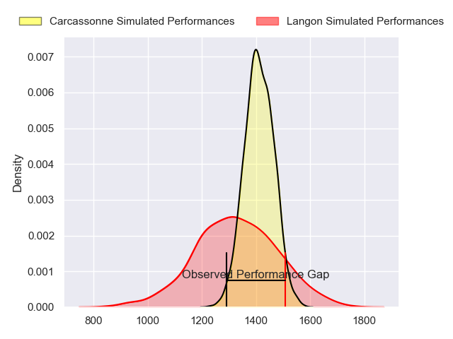
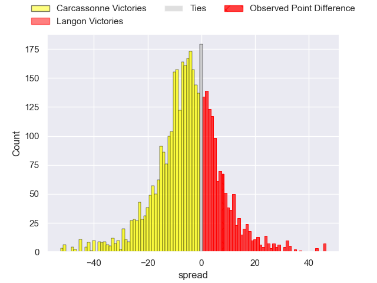
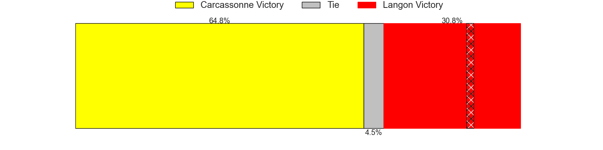
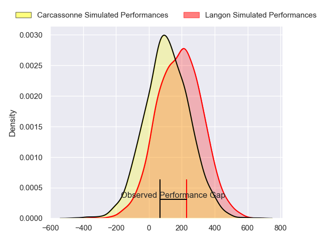
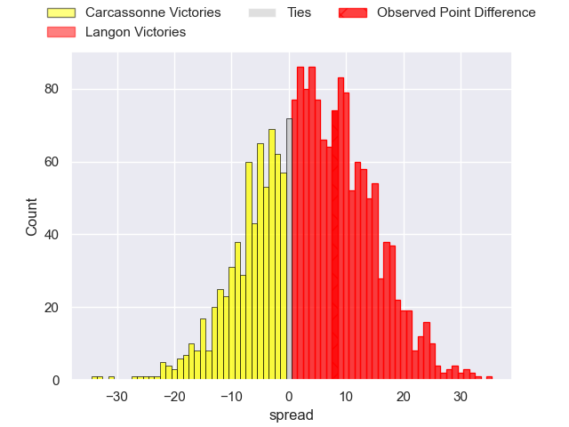
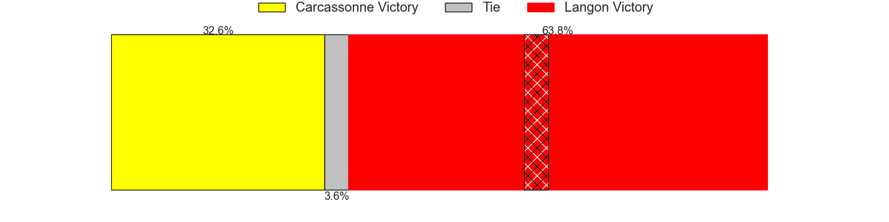

---  
layout: page  
title: Carcassonne at Langon; 24-32  
date: 2024-11-16 18:00:00 -0500  
categories: "Nationale 2024" match review  
---
# Carcassonne at Langon; 24-32

# Club Level Predictions

The first set of predictions treats a club as the smallest object, as the club develops its members, organizes a gameplan, and deploys its players as needed for each match. This club model has a prediction of 0.381, which translates to predicting Carcassonne to win by 4.3.

Our Over/Under is 34.5 - and combined with the spread above, we have a predicted scoreline of 19 to 15

Each club has a rating and a rating deviation (similar to a Glicko rating), and expected performances can be generated. This allows for simulated matches and spreads like the ones below.
## Projected Performances - Club Model

## Projected Spreads - Club Model

## Projected Results - Club Model

# Player Level Predictions

Treating teams instead as an entity made up of the currently active players, I have ratings for each player in an altogether different system. These can be combined to form team ratings once teamsheets are announced, weighting starters a bit higher than the reserves. After the match is played, players can be weighted by their minutes on the field, allowing for an accurate measure of the team's composition. With these compiled team ratings, we can make predictions, measure inaccuracy, and update the individual player ratings.
## Prediction without Player Minutes: Langon by 2.6

Langon by 0.3 on a neutral pitch

## Projected Performances - Player Model

## Projected Spreads - Player Model

## Projected Results - Player Model

|   Away Minutes | Away Player         |   Away Percentile |   Number |   Home Percentile | Home Player              |   Home Minutes |
|---------------:|:--------------------|------------------:|---------:|------------------:|:-------------------------|---------------:|
|             60 | Yan Arnold          |             34.34 |        1 |             44.89 | Tunaï Ratu Vatubua       |             58 |
|             80 | Raphaël Carbou      |             30.76 |        2 |             45.62 | Maxime Gau               |             80 |
|             80 | Siua Halanukonuka   |             34.48 |        3 |             53.46 | Loïc Clavé               |             80 |
|             50 | Romain Guyot        |             40.79 |        4 |             50.31 | Thomas Geffré            |             80 |
|             73 | Clément Fontaine    |             38.52 |        5 |             49.69 | Helmi Mimouna            |             74 |
|             20 | Bilal Fadli         |             47.5  |        6 |             47.67 | Meryll Ech-Chalkha       |             62 |
|             65 | Etienne Herjean     |             39.1  |        7 |             48.18 | Thomas Bishop            |             62 |
|             56 | Thomas Hoarau       |             41.29 |        8 |             48.84 | Thomas Mendy             |             44 |
|             63 | Kenjy Bayer         |             41.65 |        9 |             54.52 | Baptiste Tisné           |             80 |
|             73 | Johnny Mcphillips   |             35.99 |       10 |             48.83 | Christel Bertrand        |             80 |
|             23 | Paul Gadéa          |             40.32 |       11 |             50.83 | Quentin Lefort           |             73 |
|             13 | Jordan Puletua      |             34.78 |       12 |             44.93 | Sionasa Vunisa           |             80 |
|             18 | Mathys Barka        |             34.69 |       13 |             45.47 | Adriu Naivuwai           |             80 |
|             13 | Naïm Ben Alla       |             42.13 |       14 |             73.75 | Thomas Wallraf           |             21 |
|             59 | Naïm Ben Alla       |             42.13 |       14 |             73.75 | Thomas Wallraf           |             21 |
|             80 | Nils Chaliès        |             35.02 |       15 |             50.94 | Nathan Gagnac            |             80 |
|             32 | Gabin Villerouge    |            nan    |       16 |            nan    | Lucas Hernandez          |             70 |
|             59 | Nika Neparidze      |            nan    |       17 |            nan    | Julien Graffouillère     |             80 |
|             80 | Marius Iftimiciuc   |              5.24 |       18 |             53.01 | Thomas De Molder         |             60 |
|             54 | Ferdinand Dréno     |             40.12 |       19 |            nan    | Simon Zubizarreta        |             40 |
|             54 | Gabin Michet        |             30.54 |       20 |            nan    | Paul Castéra             |             80 |
|             54 | Clément Egiziano    |             39.45 |       21 |             38.33 | Vincent Debladis         |             20 |
|             73 | Valentin Sese       |             44.8  |       22 |            nan    | Jules Depoortère         |             80 |
|             10 | Vakhtangi Akhobadze |             39    |       23 |            nan    | Emiliano Coria Marchetti |             60 |
|             70 | Vakhtangi Akhobadze |             39    |       23 |            nan    | Emiliano Coria Marchetti |             60 |

