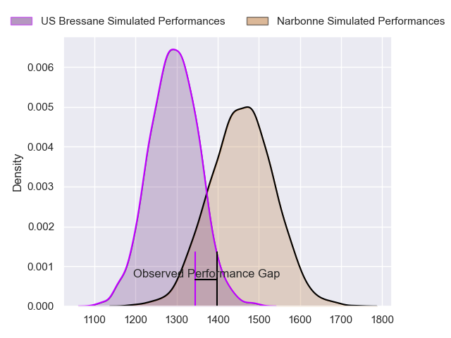
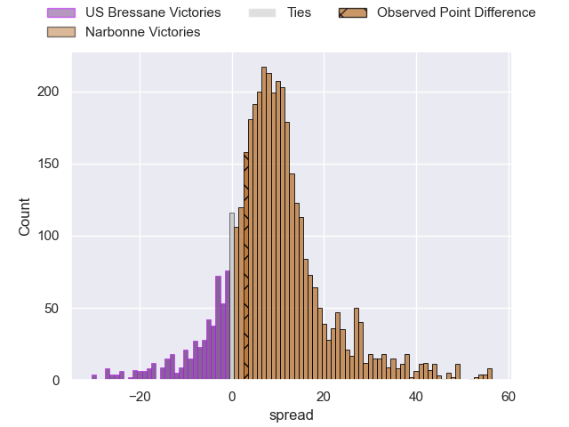
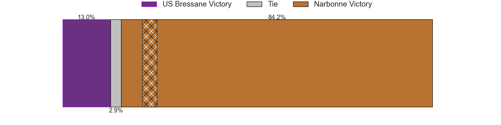
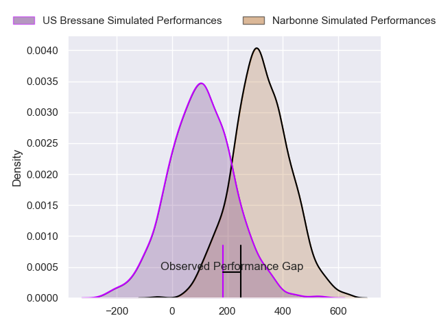
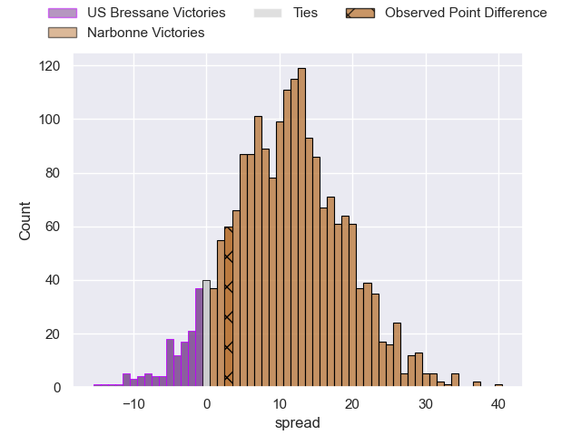
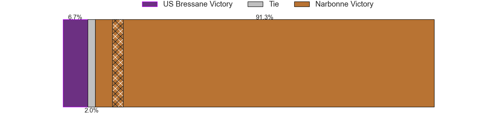

---  
layout: page  
title: US Bressane at Narbonne; 26-29  
date: 2024-11-16 18:00:00 -0500  
categories: "Nationale 2024" match review  
---
# US Bressane at Narbonne; 26-29

# Club Level Predictions

The first set of predictions treats a club as the smallest object, as the club develops its members, organizes a gameplan, and deploys its players as needed for each match. This club model has a prediction of 0.717, which translates to predicting Narbonne to win by 8.2.

Our Over/Under is 53.5 - and combined with the spread above, we have a predicted scoreline of 23 to 31

Each club has a rating and a rating deviation (similar to a Glicko rating), and expected performances can be generated. This allows for simulated matches and spreads like the ones below.
## Projected Performances - Club Model

## Projected Spreads - Club Model

## Projected Results - Club Model

# Player Level Predictions

Treating teams instead as an entity made up of the currently active players, I have ratings for each player in an altogether different system. These can be combined to form team ratings once teamsheets are announced, weighting starters a bit higher than the reserves. After the match is played, players can be weighted by their minutes on the field, allowing for an accurate measure of the team's composition. With these compiled team ratings, we can make predictions, measure inaccuracy, and update the individual player ratings.
## Prediction without Player Minutes: Narbonne by 12.4

US Bressane by 0.5 on a neutral pitch

## Projected Performances - Player Model

## Projected Spreads - Player Model

## Projected Results - Player Model

|   Away Minutes | Away Player        |   Away Percentile |   Number |   Home Percentile | Home Player          |   Home Minutes |
|---------------:|:-------------------|------------------:|---------:|------------------:|:---------------------|---------------:|
|             44 | Téo Bordenave      |             58.4  |        1 |             13.09 | Gregory Fichten      |             48 |
|             44 | Téo Bordenave      |             58.4  |        1 |             13.09 | Gregory Fichten      |             63 |
|             58 | Arnaud Feltrin     |             53.94 |        2 |             24.07 | Gabriel Atlan        |             80 |
|             80 | Erich De Jager     |             64.91 |        3 |             37.01 | Chris Talakai        |             80 |
|             48 | Thomas Déliance    |             65.33 |        4 |              8.56 | Leva Fifita          |             80 |
|             48 | Victor Fromentèze  |             63.49 |        5 |             31.62 | Marius Antonescu     |             32 |
|              0 | Nail Ait Naceur    |             57.68 |        6 |             33.93 | Thibault Clauzade    |             48 |
|             48 | Pierre Reynaud     |             63.27 |        7 |             28.58 | Paul Belzons         |             76 |
|             80 | Quentin Witt       |             57.32 |        8 |             77.97 | Lopeti Timani        |             53 |
|             80 | Jérémie Martin     |             61.56 |        9 |             36.29 | Pierrick Nova        |             80 |
|             80 | Nathan Azaïs       |             60.89 |       10 |             34.05 | Thibault Santoro     |             24 |
|             56 | Jules Margarit     |             58.58 |       11 |             44.03 | Étienne Ducom        |             28 |
|             80 | Nicolas Tachat     |             53.53 |       12 |             38.86 | Taiso Silafai-Leaana |             25 |
|             80 | Joe Margetts       |             56.61 |       13 |             23.73 | Pierre Nueno         |             48 |
|             52 | Thibaut Perrette   |             58.26 |       14 |             33.83 | Pierre-Hugo Ducom    |              0 |
|             28 | Florent Massip     |             50    |       15 |             30.52 | Boris Goutard        |             10 |
|             25 | Louis Dasalmartini |            nan    |       16 |             27.49 | Clément Estériola    |             18 |
|             25 | Nicolas Lemaire    |            nan    |       17 |            nan    | Théo Castinel        |             10 |
|             25 | Waël May           |             54.85 |       18 |             31.35 | Darrel Dyer          |             22 |
|             24 | Florian Burlet     |            nan    |       19 |            nan    | Bill Caffo           |             24 |
|             25 | Jérémy Valençot    |             53.91 |       20 |            nan    | James Hart           |             24 |
|             32 | Fred Zeilinga      |             51.36 |       21 |             27.26 | Peter Betham         |             22 |
|             56 | Elie De Fleurian   |             56.92 |       22 |            nan    | Hugo Clauzel         |             20 |
|             40 | Lasha Mchedlidze   |            nan    |       23 |            nan    | Livai Tikoipau       |             40 |
|            nan | nan                |            nan    |       24 |            nan    | Paddy Ryan           |             30 |

