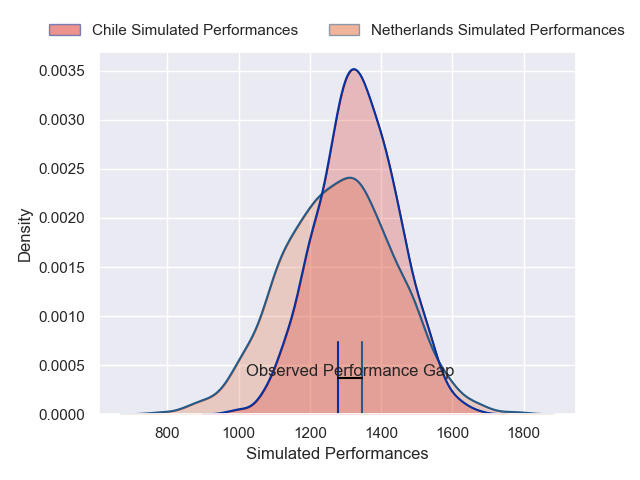
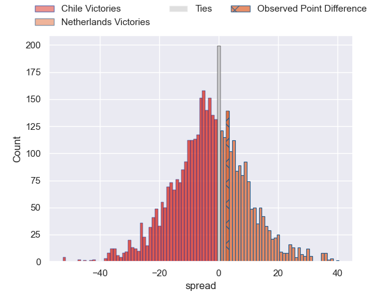
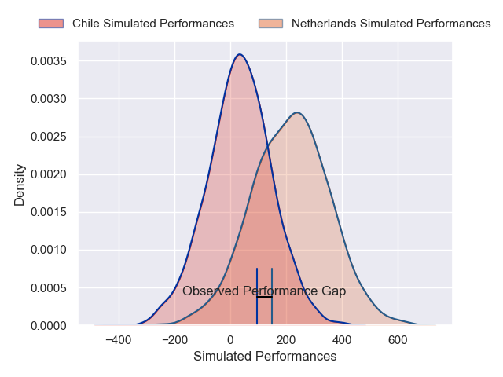
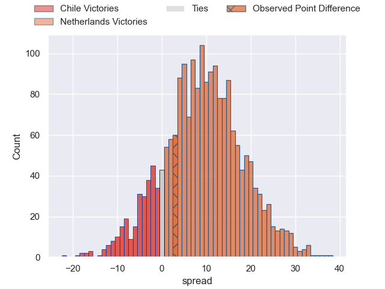
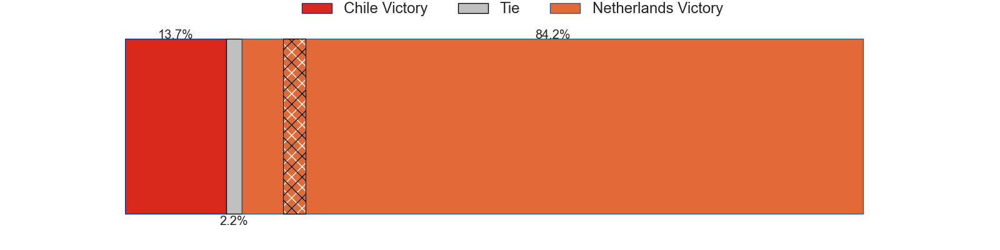

---  
layout: page  
title: Chile at Netherlands; 17-20  
date: 2024-11-16 18:00:00 -0500  
categories: "International Test Match 2024" match review  
---
# Chile at Netherlands; 17-20

# Club Level Predictions

The first set of predictions treats a club as the smallest object, as the club develops its members, organizes a gameplan, and deploys its players as needed for each match. This club model has a prediction of 0.43, which translates to predicting Chile to win by 2.6.

Our Over/Under is 47.5 - and combined with the spread above, we have a predicted scoreline of 25 to 23

Each club has a rating and a rating deviation (similar to a Glicko rating), and expected performances can be generated. This allows for simulated matches and spreads like the ones below.
## Projected Performances - Club Model

## Projected Spreads - Club Model

## Projected Results - Club Model

# Player Level Predictions

Treating teams instead as an entity made up of the currently active players, I have ratings for each player in an altogether different system. These can be combined to form team ratings once teamsheets are announced, weighting starters a bit higher than the reserves. After the match is played, players can be weighted by their minutes on the field, allowing for an accurate measure of the team's composition. With these compiled team ratings, we can make predictions, measure inaccuracy, and update the individual player ratings.
## Prediction without Player Minutes: Netherlands by 8.2

Netherlands by 5.8 on a neutral pitch

## Projected Performances - Player Model

## Projected Spreads - Player Model

## Projected Results - Player Model

|   Away Minutes | Away Player             |   Away Percentile |   Number |   Home Percentile | Home Player         |   Home Minutes |
|---------------:|:------------------------|------------------:|---------:|------------------:|:--------------------|---------------:|
|             75 | Javier Carrasco         |             52.59 |        1 |             54.46 | Odin Ruijgrok       |             66 |
|             35 | Augusto Bohme Alemparte |             15.09 |        2 |             24.57 | Lars Linnenbank     |             66 |
|             31 | Inaki Gurruchaga Suarez |             61.67 |        3 |             73.14 | Gabor Besuijen      |             66 |
|             31 | Santiago Pedrero        |             52.67 |        4 |             58.2  | Chris Van Leeuwen   |             66 |
|             32 | Clemente Saavedra       |             28.83 |        5 |             66.18 | Koen Bloemen        |             66 |
|             14 | Martin Sigren           |             62.42 |        6 |             54.53 | Spike Salman        |             66 |
|             28 | Raimundo Martinez       |             35.87 |        7 |             26.82 | Tim De Jong         |             66 |
|             66 | Ernesto Tchimino        |             47.48 |        8 |             56.01 | Christopher Raymond |             66 |
|             66 | Benjamin Videla         |             73.65 |        9 |             53.19 | Mark Coebergh       |             66 |
|             66 | Rodrigo Fernandez       |             28.75 |       10 |             52.77 | Vikas Meijer        |             66 |
|             66 | Nicolas Garafulic Schar |             78.23 |       11 |             45.24 | Daan Van Der Avoird |             66 |
|             66 | Santiago Videla         |             55    |       12 |             38.94 | David Weersma       |             66 |
|             66 | Domingo Saavedra        |             35.29 |       13 |             38.65 | William Edwards     |             66 |
|             66 | Matias Garafulic        |             17.58 |       14 |             49.84 | Tc Campbell         |             66 |
|             66 | Inaki Ayarza            |             19.52 |       15 |             37.65 | Peter Lydon         |             66 |
|             30 | Diego Escobar Alvarez   |             74.34 |       16 |            nan    | Taffy Kahembe       |             30 |
|             30 | Norman Aguayo           |            nan    |       17 |            nan    | Shane Fikken        |             40 |
|             30 | Matias Dittus           |             13.58 |       18 |            nan    | Thymo Peters        |             60 |
|             30 | Bruno Sáez              |            nan    |       19 |             64.19 | Monty Leverstein    |             80 |
|             30 | Santiago Edwards        |            nan    |       20 |             70.22 | Wolf Van Dijk       |             80 |
|             30 | Marcelo Torrealba       |              3.76 |       21 |            nan    | Boris Hadinegoro    |             72 |
|             30 | Juan Cruz Reyes         |            nan    |       22 |            nan    | Mees Voets          |             80 |
|             30 | Luca Strabucchi         |             78.69 |       23 |             49.2  | Mees Van Oord       |             71 |

