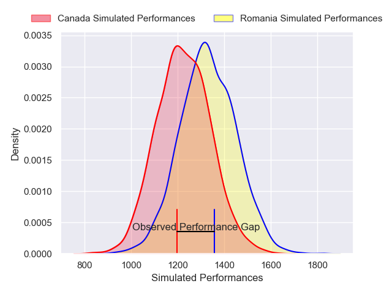
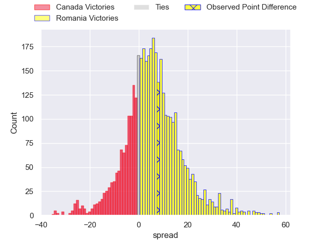
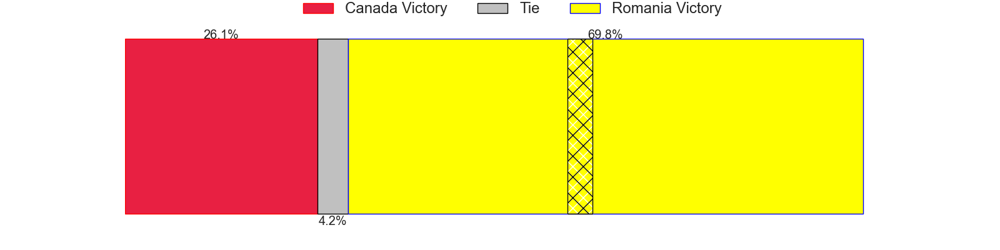
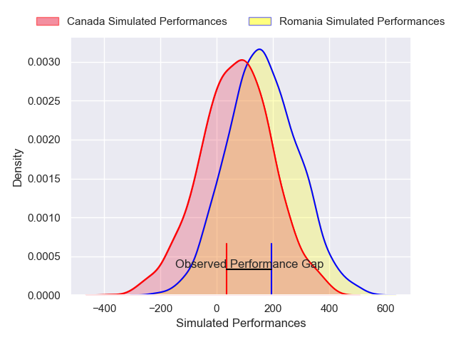
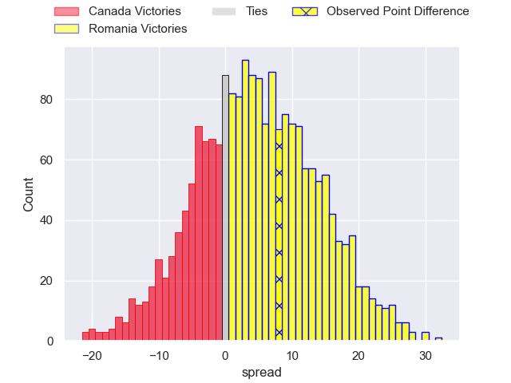
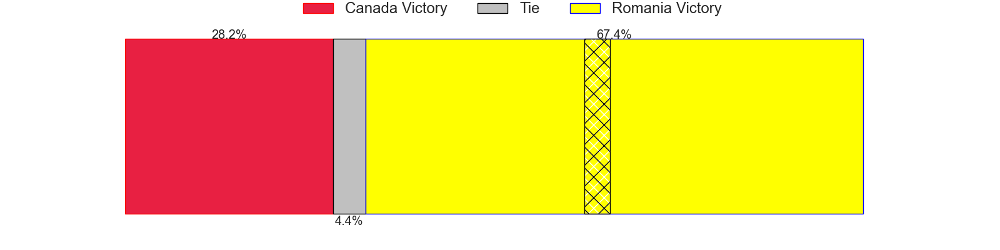

---  
layout: page  
title: Canada at Romania; 27-35  
date: 2024-11-16 18:00:00 -0500  
categories: "International Test Match 2024" match review  
---
# Canada at Romania; 27-35

# Club Level Predictions

The first set of predictions treats a club as the smallest object, as the club develops its members, organizes a gameplan, and deploys its players as needed for each match. This club model has a prediction of 0.641, which translates to predicting Romania to win by 5.4.

Our Over/Under is 48.5 - and combined with the spread above, we have a predicted scoreline of 21 to 27

Each club has a rating and a rating deviation (similar to a Glicko rating), and expected performances can be generated. This allows for simulated matches and spreads like the ones below.
## Projected Performances - Club Model

## Projected Spreads - Club Model

## Projected Results - Club Model

# Player Level Predictions

Treating teams instead as an entity made up of the currently active players, I have ratings for each player in an altogether different system. These can be combined to form team ratings once teamsheets are announced, weighting starters a bit higher than the reserves. After the match is played, players can be weighted by their minutes on the field, allowing for an accurate measure of the team's composition. With these compiled team ratings, we can make predictions, measure inaccuracy, and update the individual player ratings.
## Prediction without Player Minutes: Romania by 7.5

Romania by 3.0 on a neutral pitch

## Projected Performances - Player Model

## Projected Spreads - Player Model

## Projected Results - Player Model

|   Away Minutes | Away Player      |   Away Percentile |   Number |   Home Percentile | Home Player       |   Home Minutes |
|---------------:|:-----------------|------------------:|---------:|------------------:|:------------------|---------------:|
|             80 | Cali Martinez    |             23.33 |        1 |             66.17 | Alexandru Savin   |             75 |
|              8 | Andrew Quattrin  |             13.06 |        2 |             52.88 | Stefan Buruiana   |             35 |
|              2 | Conor Young      |             11.78 |        3 |             36.31 | Vasile Balan      |             31 |
|              2 | James Stockwood  |             25.57 |        4 |             88.03 | Nicolaas Immelman |             31 |
|              5 | Mason Flesch     |              3.45 |        5 |             12.69 | Andrei Mahu       |             40 |
|              5 | Matt Heaton      |              6.55 |        6 |             59.28 | Cristi Boboc      |             20 |
|              8 | Sion Parry       |             30.67 |        7 |             15.96 | Cristian Chirica  |              7 |
|             13 | Lucas Rumball    |              1.55 |        8 |             19.77 | Adrian Mitu       |             39 |
|             49 | Brock Gallagher  |             27.5  |        9 |             17.68 | Alin Conache      |              5 |
|             54 | Peter Nelson     |              2.67 |       10 |             48.46 | Hinckley Vaovasa  |             54 |
|             49 | Nic Benn         |             77.82 |       11 |             15.32 | Tevita Manumua    |             71 |
|             67 | Noah Flesch      |             37.98 |       12 |             79.42 | Jason Tomane      |             54 |
|             80 | Mitch Richardson |              4.23 |       13 |             65.67 | Mihai Graure      |             80 |
|             80 | Andrew Coe       |             79.92 |       14 |             20.65 | Taliauli Sikuea   |             29 |
|             40 | Cooper Coats     |             19.12 |       15 |             30.48 | Ovidiu Neagu      |             80 |
|             71 | Jesse Mackail    |            nan    |       16 |              4.67 | Ovidiu Cojocaru   |             80 |
|             60 | Sam Miller       |            nan    |       17 |              4.58 | Iulian Hartig     |             80 |
|             80 | Tyler Matchem    |            nan    |       18 |            nan    | Cosmin Manole     |             57 |
|             80 | Callum Botchar   |             73.71 |       19 |             65.28 | Yanis Horvat      |             61 |
|             80 | Izzak Kelly      |             27.83 |       20 |             21.08 | Vlad Neculau      |             80 |
|             80 | Matt Oworu       |            nan    |       21 |             44.84 | Gabriel Rupanu    |             80 |
|             74 | Jesse Kilgour    |            nan    |       22 |            nan    | Alexandru Bucur   |             72 |
|             35 | Rhys James       |            nan    |       23 |             97.21 | Paul Popoaia      |             80 |
|            nan | nan              |            nan    |       24 |             46.71 |                   |             70 |

