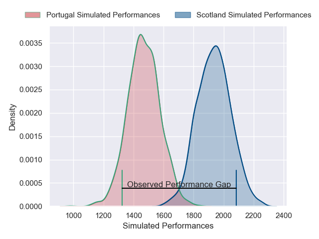
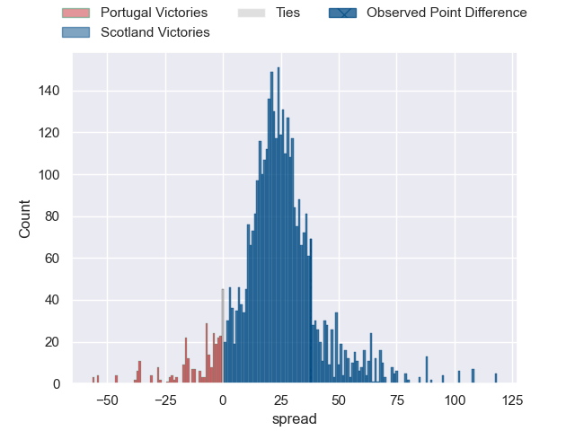
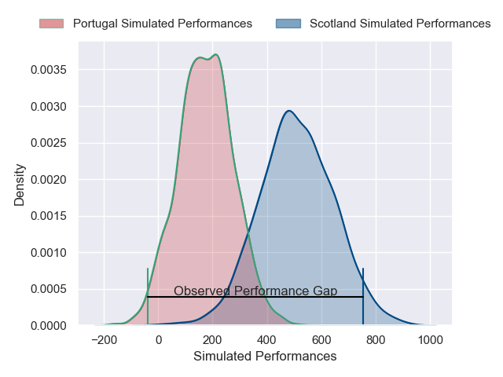
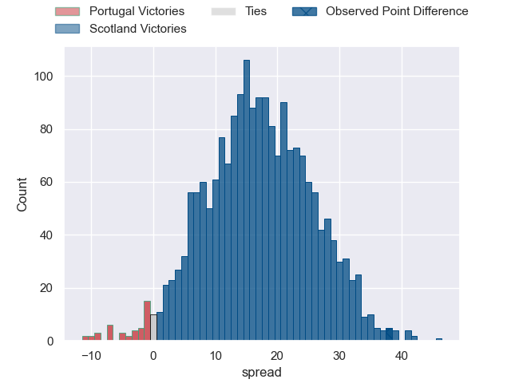
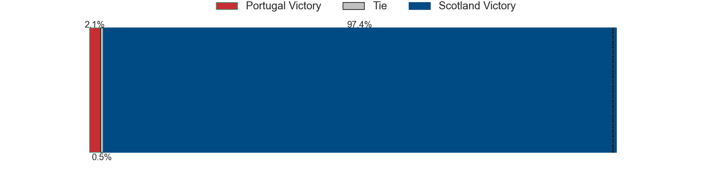

---  
layout: page  
title: Portugal at Scotland; 21-59  
date: 2024-11-16 18:00:00 -0500  
categories: "International Test Match 2024" match review  
---
# Portugal at Scotland; 21-59

# Club Level Predictions

The first set of predictions treats a club as the smallest object, as the club develops its members, organizes a gameplan, and deploys its players as needed for each match. This club model has a prediction of 0.926, which translates to predicting Scotland to win by 23.2.

Our Over/Under is 66.5 - and combined with the spread above, we have a predicted scoreline of 22 to 45

Each club has a rating and a rating deviation (similar to a Glicko rating), and expected performances can be generated. This allows for simulated matches and spreads like the ones below.
## Projected Performances - Club Model

## Projected Spreads - Club Model

## Projected Results - Club Model

# Player Level Predictions

Treating teams instead as an entity made up of the currently active players, I have ratings for each player in an altogether different system. These can be combined to form team ratings once teamsheets are announced, weighting starters a bit higher than the reserves. After the match is played, players can be weighted by their minutes on the field, allowing for an accurate measure of the team's composition. With these compiled team ratings, we can make predictions, measure inaccuracy, and update the individual player ratings.
## Prediction without Player Minutes: Scotland by 16.7

Scotland by 10.5 on a neutral pitch

## Projected Performances - Player Model

## Projected Spreads - Player Model

## Projected Results - Player Model

|   Away Minutes | Away Player            |   Away Percentile |   Number |   Home Percentile | Home Player         |   Home Minutes |
|---------------:|:-----------------------|------------------:|---------:|------------------:|:--------------------|---------------:|
|             65 | David Costa            |             23.26 |        1 |             97.07 | Jamie Bhatti        |             78 |
|             49 | Luka Begic             |              5.75 |        2 |             14.77 | Patrick Harrison    |             78 |
|             28 | Diogo Hasse Ferreira   |              7.43 |        3 |             73.59 | Will Hurd           |             58 |
|             80 | Jose Madeira           |             93.2  |        4 |             59.38 | Alex Craig          |             80 |
|             80 | Duarte Torgal          |             91.12 |        5 |             81.69 | Alex Samuel         |             12 |
|             15 | André Cunha            |             37.31 |        6 |             94.53 | Luke Crosbie        |             12 |
|             80 | Nicolas Martins        |             87.09 |        7 |             51.84 | Ben Muncaster       |             61 |
|             61 | Frederico Couto        |             34.5  |        8 |             54.84 | Josh Bayliss        |             52 |
|             61 | Samuel Marques         |             78.4  |        9 |            100    | George Horne        |             80 |
|             21 | Domingos Cabral        |             58.11 |       10 |             98.77 | Adam Hastings       |             52 |
|             26 | Lucas Martins          |             42.26 |       11 |             10.65 | Arron Reed          |             80 |
|             40 | Tomas Appleton         |             70.87 |       12 |             92.88 | Stafford McDowall   |             80 |
|             27 | Jose Lima              |             73.08 |       13 |             84.62 | Rory Hutchinson     |             12 |
|             22 | Raffaele Storti        |             88.47 |       14 |             45.65 | Darcy Graham        |             58 |
|             27 | Simao Bento            |              4.58 |       15 |             74.1  | Tom Jordan          |             80 |
|             73 | Abel Da Cunha          |             39.83 |       16 |             77.6  | Johnny Matthews     |             80 |
|             26 | Pedro Vicente          |            nan    |       17 |             79.37 | Rory Sutherland     |             65 |
|             54 | António Prim           |            nan    |       18 |             93.1  | Elliot Millar Mills |             58 |
|             48 | Antonio Rebelo Andrade |             52.95 |       19 |             41.07 | Ewan Johnson        |             80 |
|             30 | Vasco Baptista         |             32.17 |       20 |            nan    | Freddy Douglas      |             80 |
|             14 | António Campos         |            nan    |       21 |             94.68 | Jamie Dobie         |             23 |
|             20 | Hugo Aubry             |             31.42 |       22 |             81.54 | Matt Currie         |             67 |
|             10 | Manuel Cardoso Pinto   |             30.81 |       23 |             89.64 | Kyle Rowe           |             63 |
|            nan | nan                    |            nan    |       24 |             46.71 |                     |             50 |

