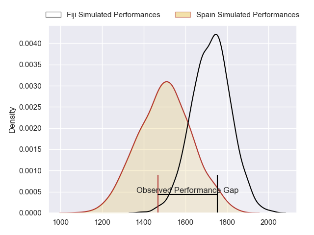
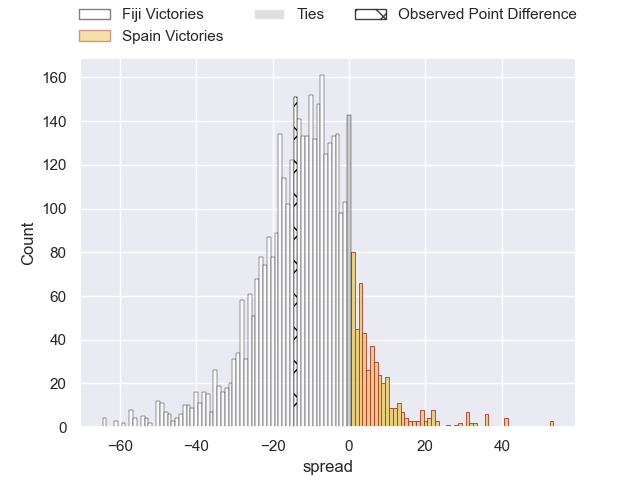
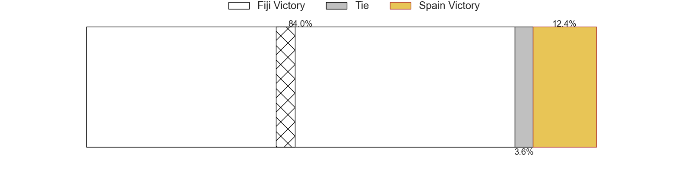
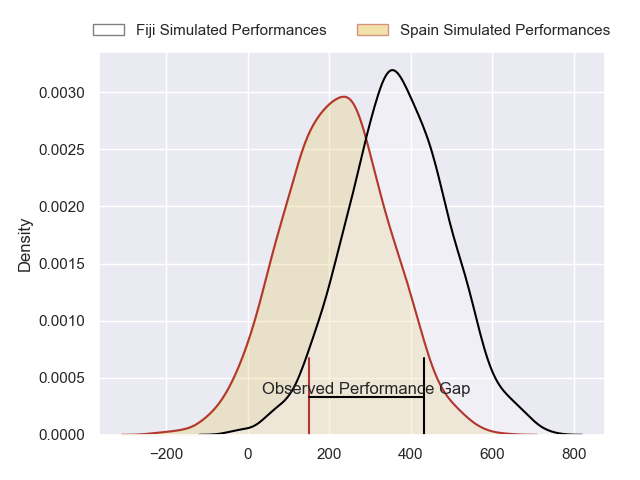
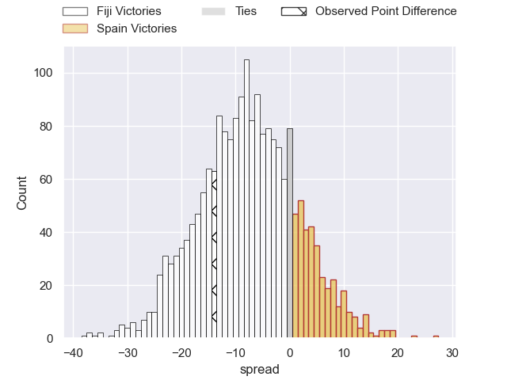
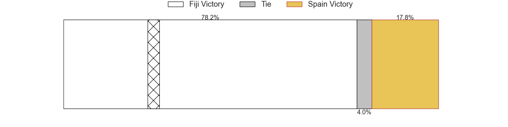

---  
layout: page  
title: Fiji at Spain; 33-19  
date: 2024-11-16 18:00:00 -0500  
categories: "International Test Match 2024" match review  
---
# Fiji at Spain; 33-19

# Club Level Predictions

The first set of predictions treats a club as the smallest object, as the club develops its members, organizes a gameplan, and deploys its players as needed for each match. This club model has a prediction of 0.236, which translates to predicting Fiji to win by 10.6.

Our Over/Under is 65.5 - and combined with the spread above, we have a predicted scoreline of 38 to 27

Each club has a rating and a rating deviation (similar to a Glicko rating), and expected performances can be generated. This allows for simulated matches and spreads like the ones below.
## Projected Performances - Club Model

## Projected Spreads - Club Model

## Projected Results - Club Model

# Player Level Predictions

Treating teams instead as an entity made up of the currently active players, I have ratings for each player in an altogether different system. These can be combined to form team ratings once teamsheets are announced, weighting starters a bit higher than the reserves. After the match is played, players can be weighted by their minutes on the field, allowing for an accurate measure of the team's composition. With these compiled team ratings, we can make predictions, measure inaccuracy, and update the individual player ratings.
## Prediction without Player Minutes: Fiji by 6.2

Fiji by 10.0 on a neutral pitch

## Projected Performances - Player Model

## Projected Spreads - Player Model

## Projected Results - Player Model

|   Away Minutes | Away Player                    |   Away Percentile |   Number |   Home Percentile | Home Player            |   Home Minutes |
|---------------:|:-------------------------------|------------------:|---------:|------------------:|:-----------------------|---------------:|
|              8 | Eroni Mawi                     |             94.79 |        1 |             40.92 | Thierry Futeu          |             54 |
|             82 | Sam Matavesi                   |             90.49 |        2 |             41.75 | Alvaro Garcia          |             21 |
|             62 | Luke Tagi                      |             87.18 |        3 |             42.97 | Lucas Santamaria       |             33 |
|             11 | Mesake Vocevoce                |             80.87 |        4 |             48.3  | Ignacio Pineiro        |             11 |
|             66 | Ratu Rotuisolia                |             63.32 |        5 |             40.09 | Imanol Urraza          |             82 |
|             66 | Vilive Miramira                |             79.13 |        6 |             37.83 | Vicente Boronat        |             82 |
|             81 | Saimoni Uluinakauvadra         |             48.43 |        7 |             41.05 | Alex Saleta            |             71 |
|             81 | Albert Tuisue                  |             98    |        8 |             42.68 | Ekain Imaz             |             71 |
|             26 | Simione Kuruvoli               |             44.72 |        9 |             32.16 | Estanislao Bay         |             56 |
|             15 | Caleb Muntz                    |             78.4  |       10 |             39.49 | Gonzalo Lopez Bontempo |             20 |
|             20 | Ponipate Loganimasi            |             50.99 |       11 |             85.3  | Martiniano Cian        |             82 |
|             17 | Waisea Nayacalevu Vuidravuwalu |             81.7  |       12 |             29.89 | Alejandro Alonso       |             82 |
|             58 | Sireli Maqala                  |             72.92 |       13 |             39.58 | Inaki Mateu            |             23 |
|             50 | Jiuta Wainiqolo                |             93.28 |       14 |             47.11 | Gauthier Minguillon    |              6 |
|             11 | Isaiah Armstrong-Ravula        |             13.48 |       15 |             39.33 | John Wessel Bell       |             56 |
|             26 | Isaiah Armstrong-Ravula        |             13.48 |       15 |             39.33 | John Wessel Bell       |             56 |
|             81 | Mesu Dolokoto                  |             43.68 |       16 |            nan    | Santiago Ovejero       |             56 |
|             81 | Haereiti Hetet                 |             96.44 |       17 |             74.98 | Bernardo Vazquez       |             65 |
|             81 | Jone Koroiduadua               |             77.18 |       18 |            nan    | Jacobo Ruiz            |             82 |
|             50 | Temo Mayanavanua               |             97.12 |       19 |            nan    | Pablo Guirao           |             82 |
|             66 | Elia Canakaivata               |             79.2  |       20 |            nan    | Raphael Nieto          |             74 |
|             64 | Peni Matawalu                  |             72.89 |       21 |            nan    | Ike Irusta             |             67 |
|             31 | Vilimoni Botitu                |             60.69 |       22 |            nan    | Gonzalo Vinuesa        |             82 |
|             81 | Inia Tabuavou                  |             77.17 |       23 |            nan    | Alberto Carmona        |             82 |

