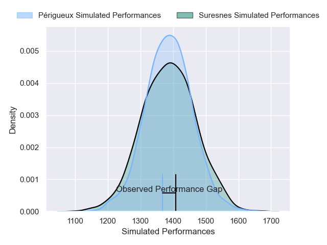
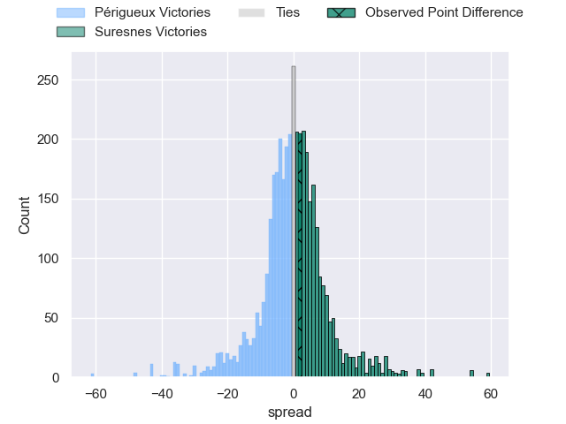
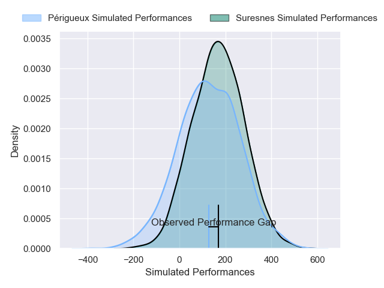
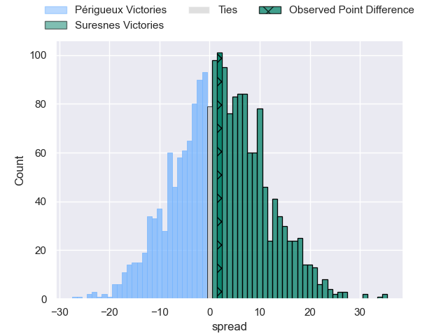

---  
layout: page  
title: Perigueux at Suresnes; 28-30  
date: 2024-11-16 18:00:00 -0500  
categories: "Nationale 2024" match review  
---
# Perigueux at Suresnes; 28-30

# Club Level Predictions

The first set of predictions treats a club as the smallest object, as the club develops its members, organizes a gameplan, and deploys its players as needed for each match. This club model has a prediction of 0.506, which translates to predicting Suresnes to win by 0.2.

Our Over/Under is 44.5 - and combined with the spread above, we have a predicted scoreline of 22 to 22

Each club has a rating and a rating deviation (similar to a Glicko rating), and expected performances can be generated. This allows for simulated matches and spreads like the ones below.
## Projected Performances - Club Model

## Projected Spreads - Club Model

## Projected Results - Club Model

# Player Level Predictions

Treating teams instead as an entity made up of the currently active players, I have ratings for each player in an altogether different system. These can be combined to form team ratings once teamsheets are announced, weighting starters a bit higher than the reserves. After the match is played, players can be weighted by their minutes on the field, allowing for an accurate measure of the team's composition. With these compiled team ratings, we can make predictions, measure inaccuracy, and update the individual player ratings.
## Prediction without Player Minutes: Suresnes by 3.0

Périgueux by 0.4 on a neutral pitch

## Projected Performances - Player Model

## Projected Spreads - Player Model

## Projected Results - Player Model

|   Away Minutes | Away Player         |   Away Percentile |   Number |   Home Percentile | Home Player             |   Home Minutes |
|---------------:|:--------------------|------------------:|---------:|------------------:|:------------------------|---------------:|
|             67 | Thomas Vidal        |             46.59 |        1 |             46.06 | Thibaud Sebire          |             80 |
|             57 | Louis Martin        |             46.81 |        2 |             46.19 | Jean-Etienne Lesueur    |             80 |
|             32 | Kalivati Tawake     |             45.84 |        3 |             45.54 | Nail Audoire            |             44 |
|             17 | Clément Lanen       |             49.23 |        4 |             48.96 | Damien Bozic            |             13 |
|             32 | Damien Lavergne     |             49.68 |        5 |             49.05 | Yakine Djebbari         |             18 |
|              4 | Karl Lambert        |             47.62 |        6 |             47.71 | Simon Veyrac            |             10 |
|             80 | Hendri Storm        |             49.06 |        7 |             47.8  | Wian Vosloo             |             13 |
|             48 | Nahum Merigan       |             55.43 |        8 |             40.7  | Laki Lee                |              7 |
|             23 | Max Green           |             79.38 |        9 |             46.15 | Théo Bachiri            |             27 |
|             18 | Greg Hutley         |             43.33 |       10 |             43.12 | Tanguy Lacoste          |             21 |
|             80 | Benjamin Yarde      |             52.26 |       11 |             51.05 | Faraj Fartass           |             55 |
|             80 | Frederick Hickes    |             41.68 |       12 |             40.72 | Petero Tuwaï            |             48 |
|             80 | Nicolas Piaton      |             41.68 |       13 |             40.72 | Victor Barnier          |             48 |
|             73 | Paul Piveteau       |             51.85 |       14 |             50.89 | Alexis Clément          |             48 |
|             74 | Anderson Neisen     |             44.02 |       15 |             43.43 | Goulwen Gueho           |             67 |
|             62 | Baptiste Arvouet    |            nan    |       16 |            nan    | Gauthier Bruté De Rémur |             80 |
|             70 | Émilien Borges      |            nan    |       17 |            nan    | Yanis Trabelsi          |             80 |
|             62 | Raphaël Vieilledent |            nan    |       18 |            nan    | Nikita Bekov            |             80 |
|             80 | Madioké Konaté      |            nan    |       19 |            nan    | Boaventura Almeida      |             55 |
|             80 | Mattéo Bordenave    |            nan    |       20 |            nan    | Thomas Lacroix          |             52 |
|             52 | Vincent Fouillade   |            nan    |       21 |            nan    | Thomas Baudy            |             80 |
|             65 | Yon Camou           |            nan    |       22 |            nan    | Jj Taulagi              |             21 |
|             80 | Martin Augeix       |            nan    |       23 |            nan    | Guiterembi Vickos       |             80 |

