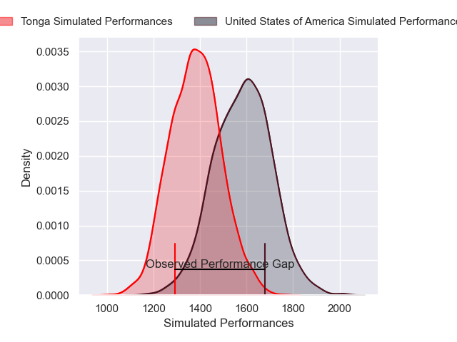
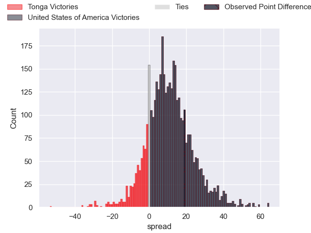
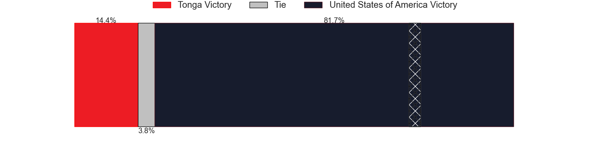
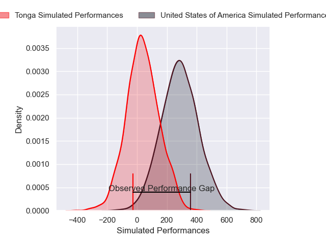
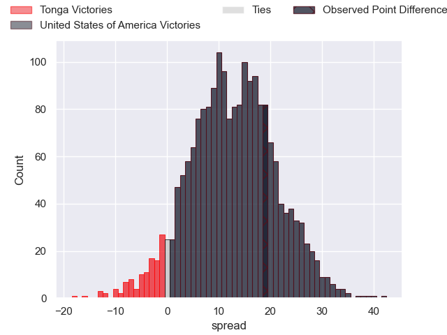
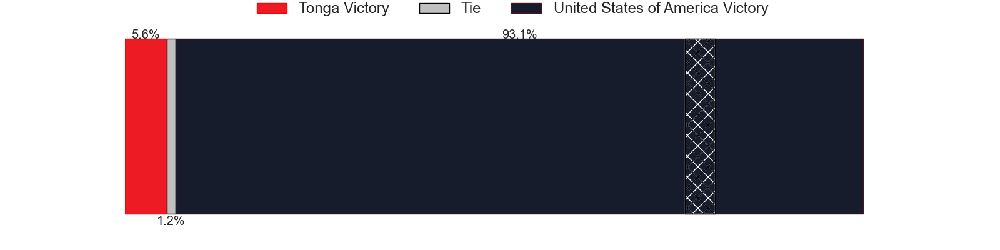

---  
layout: page  
title: Tonga at United States of America; 17-36  
date: 2024-11-16 18:00:00 -0500  
categories: "International Test Match 2024" match review  
---
# Tonga at United States of America; 17-36

# Club Level Predictions

The first set of predictions treats a club as the smallest object, as the club develops its members, organizes a gameplan, and deploys its players as needed for each match. This club model has a prediction of 0.756, which translates to predicting United States of America to win by 10.4.

Our Over/Under is 48.5 - and combined with the spread above, we have a predicted scoreline of 19 to 29

Each club has a rating and a rating deviation (similar to a Glicko rating), and expected performances can be generated. This allows for simulated matches and spreads like the ones below.
## Projected Performances - Club Model

## Projected Spreads - Club Model

## Projected Results - Club Model

# Player Level Predictions

Treating teams instead as an entity made up of the currently active players, I have ratings for each player in an altogether different system. These can be combined to form team ratings once teamsheets are announced, weighting starters a bit higher than the reserves. After the match is played, players can be weighted by their minutes on the field, allowing for an accurate measure of the team's composition. With these compiled team ratings, we can make predictions, measure inaccuracy, and update the individual player ratings.
## Prediction without Player Minutes: United States of America by 14.3

United States of America by 11.3 on a neutral pitch

## Projected Performances - Player Model

## Projected Spreads - Player Model

## Projected Results - Player Model

|   Away Minutes | Away Player          |   Away Percentile |   Number |   Home Percentile | Home Player           |   Home Minutes |
|---------------:|:---------------------|------------------:|---------:|------------------:|:----------------------|---------------:|
|             80 | Tau Koloamatangi     |             44.19 |        1 |             21.23 | Jack Iscaro           |             80 |
|              9 | Samiuela Moli        |              2.34 |        2 |             72.43 | Shilo Klein           |             36 |
|             26 | Ben Tameifuna        |             96.32 |        3 |             65.34 | Alex Maughan          |             14 |
|             26 | Semisi Paea          |             62.83 |        4 |             59.2  | Jason Damm            |             19 |
|             29 | Harrison Mataele     |              9.34 |        5 |             13.15 | Greg Peterson         |              7 |
|              0 | Tupou Ma'afu-Afungia |             52.2  |        6 |             82.06 | Vili Helu             |             25 |
|             14 | Sione Havili Talitui |             15.78 |        7 |             37.94 | Cory Gilliland-Daniel |             14 |
|              0 | Lotu Inisi           |              3.69 |        8 |             74.95 | Paddy Ryan            |             19 |
|             24 | Aisea Halo           |              7.7  |        9 |             76.89 | Ruben de Haas         |             52 |
|             16 | Patrick Pellegrini   |             87.89 |       10 |             97.74 | AJ MacGinty           |             66 |
|             66 | Tima Fainga'anuku    |              9.61 |       11 |             98.63 | Nate Augspurger       |             40 |
|             44 | Fetuli Paea          |             24.35 |       12 |             75.84 | Tavite Lopeti         |             40 |
|             61 | Fine Inisi           |              0.58 |       13 |             58.33 | Dominic Besag         |             80 |
|             71 | Taniela Filimone     |             81.1  |       14 |             81.58 | Conner Mooneyham      |             80 |
|             80 | William Havili       |             24.95 |       15 |             98.2  | Mitch Wilson          |             80 |
|             56 | Sosefo Sakalia       |            nan    |       16 |              4.21 | Kapeli Pifeleti       |             52 |
|             80 | Salesi Tuifua        |            nan    |       17 |             42.24 | Jake Turnbull         |             80 |
|             80 | Paula Latu           |            nan    |       18 |              9.75 | Paul Mullen           |             80 |
|             73 | Justin Mataele       |            nan    |       19 |            nan    | Tomás Casares         |             80 |
|             20 | Tevita Ahokovi       |             36.14 |       20 |            nan    | Mikey Grandy          |             80 |
|             12 | Siaosi Nginingini    |             73.61 |       21 |             52.95 | Ethan Mcveigh         |             80 |
|             35 | Josiah Unga          |            nan    |       22 |             61.41 | Mark O'Keeffe         |             80 |
|             59 | Poasi Tonga          |            nan    |       23 |             53.8  | Luke Carty            |             80 |

