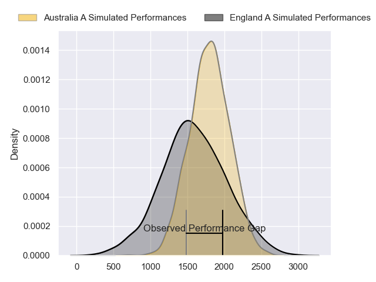
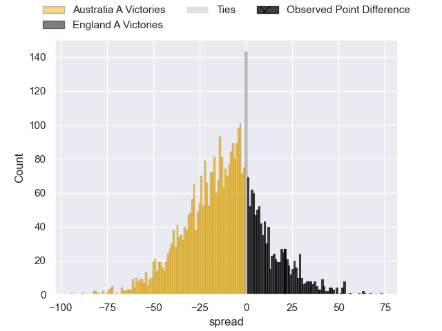
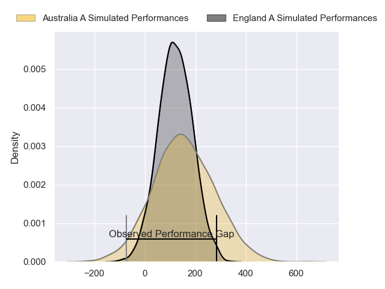
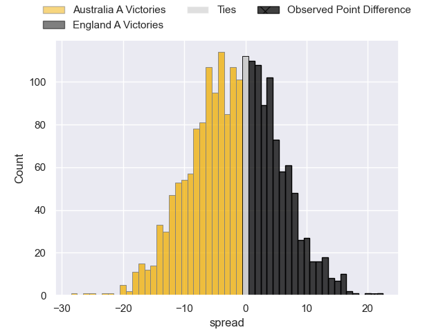

---  
layout: page  
title: Australia A at England A; 17-38  
date: 2024-11-17 18:00:00 -0500  
categories: "Tests Matchs 2024" match review  
---
# Australia A at England A; 17-38

# Club Level Predictions

The first set of predictions treats a club as the smallest object, as the club develops its members, organizes a gameplan, and deploys its players as needed for each match. This club model has a prediction of 0.288, which translates to predicting Australia A to win by 10.4.

Our Over/Under is 58.5 - and combined with the spread above, we have a predicted scoreline of 34 to 24

Each club has a rating and a rating deviation (similar to a Glicko rating), and expected performances can be generated. This allows for simulated matches and spreads like the ones below.
## Projected Performances - Club Model

## Projected Spreads - Club Model

## Projected Results - Club Model

# Player Level Predictions

Treating teams instead as an entity made up of the currently active players, I have ratings for each player in an altogether different system. These can be combined to form team ratings once teamsheets are announced, weighting starters a bit higher than the reserves. After the match is played, players can be weighted by their minutes on the field, allowing for an accurate measure of the team's composition. With these compiled team ratings, we can make predictions, measure inaccuracy, and update the individual player ratings.
## Prediction without Player Minutes: England A by 3.3

England A by 1.1 on a neutral pitch

## Projected Performances - Player Model

## Projected Spreads - Player Model

## Projected Results - Player Model

|   Away Minutes | Away Player           |   Away Percentile |   Number |   Home Percentile | Home Player          |   Home Minutes |
|---------------:|:----------------------|------------------:|---------:|------------------:|:---------------------|---------------:|
|              6 | Harry Hoopert         |             29.06 |        1 |             32.08 | Asher Opoku-Fordjour |             43 |
|             22 | Josh Nasser           |             55.42 |        2 |             92.12 | Gabriel Oghre        |             37 |
|             19 | Massimo De Lutiis     |             40.3  |        3 |             93.01 | Joe Heyes            |             37 |
|             19 | Ryan Smith            |             23.67 |        4 |             82.45 | Hugh Tizard          |             23 |
|             26 | Josh Canham           |             21.14 |        5 |             37.55 | Arthur Clark         |             12 |
|             29 | Tom Hooper            |             67.18 |        6 |             98.13 | Tom Pearson          |             20 |
|             18 | Luke Reimer           |             54.37 |        7 |             96.1  | Henry Pollock        |             13 |
|             62 | Joe Brial             |             30.97 |        8 |             66.26 | Tom Willis           |             18 |
|             80 | Ryan Lonergan         |             81.01 |        9 |             18.38 | Will Porter          |             23 |
|             20 | Tom Lynagh            |             69.26 |       10 |            nan    | nan                  |            nan |
|             80 | Darby Lancaster       |             26.09 |       11 |            nan    | nan                  |            nan |
|             80 | Hamish Stewart        |             67.48 |       12 |            nan    | nan                  |            nan |
|             57 | Joey Walton           |             64.4  |       13 |            nan    | nan                  |            nan |
|             80 | Corey Toole           |             45.77 |       14 |            nan    | nan                  |            nan |
|             68 | Jock Campbell         |             56.55 |       15 |            nan    | nan                  |            nan |
|             60 | Lachlan Lonergan      |             15.45 |       16 |            nan    | nan                  |            nan |
|             80 | Tom Lambert           |            nan    |       17 |            nan    | nan                  |            nan |
|             80 | James Slipper         |             95    |       18 |            nan    | nan                  |            nan |
|             74 | Angus Blyth           |             93.36 |       19 |            nan    | nan                  |            nan |
|             67 | Rory Scott            |             74.39 |       20 |            nan    | nan                  |            nan |
|             60 | Issak Fines-Leleiwasa |             32.31 |       21 |             85.91 | Archie McParland     |             80 |
|            nan | nan                   |            nan    |       23 |             15.49 | Will Muir            |             80 |

