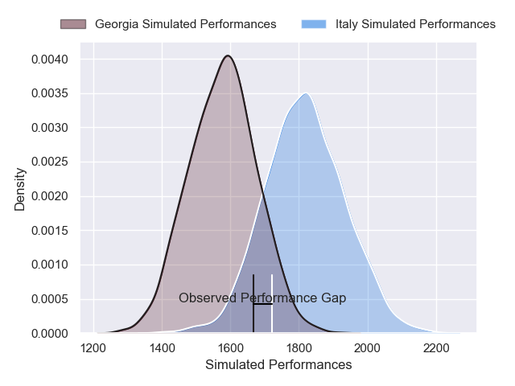
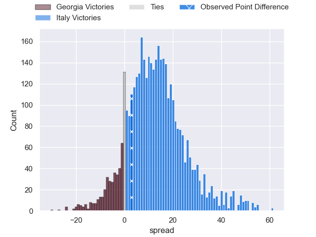
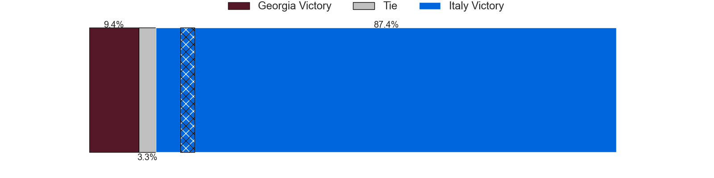
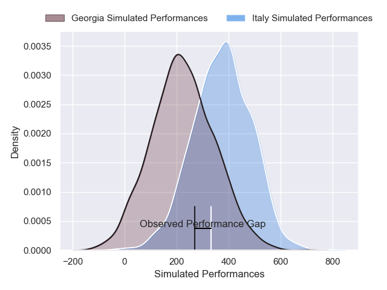
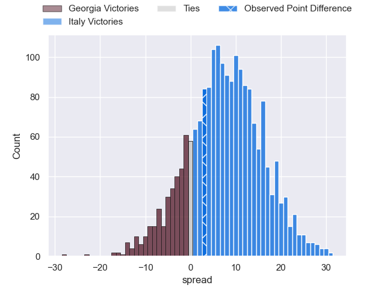
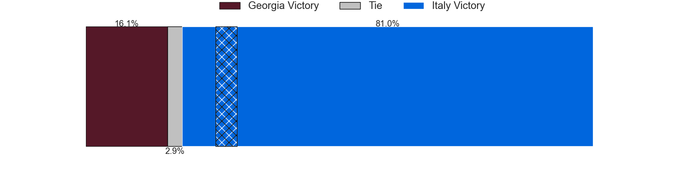

---  
layout: page  
title: Georgia at Italy; 17-20  
date: 2024-11-17 18:00:00 -0500  
categories: "International Test Match 2024" match review  
---
# Georgia at Italy; 17-20

# Club Level Predictions

The first set of predictions treats a club as the smallest object, as the club develops its members, organizes a gameplan, and deploys its players as needed for each match. This club model has a prediction of 0.792, which translates to predicting Italy to win by 12.2.

Our Over/Under is 48.5 - and combined with the spread above, we have a predicted scoreline of 18 to 30

Each club has a rating and a rating deviation (similar to a Glicko rating), and expected performances can be generated. This allows for simulated matches and spreads like the ones below.
## Projected Performances - Club Model

## Projected Spreads - Club Model

## Projected Results - Club Model

# Player Level Predictions

Treating teams instead as an entity made up of the currently active players, I have ratings for each player in an altogether different system. These can be combined to form team ratings once teamsheets are announced, weighting starters a bit higher than the reserves. After the match is played, players can be weighted by their minutes on the field, allowing for an accurate measure of the team's composition. With these compiled team ratings, we can make predictions, measure inaccuracy, and update the individual player ratings.
## Prediction without Player Minutes: Italy by 15.7

Italy by 10.4 on a neutral pitch

## Projected Performances - Player Model

## Projected Spreads - Player Model

## Projected Results - Player Model

|   Away Minutes | Away Player          |   Away Percentile |   Number |   Home Percentile | Home Player        |   Home Minutes |
|---------------:|:---------------------|------------------:|---------:|------------------:|:-------------------|---------------:|
|             80 | Nika Abuladze        |             88.97 |        1 |             49.59 | Danilo Fischetti   |              0 |
|             13 | Vano Karkadze        |             50.62 |        2 |             95.17 | Giacomo Nicotera   |             80 |
|             80 | Irakli Aptsiauri     |             64.29 |        3 |             91.15 | Simone Ferrari     |             80 |
|             80 | Mikheil Babunashvili |             84.95 |        4 |             68.81 | Niccolo Cannone    |             80 |
|             80 | Giorgi Javakhia      |             86.31 |        5 |             67.27 | Dino Lamb          |              0 |
|             37 | Ilia Spanderashvili  |             12.47 |        6 |             84.93 | Sebastian Negri    |             24 |
|             37 | Giorgi Tsutskiridze  |             84.3  |        7 |             94.8  | Michele Lamaro     |             29 |
|             23 | Tornike Jalagonia    |              8.35 |        8 |             21.94 | Ross Vintcent      |             24 |
|             12 | Vasil Lobzhanidze    |             13.28 |        9 |             46.07 | Alessandro Garbisi |              5 |
|             20 | Luka Matkava         |             81.72 |       10 |             79.26 | Paolo Garbisi      |             80 |
|             80 | Sandro Todua         |             92.57 |       11 |             95.56 | Monty Ioane        |             11 |
|              6 | Tornike Kakhoidze    |             36.96 |       12 |             87.87 | Tommaso Menoncello |              3 |
|              8 | Giorgi Kveseladze    |             91.92 |       13 |             92.69 | Juan Ignacio Brex  |              0 |
|              0 | Aka Tabutsadze       |             87.32 |       14 |             18.58 | Jacopo Trulla      |             30 |
|             66 | Davit Niniashvili    |             67.66 |       15 |             94.81 | Matt Gallagher     |             53 |
|             80 | Luka Nioradze        |            nan    |       16 |             74.77 | Gianmarco Lucchesi |             53 |
|             51 | Giorgi Akhaladze     |             16.88 |       17 |             40.59 | Mirco Spagnolo     |             53 |
|             80 | Luka Japaridze       |             79.82 |       18 |             37.51 | Pietro Ceccarelli  |             60 |
|             56 | Lado Chachanidze     |             22.85 |       19 |             31.01 | Riccardo Favretto  |             80 |
|             69 | Luka Ivanishvili     |             69.42 |       20 |             68.43 | Manuel Zuliani     |             80 |
|              2 | Gela Aprasidze       |             29.84 |       21 |             10.16 | Alessandro Fusco   |             56 |
|             80 | Tedo Abzhandadze     |             44.76 |       22 |             72.69 | Leonardo Marin     |             53 |
|             30 | Demur Tapladze       |             81.52 |       23 |             69.87 | Giulio Bertaccini  |             74 |
|            nan | nan                  |            nan    |       24 |             48.35 |                    |             43 |

