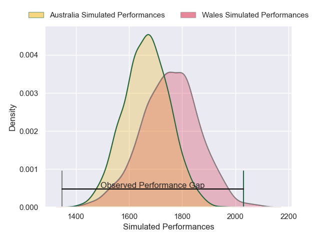
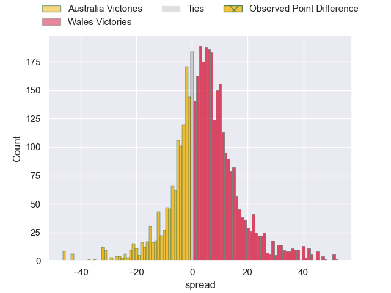
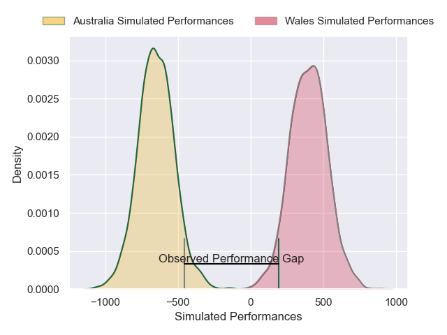
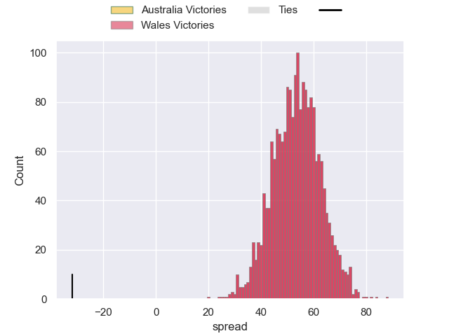

---  
layout: page  
title: Australia at Wales; 52-20  
date: 2024-11-17 18:00:00 -0500  
categories: "International Test Match 2024" match review  
---
# Australia at Wales; 52-20

# Club Level Predictions

The first set of predictions treats a club as the smallest object, as the club develops its members, organizes a gameplan, and deploys its players as needed for each match. This club model has a prediction of 0.62, which translates to predicting Wales to win by 4.4.

Our Over/Under is 55.5 - and combined with the spread above, we have a predicted scoreline of 26 to 30

Each club has a rating and a rating deviation (similar to a Glicko rating), and expected performances can be generated. This allows for simulated matches and spreads like the ones below.
## Projected Performances - Club Model

## Projected Spreads - Club Model

## Projected Results - Club Model

# Player Level Predictions

Treating teams instead as an entity made up of the currently active players, I have ratings for each player in an altogether different system. These can be combined to form team ratings once teamsheets are announced, weighting starters a bit higher than the reserves. After the match is played, players can be weighted by their minutes on the field, allowing for an accurate measure of the team's composition. With these compiled team ratings, we can make predictions, measure inaccuracy, and update the individual player ratings.
## Prediction without Player Minutes: Wales by 52.4

Wales by 45.3 on a neutral pitch

## Projected Performances - Player Model

## Projected Spreads - Player Model

## Projected Results - Player Model

|   Away Minutes | Away Player           |   Away Percentile |   Number |   Home Percentile | Home Player      |   Home Minutes |
|---------------:|:----------------------|------------------:|---------:|------------------:|:-----------------|---------------:|
|             58 | Angus Bell            |              0.38 |        1 |             30.23 | Gareth Thomas    |             53 |
|             20 | Matt Faessler         |             78.66 |        2 |             16.98 | Dewi Lake        |             72 |
|             80 | Allan Alaalatoa       |             96.02 |        3 |             41.71 | Archie Griffin   |             80 |
|             77 | Nick Frost            |             77.97 |        4 |             24.21 | Will Rowlands    |             75 |
|             80 | Will Skelton          |              0.09 |        5 |             88.49 | Adam Beard       |             80 |
|             27 | Seru Uru              |             68.16 |        6 |             57.58 | James Botham     |             80 |
|             27 | Fraser McReight       |             92.91 |        7 |             84.04 | Jac Morgan       |             80 |
|             27 | Rob Valetini          |             97.48 |        8 |             39.61 | Aaron Wainwright |             80 |
|             20 | Nic White             |             98.85 |        9 |             35.41 | Ellis Bevan      |             22 |
|             78 | Noah Lolesio          |             87.27 |       10 |             73.72 | Gareth Anscombe  |             20 |
|             27 | Max Jorgensen         |             71.32 |       11 |             26.98 | Blair Murray     |             46 |
|             18 | Samu Kerevi           |             95.86 |       12 |             41.29 | Ben Thomas       |             20 |
|             14 | Len Ikitau            |             63.52 |       13 |             71.8  | Max Llewellyn    |             60 |
|             34 | Andrew Kellaway       |             41.03 |       14 |             50.32 | Tom Rogers       |             26 |
|             58 | Tom Wright            |             88.22 |       15 |              9.78 | Cameron Winnett  |             26 |
|             54 | Brandon Paenga-Amosa  |             73.05 |       16 |             93.61 | Ryan Elias       |             80 |
|             60 | James Slipper         |             95.57 |       17 |             82.45 | Nicky Smith      |             54 |
|             80 | Zane Nonggorr         |             78.69 |       18 |              1.88 | Keiron Assiratti |             80 |
|             54 | Lukhan Salakaia-Loto  |             12.51 |       19 |             71.44 | Christ Tshiunza  |              7 |
|             80 | Langi Gleeson         |             60.78 |       20 |             73.81 | Tommy Reffell    |             80 |
|             80 | Tate McDermott        |             80.66 |       21 |             88.69 | Rhodri Williams  |             26 |
|             80 | Ben Donaldson         |             19.1  |       22 |             71.25 | Sam Costelow     |             80 |
|             67 | Joseph-Aukuso Suaalii |             53.8  |       23 |             45.81 | Eddie James      |             80 |

