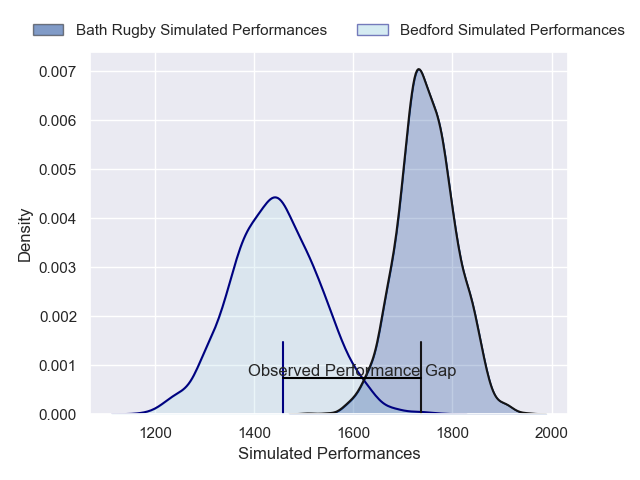
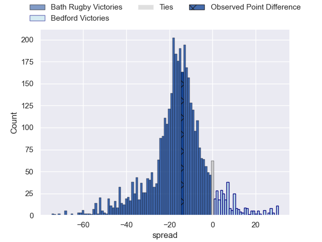
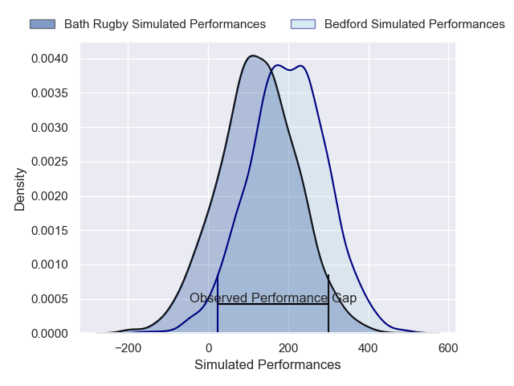
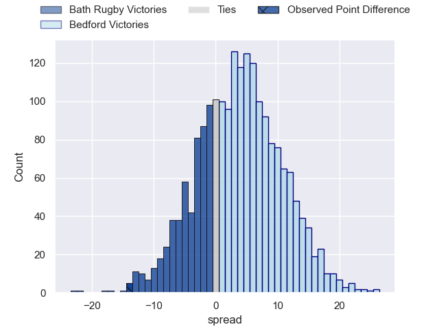
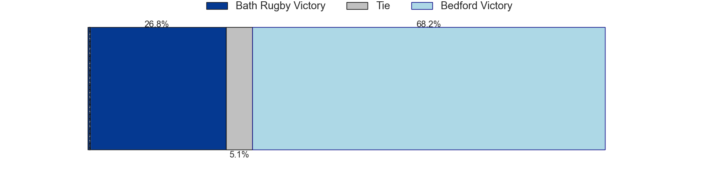

---  
layout: page  
title: Bath Rugby at Bedford; 21-7  
date: 2024-11-23 18:00:00 -0500  
categories: "Premiership Rugby Cup 2024" match review  
---
# Bath Rugby at Bedford; 21-7

# Club Level Predictions

The first set of predictions treats a club as the smallest object, as the club develops its members, organizes a gameplan, and deploys its players as needed for each match. This club model has a prediction of 0.152, which translates to predicting Bath Rugby to win by 15.2.

Our Over/Under is 52.5 - and combined with the spread above, we have a predicted scoreline of 34 to 19

Each club has a rating and a rating deviation (similar to a Glicko rating), and expected performances can be generated. This allows for simulated matches and spreads like the ones below.
## Projected Performances - Club Model

## Projected Spreads - Club Model

## Projected Results - Club Model

# Player Level Predictions

Treating teams instead as an entity made up of the currently active players, I have ratings for each player in an altogether different system. These can be combined to form team ratings once teamsheets are announced, weighting starters a bit higher than the reserves. After the match is played, players can be weighted by their minutes on the field, allowing for an accurate measure of the team's composition. With these compiled team ratings, we can make predictions, measure inaccuracy, and update the individual player ratings.
## Prediction without Player Minutes: Bedford by 4.1

Bath Rugby by 0.5 on a neutral pitch

## Projected Performances - Player Model

## Projected Spreads - Player Model

## Projected Results - Player Model

|   Away Minutes | Away Player         |   Away Percentile |   Number |   Home Percentile | Home Player        |   Home Minutes |
|---------------:|:--------------------|------------------:|---------:|------------------:|:-------------------|---------------:|
|             53 | Arthur Cordwell     |             65.05 |        1 |             35.17 | Joey Conway        |             80 |
|             29 | Jasper Spandler     |             44.34 |        2 |             33.49 | Tommy Herman       |             35 |
|              5 | Kieran Verden       |             35.91 |        3 |             37.82 | Beltus Nonleh      |             24 |
|              5 | Mackenzie Graham    |             50.4  |        4 |             37.47 | Rory Ward          |             35 |
|              8 | Ewan Richards       |             58.46 |        5 |             76.17 | George Smith       |             22 |
|              3 | Ethan Staddon       |             47.8  |        6 |             48.15 | Fyn Brown          |             22 |
|             22 | Tom Cowan           |             32.69 |        7 |             59.14 | Joe Howard         |             19 |
|             12 | Alfie Barbeary      |             86.74 |        8 |             33.52 | Fred Tuilagi       |             19 |
|             24 | Tom Carr-Smith      |             49.92 |        9 |             39.55 | Alex Day           |              0 |
|              2 | Orlando Bailey      |             89.4  |       10 |             26.2  | Will Maisey        |             80 |
|             48 | Ruaridh McConnochie |             93.64 |       11 |             48.13 | Dean Adamson       |             64 |
|             60 | Max Ojomoh          |             93.69 |       12 |             31.26 | Joel Matavesi      |             69 |
|             60 | Louie Hennessey     |             31.73 |       13 |             52.73 | Lucas Titherington |             80 |
|             80 | Regan Grace         |             70.33 |       14 |             30.95 | Alfie Garside      |             80 |
|             65 | Austin Emens        |             74.22 |       15 |             77.93 | Louis James        |             22 |
|             80 | Kepu Tuipulotu      |            nan    |       16 |            nan    | Nathan Langdon     |             22 |
|             15 | Archie Stanley      |            nan    |       17 |            nan    | Jamie Jack         |              6 |
|             15 | Mikey Summerfield   |            nan    |       18 |            nan    | Oisin Heffernan    |             16 |
|             27 | Arthur Green        |            nan    |       19 |            nan    | Shay Kerry         |             11 |
|             60 | Jaco Coetzee        |             58.33 |       20 |            nan    | Luke Frost         |              4 |
|             60 | Neil Le Roux        |            nan    |       21 |            nan    | Jac Arthur         |             16 |
|             56 | Ciaran Donoghue     |            nan    |       22 |            nan    | Jonny Weimann      |             80 |
|             56 | Will Parry          |            nan    |       23 |             82.03 | Matt Worley        |             22 |

