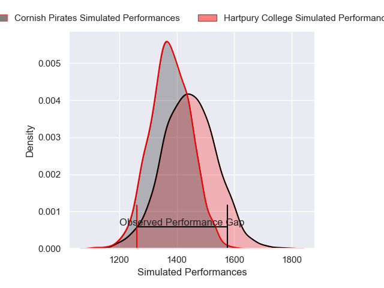
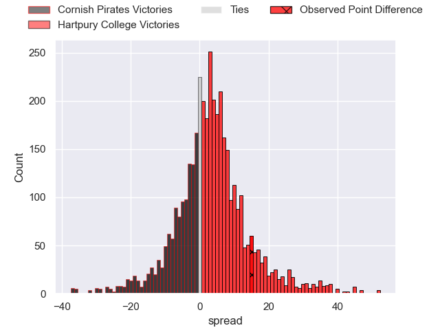
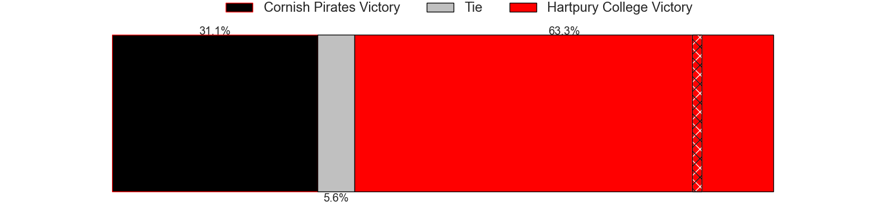
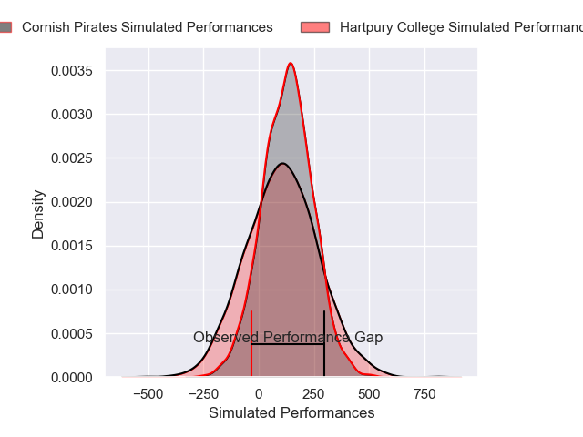
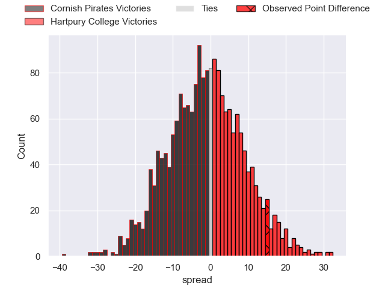

---  
layout: page  
title: Cornish Pirates at Hartpury College; 26-41  
date: 2024-11-23 18:00:00 -0500  
categories: "Premiership Rugby Cup 2024" match review  
---
# Cornish Pirates at Hartpury College; 26-41

# Club Level Predictions

The first set of predictions treats a club as the smallest object, as the club develops its members, organizes a gameplan, and deploys its players as needed for each match. This club model has a prediction of 0.59, which translates to predicting Hartpury College to win by 3.2.

Our Over/Under is 48.5 - and combined with the spread above, we have a predicted scoreline of 23 to 26

Each club has a rating and a rating deviation (similar to a Glicko rating), and expected performances can be generated. This allows for simulated matches and spreads like the ones below.
## Projected Performances - Club Model

## Projected Spreads - Club Model

## Projected Results - Club Model

# Player Level Predictions

Treating teams instead as an entity made up of the currently active players, I have ratings for each player in an altogether different system. These can be combined to form team ratings once teamsheets are announced, weighting starters a bit higher than the reserves. After the match is played, players can be weighted by their minutes on the field, allowing for an accurate measure of the team's composition. With these compiled team ratings, we can make predictions, measure inaccuracy, and update the individual player ratings.
## Prediction without Player Minutes: Cornish Pirates by 4.4

Cornish Pirates by 8.5 on a neutral pitch

## Projected Performances - Player Model

## Projected Spreads - Player Model

## Projected Results - Player Model

|   Away Minutes | Away Player       |   Away Percentile |   Number |   Home Percentile | Home Player           |   Home Minutes |
|---------------:|:------------------|------------------:|---------:|------------------:|:----------------------|---------------:|
|             40 | Billy Young       |             35.69 |        1 |             73.66 | Toti Benz-Salomon     |             54 |
|             40 | Billy Young       |             35.69 |        1 |             73.66 | Toti Benz-Salomon     |             80 |
|             69 | Sol Moody         |             29.2  |        2 |             21.41 | Will Crane            |             62 |
|              0 | James French      |             45.47 |        3 |             69.83 | Jono Benz-Salomon     |             80 |
|              0 | James French      |             45.47 |        3 |             69.83 | Jono Benz-Salomon     |             74 |
|             11 | Charlie Rice      |             40.66 |        4 |             19.49 | Cameron Cobbett       |             62 |
|             36 | Eoin O'Connor     |             39.59 |        5 |             30.29 | Jack Davies           |             45 |
|             18 | Josh King         |             52.02 |        6 |             22.5  | Sam Lewis             |             45 |
|             11 | Will Gibson       |             49.21 |        7 |             18.89 | Harry Short           |             71 |
|             23 | Hugh Bokenham     |             62.69 |        8 |             29.92 | Jarrard Hayler        |             80 |
|             21 | Cam Jones         |             40.83 |        9 |             64.59 | Mike Austin           |             80 |
|             18 | Iwan Jenkins      |             58.8  |       10 |             29.8  | Harry Bazalgette      |             56 |
|             80 | Robin Wedlake     |             43.99 |       11 |             65.39 | Ollie Holliday        |             68 |
|             80 | Charlie Mccaig    |             27.21 |       12 |             16.01 | Robbie Smith          |             61 |
|             80 | Matt Mcnab        |             38.51 |       13 |             50.09 | Jack Johnson          |             61 |
|             44 | Arthur Relton     |             65.31 |       14 |             35.16 | Bradley Denty         |             80 |
|             61 | Will Trewin       |             25.39 |       15 |             44.92 | Alex Morgan           |             80 |
|             25 | Harry Hocking     |            nan    |       16 |            nan    | Ethan Hunt            |             40 |
|             16 | Oisin Michel      |            nan    |       17 |            nan    | Archie Mcarthur       |             80 |
|             11 | Jay Tyack         |            nan    |       18 |            nan    | Joe Rees              |             54 |
|             80 | Matt Cannon       |            nan    |       19 |            nan    | Carn Richards-Farr    |             61 |
|             67 | Tomiwa Agbongbon  |            nan    |       20 |            nan    | Deian Gwynne          |             80 |
|             42 | Dan Hiscocks      |            nan    |       21 |            nan    | Matty Jones           |             80 |
|             80 | Bruce Houston     |            nan    |       22 |            nan    | Josiah Edwards-Giraud |             80 |
|             80 | Iwan Price-Thomas |            nan    |       23 |            nan    | Morgan Adderly-Jones  |             80 |

