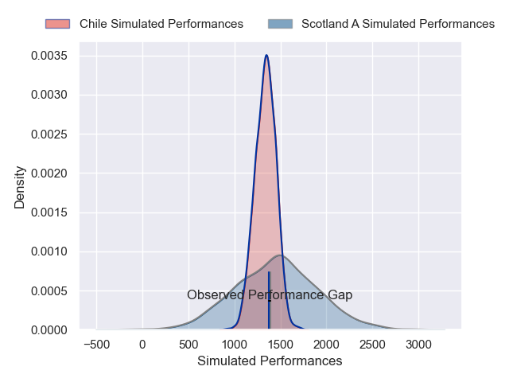
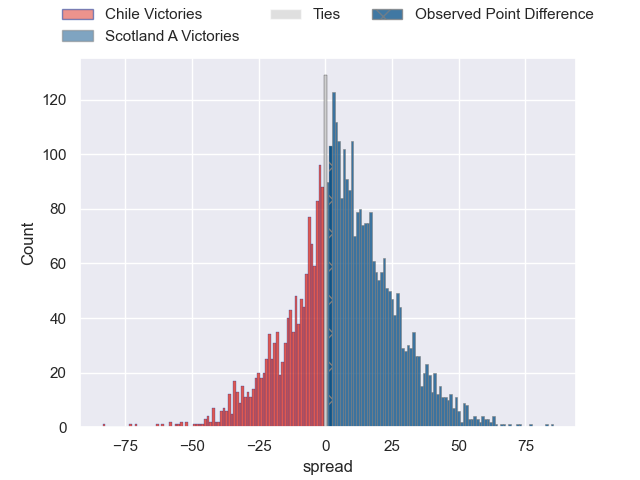
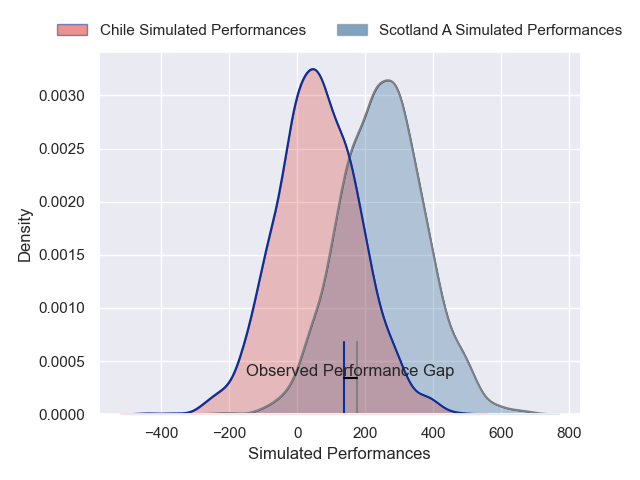
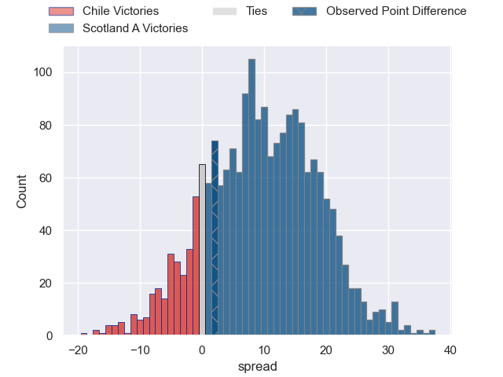
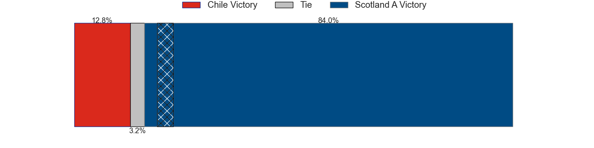

---  
layout: page  
title: Chile at Scotland A; 17-19  
date: 2024-11-23 18:00:00 -0500  
categories: "Developmental International 2024" match review  
---
# Chile at Scotland A; 17-19

# Club Level Predictions

The first set of predictions treats a club as the smallest object, as the club develops its members, organizes a gameplan, and deploys its players as needed for each match. This club model has a prediction of 0.667, which translates to predicting Scotland A to win by 6.4.

Our Over/Under is 64.5 - and combined with the spread above, we have a predicted scoreline of 29 to 36

Each club has a rating and a rating deviation (similar to a Glicko rating), and expected performances can be generated. This allows for simulated matches and spreads like the ones below.
## Projected Performances - Club Model

## Projected Spreads - Club Model

## Projected Results - Club Model

# Player Level Predictions

Treating teams instead as an entity made up of the currently active players, I have ratings for each player in an altogether different system. These can be combined to form team ratings once teamsheets are announced, weighting starters a bit higher than the reserves. After the match is played, players can be weighted by their minutes on the field, allowing for an accurate measure of the team's composition. With these compiled team ratings, we can make predictions, measure inaccuracy, and update the individual player ratings.
## Prediction without Player Minutes: Scotland A by 9.8

Scotland A by 7.7 on a neutral pitch

## Projected Performances - Player Model

## Projected Spreads - Player Model

## Projected Results - Player Model

|   Away Minutes | Away Player             |   Away Percentile |   Number |   Home Percentile | Home Player        |   Home Minutes |
|---------------:|:------------------------|------------------:|---------:|------------------:|:-------------------|---------------:|
|             66 | Javier Carrasco         |             53.47 |        1 |             96.68 | Jamie Bhatti       |             66 |
|             66 | Diego Escobar Alvarez   |             79.14 |        2 |             78.37 | Gregor Hiddleston  |             66 |
|             66 | Inaki Gurruchaga Suarez |             72.64 |        3 |             34.44 | D'Arcy Rae         |             66 |
|             66 | Santiago Pedrero        |             54.97 |        4 |             86.5  | Marshall Sykes     |             17 |
|             66 | Bruno Sáez              |             60.66 |        5 |             39.7  | Ewan Johnson       |             80 |
|             66 | Martin Sigren           |             66.49 |        6 |             42.66 | Tom Dodd           |             68 |
|             66 | Clemente Saavedra       |             26.47 |        7 |             47.41 | Freddy Douglas     |             70 |
|             66 | Alfonso Escobar         |             45.16 |        8 |             37.95 | Ben Muncaster      |             63 |
|             66 | Benjamin Videla         |             77.16 |        9 |             93.93 | Jamie Dobie        |             70 |
|             66 | Juan Cruz Reyes         |             57.49 |       10 |             80.84 | Ross Thompson      |             71 |
|             66 | Matias Garafulic        |             20.03 |       11 |             15.08 | Ross McCann        |             56 |
|             66 | Santiago Videla         |             56.06 |       12 |             91.57 | Stafford McDowall  |             63 |
|             66 | Domingo Saavedra        |             38.26 |       13 |             19.03 | Mosese Tuipulotu   |             80 |
|             66 | Cristobal Game Jimenez  |             65.6  |       14 |             88.03 | Matt Currie        |             58 |
|             66 | Luca Strabucchi         |             83.2  |       15 |              1.95 | Arron Reed         |             66 |
|             30 | Augusto Bohme Alemparte |             13.19 |       16 |            nan    | Harri Morris       |             80 |
|             30 | Norman Aguayo           |            nan    |       17 |            nan    | Mikey Jones        |             30 |
|             30 | Matias Dittus           |             14.23 |       18 |            nan    | Fin Richardson     |             30 |
|             30 | Raimundo Martinez       |             39.75 |       19 |            nan    | Olujare Oguntibeju |             30 |
|             30 | Ernesto Tchimino        |             47.25 |       20 |            nan    | Liam Mcconnell     |             30 |
|             30 | Marcelo Torrealba       |              3.67 |       21 |             33.87 | Ben Afshar         |             30 |
|             80 | Rodrigo Fernandez       |             22.36 |       22 |             85.43 | Ben Healy          |             30 |
|             18 | Nicolas Garafulic Schar |             75.02 |       23 |            nan    | Jack Brown         |             30 |

