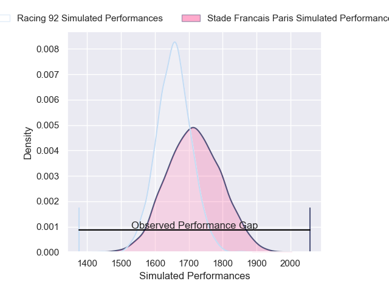
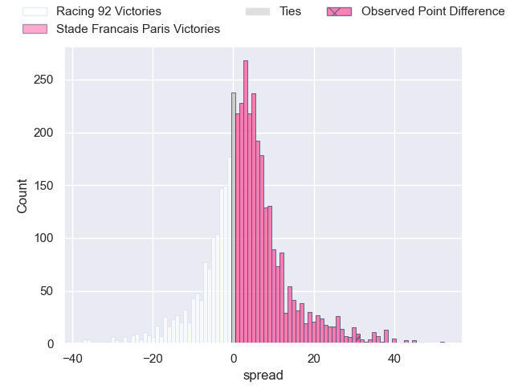
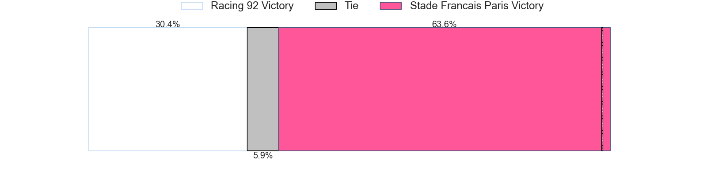
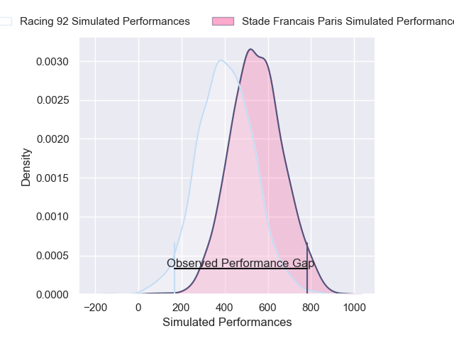
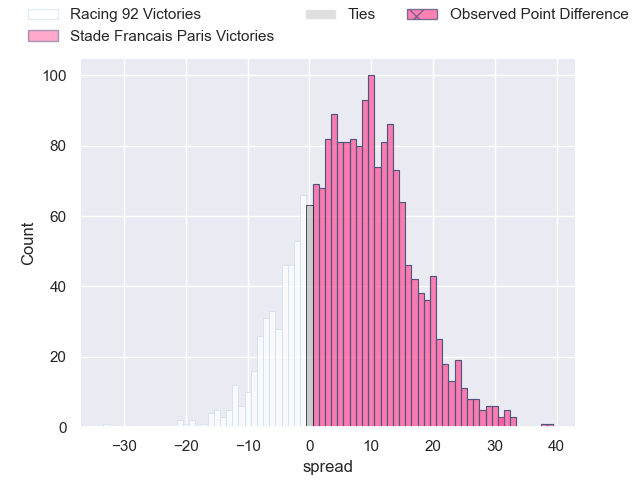
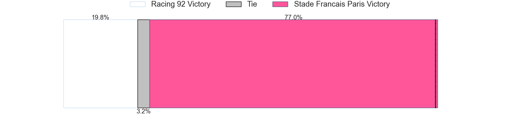

---  
layout: page  
title: Racing 92 at Stade Francais Paris; 12-43  
date: 2024-11-24 18:00:00 -0500  
categories: "Top 14 Orange 2024" match review  
---
# Racing 92 at Stade Francais Paris; 12-43

# Club Level Predictions

The first set of predictions treats a club as the smallest object, as the club develops its members, organizes a gameplan, and deploys its players as needed for each match. This club model has a prediction of 0.585, which translates to predicting Stade Francais Paris to win by 3.0.

Our Over/Under is 51.5 - and combined with the spread above, we have a predicted scoreline of 24 to 27

Each club has a rating and a rating deviation (similar to a Glicko rating), and expected performances can be generated. This allows for simulated matches and spreads like the ones below.
## Projected Performances - Club Model

## Projected Spreads - Club Model

## Projected Results - Club Model

# Player Level Predictions

Treating teams instead as an entity made up of the currently active players, I have ratings for each player in an altogether different system. These can be combined to form team ratings once teamsheets are announced, weighting starters a bit higher than the reserves. After the match is played, players can be weighted by their minutes on the field, allowing for an accurate measure of the team's composition. With these compiled team ratings, we can make predictions, measure inaccuracy, and update the individual player ratings.
## Prediction without Player Minutes: Stade Francais Paris by 10.2

Racing 92 by 5.2 on a neutral pitch

## Projected Performances - Player Model

## Projected Spreads - Player Model

## Projected Results - Player Model

|   Away Minutes | Away Player         |   Away Percentile |   Number |   Home Percentile | Home Player          |   Home Minutes |
|---------------:|:--------------------|------------------:|---------:|------------------:|:---------------------|---------------:|
|             71 | Eddy Ben Arous      |             94.1  |        1 |             42.33 | Moses Alo-Emile      |             47 |
|             71 | Camille Chat        |             89.88 |        2 |             26.84 | Lucas Peyresblanques |             51 |
|             65 | Thomas Laclayat     |             71.46 |        3 |             80.16 | Paul Alo-Emile       |             23 |
|             80 | Boris Palu          |             90.32 |        4 |              7.19 | Paul Gabrillagues    |             49 |
|             59 | Fabien Sanconnie    |             47.07 |        5 |             71.76 | Baptiste Pesenti     |             26 |
|             68 | Junior Kpoku        |             86.72 |        6 |             17.33 | Tanginoa Halaifonua  |             81 |
|             45 | Ibrahim Diallo      |             36.32 |        7 |             32.37 | Romain Briatte       |             81 |
|             80 | Maxime Baudonne     |             74.76 |        8 |             74.19 | Yoan Tanga           |             66 |
|             32 | Clovis Le Bail      |             54.47 |        9 |             97.6  | Brad Weber           |             81 |
|             61 | Antoine Gibert      |             94.19 |       10 |             57.92 | Louis Carbonel       |             10 |
|             26 | Wame Naituvi        |             85.09 |       11 |             79.27 | Lester Etien         |             33 |
|             30 | Dan Lancaster       |              5.66 |       12 |             90.57 | Julien Delbouis      |             30 |
|             69 | Henry Chavancy      |             97.45 |       13 |             76.04 | Jeremy Ward          |             81 |
|             32 | Henry Arundell      |             21.93 |       14 |             79.74 | Peniasi Dakuwaqa     |             81 |
|             59 | Sam James           |             94.53 |       15 |             56.05 | Joe Jonas            |             34 |
|             59 | Feleti Kaitu'u      |             39.11 |       16 |            nan    | Mamoudou Meite       |             81 |
|             80 | Guram Gogichashvili |             77.06 |       17 |             64.82 | Sergo Abramishvili   |             30 |
|             80 | Guram Gogichashvili |             77.06 |       17 |             64.82 | Sergo Abramishvili   |             24 |
|             80 | Cameron Woki        |             95.43 |       18 |             89.34 | JJ van der Mescht    |             70 |
|             12 | Noa Zinzen          |            nan    |       19 |             81    | Sekou Macalou        |             81 |
|             45 | Hacjivah Dayimani   |             92.98 |       20 |            nan    | Thibaut Motassi      |             49 |
|             45 | Tristan Tedder      |             48.63 |       21 |             82.77 | Zack Henry           |             55 |
|             49 | Max Spring          |             14.26 |       22 |             49.52 | Joe Marchant         |             81 |
|             58 | Gia Kharaishvili    |             65.63 |       23 |             31.93 | Hugo Ndiaye          |             61 |

