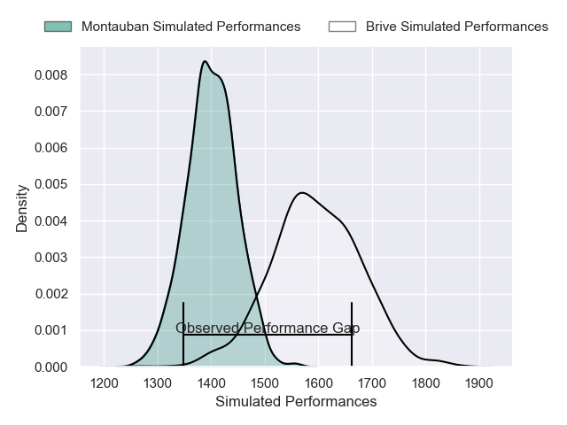
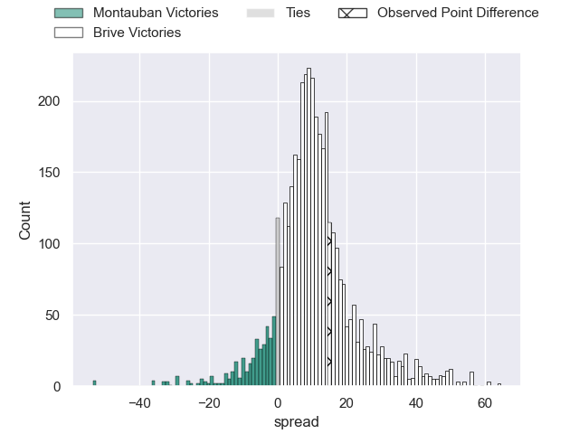
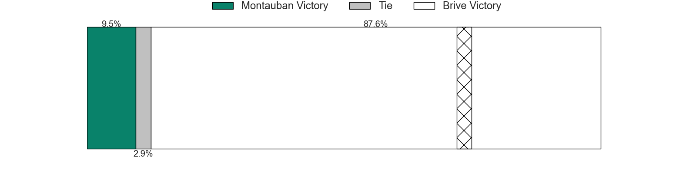
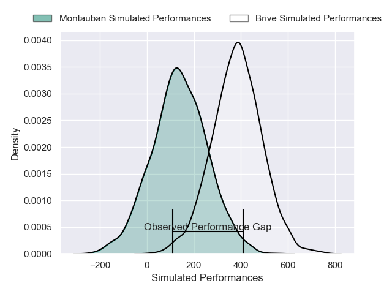
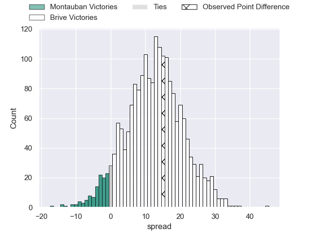
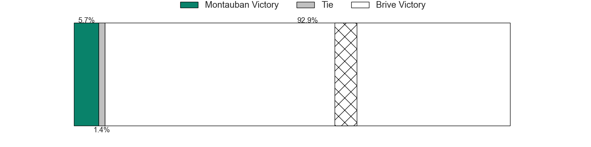

---  
layout: page  
title: Montauban at Brive; 22-37  
date: 2024-11-28 18:00:00 -0500  
categories: "Pro D2 2024" match review  
---
# Montauban at Brive; 22-37

# Club Level Predictions

The first set of predictions treats a club as the smallest object, as the club develops its members, organizes a gameplan, and deploys its players as needed for each match. This club model has a prediction of 0.752, which translates to predicting Brive to win by 9.8.

Our Over/Under is 61.5 - and combined with the spread above, we have a predicted scoreline of 26 to 36

Each club has a rating and a rating deviation (similar to a Glicko rating), and expected performances can be generated. This allows for simulated matches and spreads like the ones below.
## Projected Performances - Club Model

## Projected Spreads - Club Model

## Projected Results - Club Model

# Player Level Predictions

Treating teams instead as an entity made up of the currently active players, I have ratings for each player in an altogether different system. These can be combined to form team ratings once teamsheets are announced, weighting starters a bit higher than the reserves. After the match is played, players can be weighted by their minutes on the field, allowing for an accurate measure of the team's composition. With these compiled team ratings, we can make predictions, measure inaccuracy, and update the individual player ratings.
## Prediction without Player Minutes: Brive by 11.7

Montauban by 1.2 on a neutral pitch

## Projected Performances - Player Model

## Projected Spreads - Player Model

## Projected Results - Player Model

|   Away Minutes | Away Player       |   Away Percentile |   Number |   Home Percentile | Home Player               |   Home Minutes |
|---------------:|:------------------|------------------:|---------:|------------------:|:--------------------------|---------------:|
|             80 | Lucas Seyrolle    |             47.38 |        1 |             59.39 | Vakh Abdaladze            |             34 |
|             44 | Ru-Hann Greyling  |             70.84 |        2 |             48.16 | Lucas Da Silva            |             34 |
|             32 | Luka Azariashvili |             61.03 |        3 |             59.39 | Marcel Van Der Merwe      |             34 |
|             36 | Tjiuee Uanivi     |             22.8  |        4 |             51.02 | Tevita Ratuva             |             34 |
|             29 | Kévin Gimeno      |             48.22 |        5 |              8.05 | Konstantin Mikautadze     |             40 |
|             51 | Fred Quercy       |             63.34 |        6 |             62.84 | Matthieu Voisin           |             66 |
|             40 | Kyllian Ringuet   |             59.63 |        7 |             96.54 | Courtney Lawes            |             80 |
|             80 | Sikhumbuzo Notshe |             80.11 |        8 |             56.63 | Rahboni Warren-Vosayaco   |             36 |
|             44 | Yoan Cottin       |             44.95 |        9 |             62.99 | Léo Carbonneau            |             33 |
|             36 | Thomas Fortunel   |             41.52 |       10 |             53.8  | Stuart Olding             |             33 |
|             36 | Josua Vici        |             64.56 |       11 |             60.51 | Erwan Dridi               |             47 |
|              0 | Jt Jackson        |             65.65 |       12 |             55.46 | Sam Johnson               |             80 |
|             46 | Maxime Espeut     |             40.65 |       13 |             44.07 | Georges Shvelidze         |             56 |
|             46 | Stephane Ahmed    |             96.17 |       14 |             58.86 | Asaeli Tuivuaka           |             63 |
|             46 | Baptiste Mouchous |             57.85 |       15 |             59.49 | Mathis Ferté              |             69 |
|             56 | Jérémie Maurouard |             71.58 |       16 |            nan    | Benjamin Boudou           |             46 |
|             80 | Thomas Bué        |            nan    |       17 |            nan    | Nathan Fraissenon         |             57 |
|             34 | Frank Bradshaw    |             58.64 |       18 |             58.98 | Asier Usarraga Latierro   |             33 |
|             67 | Noa Kanika        |             62.08 |       19 |            nan    | Retief Marais             |             80 |
|             59 | Karl Wilkins      |            nan    |       20 |             40.32 | Taniela Sadrugu           |             30 |
|             80 | Maël Castel       |            nan    |       21 |             53.5  | Hugo Verdu                |              0 |
|             40 | Simon Renda       |             50    |       22 |            nan    | Timilai Rokoduru          |             70 |
|             80 | Tietie Tuimauga   |             58.58 |       23 |            nan    | Francisco Coria Marchetti |             80 |

