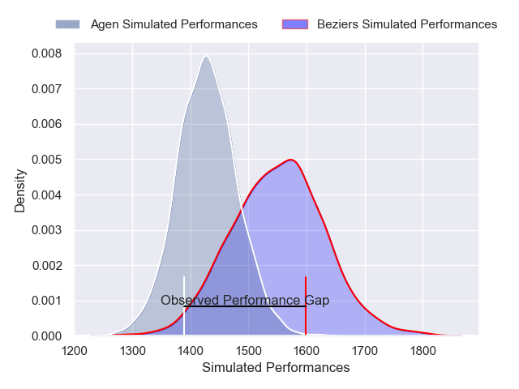
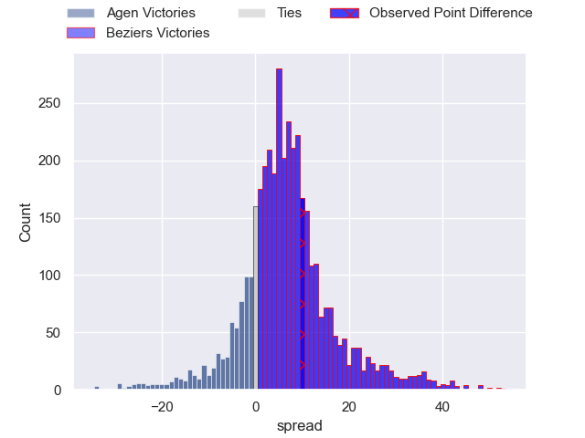
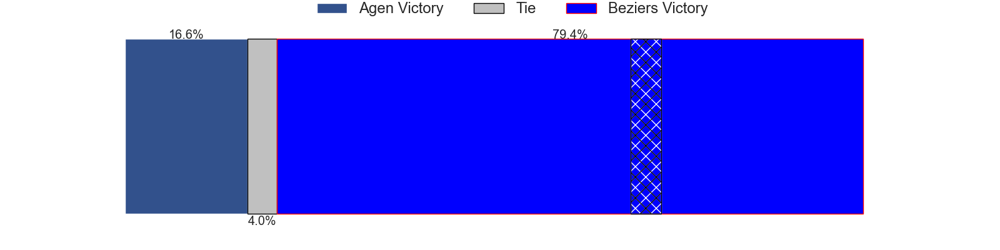
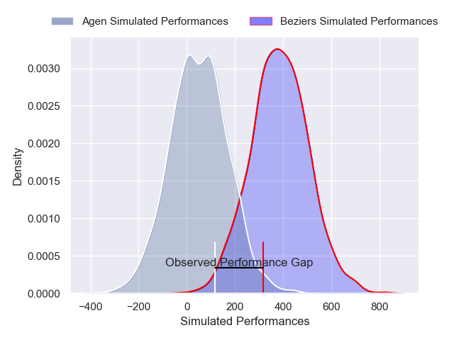
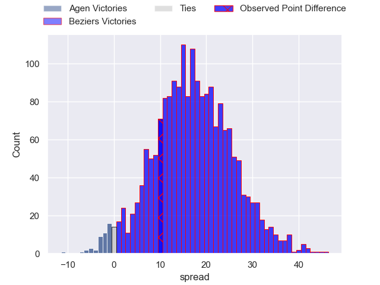
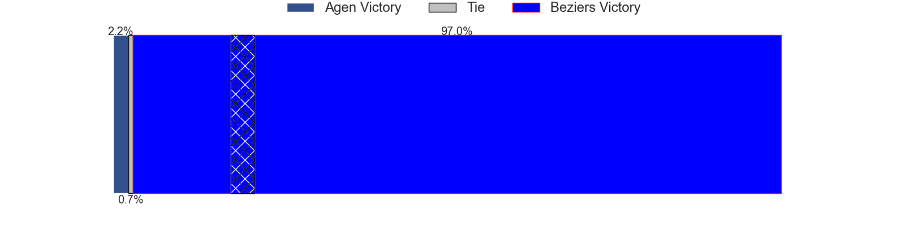

---  
layout: page  
title: Agen at Beziers; 24-34  
date: 2024-11-29 18:00:00 -0500  
categories: "Pro D2 2024" match review  
---
# Agen at Beziers; 24-34

# Club Level Predictions

The first set of predictions treats a club as the smallest object, as the club develops its members, organizes a gameplan, and deploys its players as needed for each match. This club model has a prediction of 0.665, which translates to predicting Beziers to win by 6.0.

Our Over/Under is 56.5 - and combined with the spread above, we have a predicted scoreline of 25 to 31

Each club has a rating and a rating deviation (similar to a Glicko rating), and expected performances can be generated. This allows for simulated matches and spreads like the ones below.
## Projected Performances - Club Model

## Projected Spreads - Club Model

## Projected Results - Club Model

# Player Level Predictions

Treating teams instead as an entity made up of the currently active players, I have ratings for each player in an altogether different system. These can be combined to form team ratings once teamsheets are announced, weighting starters a bit higher than the reserves. After the match is played, players can be weighted by their minutes on the field, allowing for an accurate measure of the team's composition. With these compiled team ratings, we can make predictions, measure inaccuracy, and update the individual player ratings.
## Prediction without Player Minutes: Beziers by 15.4

Beziers by 1.0 on a neutral pitch

## Projected Performances - Player Model

## Projected Spreads - Player Model

## Projected Results - Player Model

|   Away Minutes | Away Player         |   Away Percentile |   Number |   Home Percentile | Home Player            |   Home Minutes |
|---------------:|:--------------------|------------------:|---------:|------------------:|:-----------------------|---------------:|
|             47 | Hans Lombard-Buret  |             68.89 |        1 |             71.44 | Yahnis El Maslouhi     |             16 |
|             80 | Santiago Socino     |             88.53 |        2 |             70.7  | Wilmar Arnoldi         |             53 |
|             80 | Alex Burin          |             53.91 |        3 |             49.61 | Christian Judge        |             49 |
|             52 | Evan Olmstead       |              4.21 |        4 |              2.98 | Shahn Eru              |             53 |
|             55 | Javier Eissmann     |              4.12 |        5 |             37.37 | Pierre Gayraud         |             31 |
|             52 | Julien Lebian       |             31.12 |        6 |             27.24 | William van Bost       |             38 |
|             32 | Tomasi Fineanganofo |             46.12 |        7 |             19.74 | Gillian Benoy          |             80 |
|             52 | Valentin Gayraud    |             50.63 |        8 |             65.46 | Baptiste Abescat-Leroy |             80 |
|             54 | Dorian Bellot       |             55.34 |        9 |             70.28 | Damien Añon            |             67 |
|             57 | Billy Searle        |              5.4  |       10 |             22.8  | Charly Malie           |             45 |
|             80 | Iban Etcheverry     |             25.41 |       11 |             72.24 | Nicolas Plazy          |             80 |
|             80 | Clement Garrigues   |             25.7  |       12 |             81.47 | Taylor Gontineac       |             49 |
|             30 | Peyo Muscarditz     |             80.41 |       13 |             59.07 | Paul Recor             |             56 |
|             80 | Lucas Martins       |             73.49 |       14 |             29.01 | Pierre Courtaud        |             56 |
|             30 | Franck Pourteau     |             90    |       15 |             76.35 | Gabin Lorre            |             80 |
|             30 | Vincent Farre       |             36.84 |       16 |             76.19 | Samuel Marques         |             67 |
|             28 | Matthieu Bonnet     |             33.28 |       17 |             51.36 | Sias Koen              |             60 |
|             26 | Hayam El Bibouji    |             81.86 |       18 |             64.83 | Marco Trauth           |             80 |
|             54 | Beau Farrance       |             49.24 |       19 |             67.99 | Watisoni Votu          |             80 |
|             21 | Jack Maunder        |             77.67 |       20 |             80.09 | Clement Doumenc        |             15 |
|             80 | Kolinio Ramoka      |             67.31 |       21 |             64.58 | Yannick Arroyo         |             13 |
|             28 | Mamuka Mstoiani     |             50.52 |       22 |             20.31 | Yanis Boulassel        |             80 |
|             23 | Thibaud Mazzoleni   |             57.94 |       23 |             11.92 | Victor Dreuille        |             57 |

