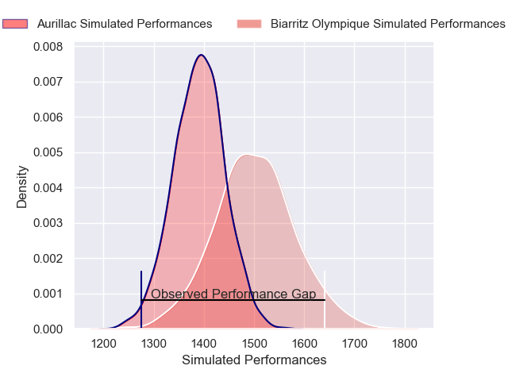
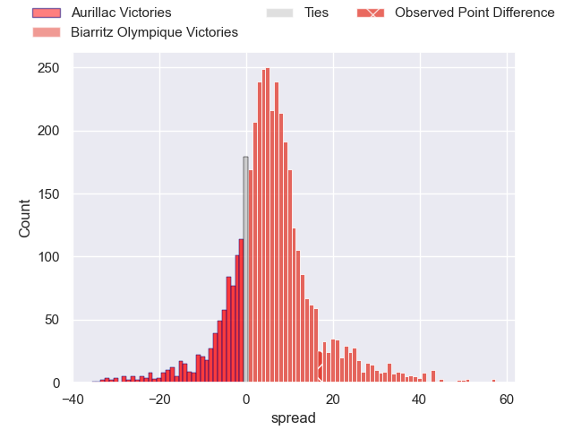
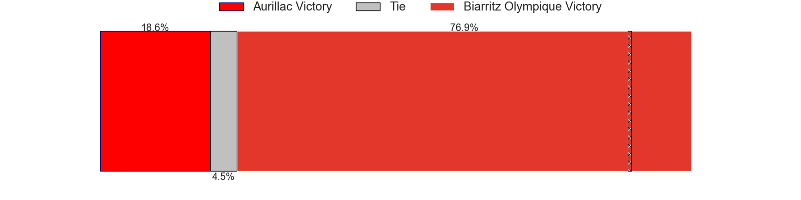
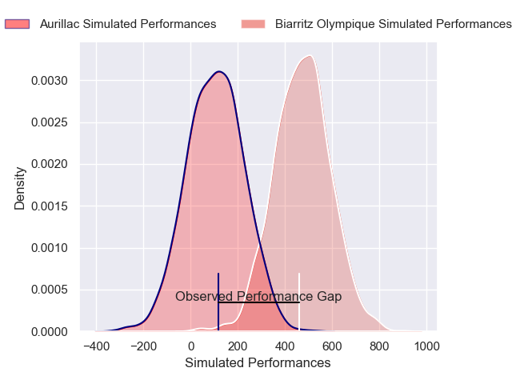
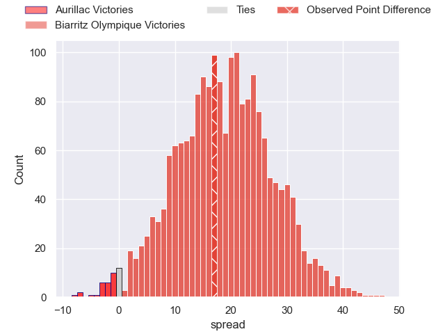
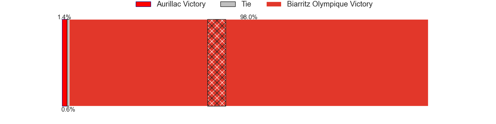

---  
layout: page  
title: Aurillac at Biarritz Olympique; 6-23  
date: 2024-11-29 18:00:00 -0500  
categories: "Pro D2 2024" match review  
---
# Aurillac at Biarritz Olympique; 6-23

# Club Level Predictions

The first set of predictions treats a club as the smallest object, as the club develops its members, organizes a gameplan, and deploys its players as needed for each match. This club model has a prediction of 0.655, which translates to predicting Biarritz Olympique to win by 5.7.

Our Over/Under is 50.5 - and combined with the spread above, we have a predicted scoreline of 23 to 28

Each club has a rating and a rating deviation (similar to a Glicko rating), and expected performances can be generated. This allows for simulated matches and spreads like the ones below.
## Projected Performances - Club Model

## Projected Spreads - Club Model

## Projected Results - Club Model

# Player Level Predictions

Treating teams instead as an entity made up of the currently active players, I have ratings for each player in an altogether different system. These can be combined to form team ratings once teamsheets are announced, weighting starters a bit higher than the reserves. After the match is played, players can be weighted by their minutes on the field, allowing for an accurate measure of the team's composition. With these compiled team ratings, we can make predictions, measure inaccuracy, and update the individual player ratings.
## Prediction without Player Minutes: Biarritz Olympique by 18.2

Biarritz Olympique by 2.8 on a neutral pitch

## Projected Performances - Player Model

## Projected Spreads - Player Model

## Projected Results - Player Model

|   Away Minutes | Away Player             |   Away Percentile |   Number |   Home Percentile | Home Player             |   Home Minutes |
|---------------:|:------------------------|------------------:|---------:|------------------:|:------------------------|---------------:|
|             17 | Robbie Rodgers          |             56.15 |        1 |             52.69 | Giorgi Nutsubidze       |             55 |
|             62 | Basa Khonelidze         |             55.67 |        2 |             54.79 | Yohan Beheregaray       |             54 |
|             80 | Dominic Robertson-McCoy |             40.22 |        3 |             49.4  | Giorgi Dzmanashvili (2) |             31 |
|             74 | Martial Rolland         |             55.91 |        4 |             50.21 | Charlie Matthews        |             32 |
|              0 | Mosa'Ati Moala          |             55.49 |        5 |             80.09 | Piula Fa'asalele        |             53 |
|             24 | Eoghan Masterson        |             55.82 |        6 |             49.49 | Jessy Jegerlehner       |             16 |
|             40 | Lucas Oudard            |             56.66 |        7 |             50.25 | Thomas Hébert           |             40 |
|             58 | Didier Tison            |             50.35 |        8 |             43.13 | Nafi Ma'Afu             |             28 |
|             19 | David Delarue           |             56.88 |        9 |             51.62 | Imanol Biscay           |             38 |
|             80 | Ugo Seunes              |             47.97 |       10 |             41.59 | Thomas Dolhagaray       |             53 |
|             24 | Aj Coertzen             |             56.63 |       11 |             51.1  | Gervais Cordin          |             49 |
|             39 | Karsen Talalua          |             42.51 |       12 |             46.98 | François Vergnaud       |             53 |
|             30 | Karl Martin             |             52.93 |       13 |             95.44 | Mathieu Acebes          |             80 |
|             80 | Juun Pieters            |             57.24 |       14 |             49.51 | Yohan Tapie             |             43 |
|             57 | Axel Bévia              |             52.47 |       15 |             44.06 | Kylian Jaminet          |             80 |
|             41 | Ronan Loughnane         |            nan    |       16 |             66.72 | Luteru Tolai            |             16 |
|             63 | Irakli Mtchedlidze      |             54.23 |       17 |            nan    | Alexandre Plantier      |             80 |
|             71 | Koen Bloemen            |             68.85 |       18 |            nan    | Levi Douglas            |             80 |
|             50 | Mael Perrin             |             48.42 |       19 |             51.94 | Ekain Imaz Agirre       |             80 |
|             52 | Tim De Jong             |             29.34 |       20 |            nan    | Kerman Aurrekoetxea     |             59 |
|             56 | Boris Hadinegoro        |            nan    |       21 |            nan    | Yann David              |             80 |
|             61 | Jean-Luc Cilliers       |            nan    |       22 |            nan    | Ilian Perraux           |             80 |
|             80 | Valentin Welsch         |            nan    |       23 |             72.69 | Solomone Tukuafu        |             80 |

