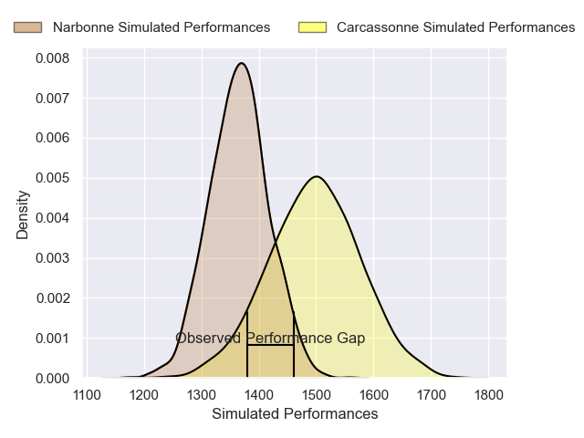
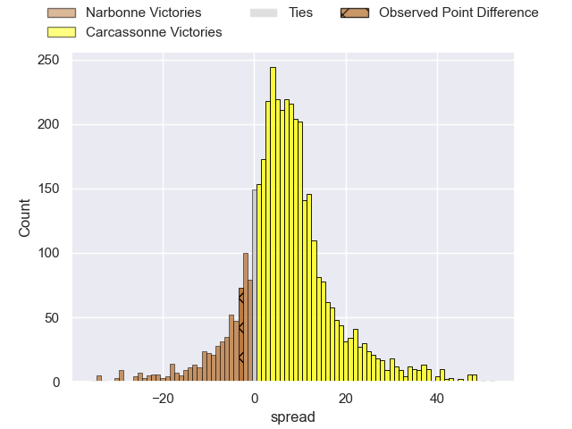
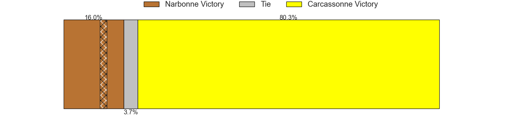
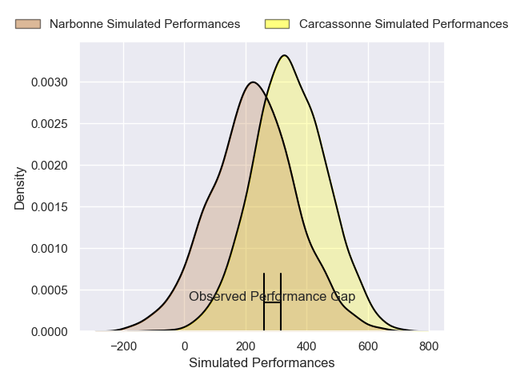
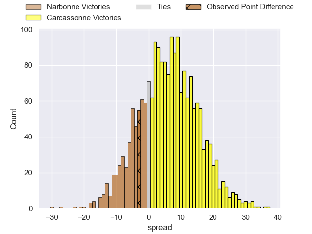
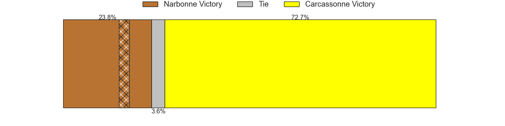

---  
layout: page  
title: Narbonne at Carcassonne; 18-15  
date: 2024-11-29 18:00:00 -0500  
categories: "Nationale 2024" match review  
---
# Narbonne at Carcassonne; 18-15

# Club Level Predictions

The first set of predictions treats a club as the smallest object, as the club develops its members, organizes a gameplan, and deploys its players as needed for each match. This club model has a prediction of 0.676, which translates to predicting Carcassonne to win by 6.5.

Our Over/Under is 48.5 - and combined with the spread above, we have a predicted scoreline of 21 to 27

Each club has a rating and a rating deviation (similar to a Glicko rating), and expected performances can be generated. This allows for simulated matches and spreads like the ones below.
## Projected Performances - Club Model

## Projected Spreads - Club Model

## Projected Results - Club Model

# Player Level Predictions

Treating teams instead as an entity made up of the currently active players, I have ratings for each player in an altogether different system. These can be combined to form team ratings once teamsheets are announced, weighting starters a bit higher than the reserves. After the match is played, players can be weighted by their minutes on the field, allowing for an accurate measure of the team's composition. With these compiled team ratings, we can make predictions, measure inaccuracy, and update the individual player ratings.
## Prediction without Player Minutes: Carcassonne by 10.9

Carcassonne by 1.8 on a neutral pitch

## Projected Performances - Player Model

## Projected Spreads - Player Model

## Projected Results - Player Model

|   Away Minutes | Away Player               |   Away Percentile |   Number |   Home Percentile | Home Player         |   Home Minutes |
|---------------:|:--------------------------|------------------:|---------:|------------------:|:--------------------|---------------:|
|             10 | Gregory Fichten           |             16.86 |        1 |             56.34 | Yan Arnold          |             28 |
|             80 | Clément Esteriola         |              9.77 |        2 |             54.11 | Raphael Carbou      |             80 |
|             80 | Chris Talakai             |             29.9  |        3 |             14.49 | Vakhtangi Akhobadze |             21 |
|             56 | Leva Fifita               |             13.6  |        4 |             54.3  | Romain Manchia      |             21 |
|             56 | Marius Antonescu          |             14.91 |        5 |             28.77 | Clément Fontaine    |             80 |
|             56 | Thibault Clauzade         |             81.81 |        6 |             12.84 | Valentin Sese       |             80 |
|             19 | Paul Belzons              |             13.28 |        7 |             82.76 | Etienne Herjean     |             52 |
|             59 | Lopeti Timani             |             79.93 |        8 |              7.23 | Thomas Hoarau       |             71 |
|             62 | Pierrick Nova             |             39.24 |        9 |             30.54 | Gaetan Pichon       |             59 |
|             80 | Gilles Bosch              |              9.6  |       10 |             61.8  | Johnny McPhillips   |             19 |
|             80 | Clément Clavières         |             42.92 |       11 |             29.09 | Naim Ben Alla       |             62 |
|             80 | Parataiso Silafai-Lea'ana |             70.61 |       12 |             29.97 | Jordan Puletua      |             80 |
|             80 | Peter Betham              |             98.93 |       13 |             29.19 | Mathys Barka        |             24 |
|             71 | Pierre-Hugo Ducom         |             13.29 |       14 |             93.43 | Clement Egiziano    |             24 |
|             71 | Thibault Santoro          |             31.92 |       15 |             36.92 | Nils Chalies        |             64 |
|             16 | Théo Castinel             |             72.59 |       16 |             41.12 | Florent Lorenzon    |             24 |
|             80 | Gabriel Atlan             |             66.05 |       17 |            nan    | Baptiste Moreno     |             24 |
|             80 | Livai Tikoipau            |             24.38 |       18 |             79.38 | Fabien Lorenzon     |             28 |
|             64 | Darrell Dyer              |             88.36 |       19 |             76.05 | Romain Guyot        |             80 |
|             80 | Luke Nakobukobua          |             92.67 |       20 |             25.78 | Corentin Bousquet   |             80 |
|             80 | Erwan Nicolas             |             58.62 |       21 |             34    | Ferdinand Dreno     |             80 |
|             31 | Tom Chauvet               |             31.8  |       22 |             80.92 | Paul Gadea          |             80 |
|             18 | Pierre Nueno              |             13.29 |       23 |             91.35 | Maxime Gianet       |             59 |

