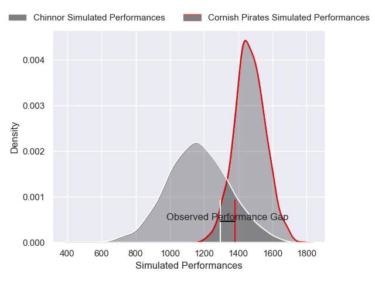
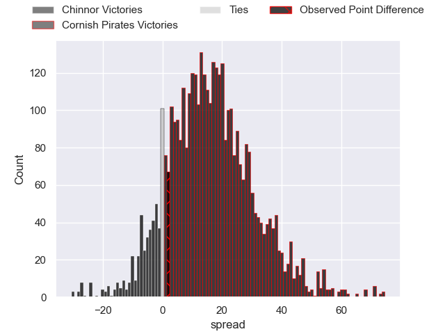
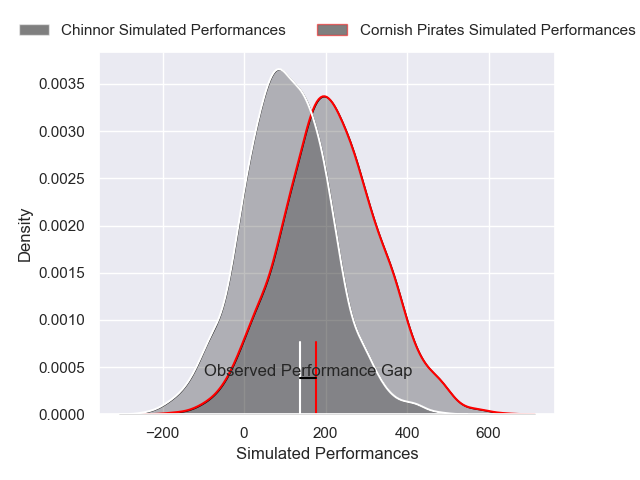
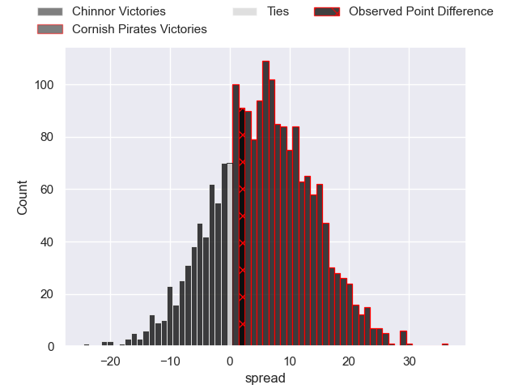

---  
layout: page  
title: Chinnor at Cornish Pirates; 13-15  
date: 2024-11-29 18:00:00 -0500  
categories: "RFU Championship 2024" match review  
---
# Chinnor at Cornish Pirates; 13-15

# Club Level Predictions

The first set of predictions treats a club as the smallest object, as the club develops its members, organizes a gameplan, and deploys its players as needed for each match. This club model has a prediction of 0.821, which translates to predicting Cornish Pirates to win by 15.2.

Our Over/Under is 59.5 - and combined with the spread above, we have a predicted scoreline of 22 to 37

Each club has a rating and a rating deviation (similar to a Glicko rating), and expected performances can be generated. This allows for simulated matches and spreads like the ones below.
## Projected Performances - Club Model

## Projected Spreads - Club Model

## Projected Results - Club Model

# Player Level Predictions

Treating teams instead as an entity made up of the currently active players, I have ratings for each player in an altogether different system. These can be combined to form team ratings once teamsheets are announced, weighting starters a bit higher than the reserves. After the match is played, players can be weighted by their minutes on the field, allowing for an accurate measure of the team's composition. With these compiled team ratings, we can make predictions, measure inaccuracy, and update the individual player ratings.
## Prediction without Player Minutes: Cornish Pirates by 5.2

Cornish Pirates by 0.7 on a neutral pitch

## Projected Performances - Player Model

## Projected Spreads - Player Model

## Projected Results - Player Model

|   Away Minutes | Away Player           |   Away Percentile |   Number |   Home Percentile | Home Player       |   Home Minutes |
|---------------:|:----------------------|------------------:|---------:|------------------:|:------------------|---------------:|
|             40 | Keston Lines          |             33.66 |        1 |             23.04 | Billy Keast       |             53 |
|             32 | Alun Walker           |             95.35 |        2 |             12.25 | Sol Moody         |             62 |
|             80 | Rob Hardwick          |             53.18 |        3 |             54.94 | James French      |             52 |
|             26 | Scott Hall            |             15.09 |        4 |             12.02 | Charlie Rice      |             80 |
|             26 | George Shaw           |             39.04 |        5 |             14.47 | Eoin O'Connor     |             80 |
|             29 | Harry Dugmore         |             63.28 |        6 |             65.52 | Josh King         |             40 |
|             64 | Kieran Curran         |             55.52 |        7 |             75.52 | Will Gibson       |             80 |
|             80 | Willie Ryan           |             74.14 |        8 |             55.7  | Hugh Bokenham     |             23 |
|             48 | Luke Carter           |             89.82 |        9 |             13.46 | Cam Jones         |             18 |
|             20 | Connor Slevin         |             37.2  |       10 |             71.6  | Bruce Houston     |             54 |
|             80 | Kieran Goss           |             54.1  |       11 |             18.76 | Matthew McNab     |             80 |
|             80 | Epi Rokodrava         |             34.92 |       12 |             42.97 | Harry Yates       |             80 |
|             56 | Morgan Passman        |             40.83 |       13 |             23.18 | Charlie McCaig    |             80 |
|             80 | Grant Hughes          |             45.82 |       14 |             68.1  | Arthur Relton     |             52 |
|             54 | William Feeney        |             29.42 |       15 |             72.12 | Will Trewin       |             80 |
|             14 | Alfie North           |            nan    |       16 |             58.4  | Jay Tyack         |             80 |
|             29 | George Richard Stokes |             44.74 |       17 |              6.08 | Dan HIscocks      |             48 |
|             29 | Tim Hoyt              |             35.48 |       18 |             19.47 | Billy Young       |             48 |
|             13 | Ethan Clarke          |            nan    |       19 |             41.93 | Matt Cannon       |             48 |
|             48 | Ryan Crowley          |            nan    |       20 |             46.51 | Harry Hocking     |             22 |
|             32 | Callum Pascoe         |            nan    |       21 |              8.85 | Iwan Price-Thomas |             80 |

