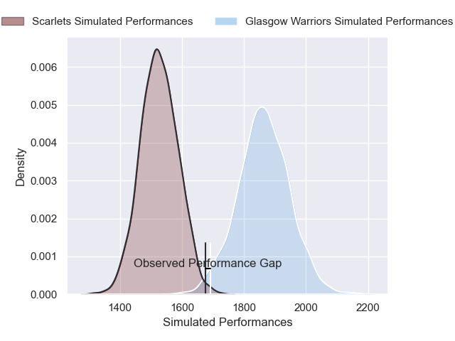
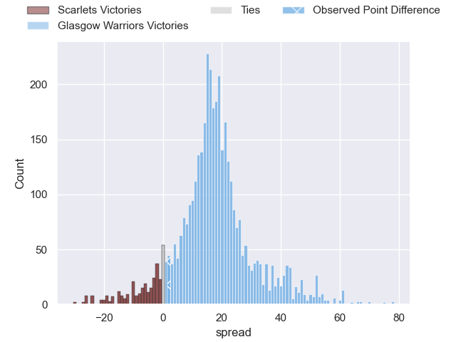
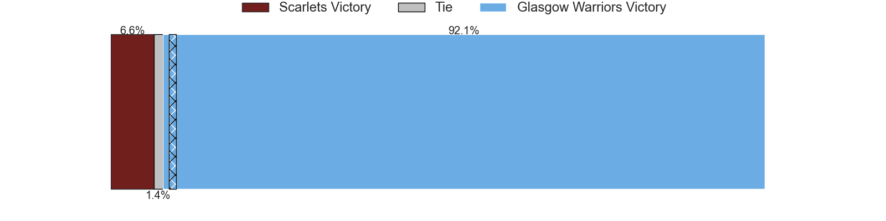
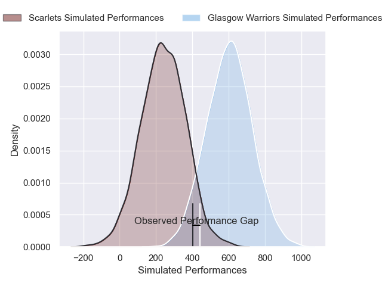
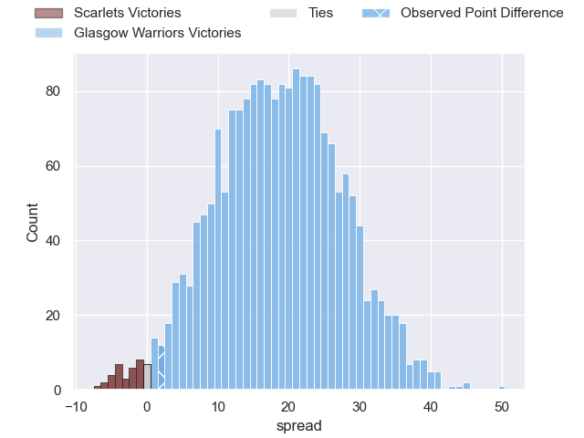

---  
layout: page  
title: Scarlets at Glasgow Warriors; 15-17  
date: 2024-11-29 18:00:00 -0500  
categories: "United Rugby Championship 2024" match review  
---
# Scarlets at Glasgow Warriors; 15-17

# Club Level Predictions

The first set of predictions treats a club as the smallest object, as the club develops its members, organizes a gameplan, and deploys its players as needed for each match. This club model has a prediction of 0.869, which translates to predicting Glasgow Warriors to win by 16.8.

Our Over/Under is 52.5 - and combined with the spread above, we have a predicted scoreline of 18 to 35

Each club has a rating and a rating deviation (similar to a Glicko rating), and expected performances can be generated. This allows for simulated matches and spreads like the ones below.
## Projected Performances - Club Model

## Projected Spreads - Club Model

## Projected Results - Club Model

# Player Level Predictions

Treating teams instead as an entity made up of the currently active players, I have ratings for each player in an altogether different system. These can be combined to form team ratings once teamsheets are announced, weighting starters a bit higher than the reserves. After the match is played, players can be weighted by their minutes on the field, allowing for an accurate measure of the team's composition. With these compiled team ratings, we can make predictions, measure inaccuracy, and update the individual player ratings.
## Prediction without Player Minutes: Glasgow Warriors by 24.7

Glasgow Warriors by 15.2 on a neutral pitch

## Projected Performances - Player Model

## Projected Spreads - Player Model

## Projected Results - Player Model

|   Away Minutes | Away Player          |   Away Percentile |   Number |   Home Percentile | Home Player           |   Home Minutes |
|---------------:|:---------------------|------------------:|---------:|------------------:|:----------------------|---------------:|
|             66 | Alec Hepburn         |             82.47 |        1 |             63.25 | Patrick Schickerling  |             80 |
|             80 | Marnus van der Merwe |             93.49 |        2 |             72.4  | Johnny Matthews       |             80 |
|             80 | Henry Thomas         |             67.62 |        3 |             73.98 | Finlay Richardson     |             80 |
|             58 | Max Douglas          |             89.65 |        4 |             34.04 | Jare Oguntibeju       |             80 |
|             49 | Sam Lousi            |             89.91 |        5 |             75.61 | Alex Samuel           |             80 |
|             25 | Josh MacLeod         |             74.14 |        6 |             40.86 | Ally Miller           |             53 |
|             25 | Dan Davis            |             82.07 |        7 |             97.93 | Henco Venter          |             60 |
|             22 | Vaea Fifita          |             95.48 |        8 |             49.73 | Jack Mann             |             21 |
|             80 | Jac Davies           |             61.25 |        9 |            100    | George Horne          |             27 |
|             14 | Ioan Lloyd           |              8.2  |       10 |             98.4  | Adam Hastings         |             50 |
|             80 | Blair Murray         |             31.04 |       11 |             89.6  | Kyle Rowe             |             80 |
|              4 | Johnny Williams      |             84.97 |       12 |             69.16 | Tom Jordan            |             50 |
|             55 | Macs Page            |             34.04 |       13 |             92.05 | Stafford McDowall     |             24 |
|             11 | Ellis Mee            |             24.86 |       14 |             99.45 | Sebastian Cancelliere |             56 |
|             80 | Ioan Nicholas        |             17.88 |       15 |             83.27 | Josh McKay            |             50 |
|             55 | Sam Wainwright       |             29.41 |       16 |             83.4  | Duncan Weir           |             24 |
|             76 | Eddie James          |             47.91 |       17 |             60.46 | Sam Talakai           |             80 |
|             80 | Ryan Elias           |             93.64 |       18 |             76.17 | Allan Dell            |             76 |
|             80 | Taine Plumtree       |             86.9  |       19 |             33    | Ben Afshar            |             80 |
|             69 | Alex Craig           |             61.05 |       20 |             80.47 | Gregor Hiddleston     |             80 |
|             31 | Kemsley Mathias      |             73.56 |       21 |             10.54 | Grant Stewart         |             63 |
|            nan | nan                  |            nan    |       22 |             41.24 | Angus Fraser          |             24 |

