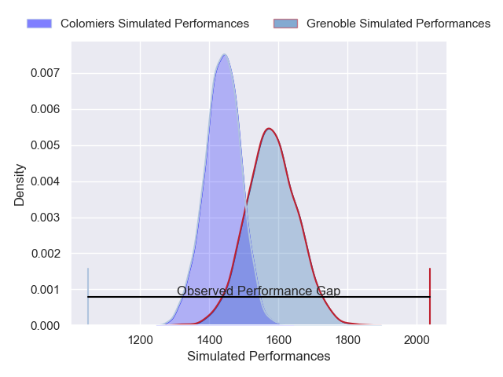
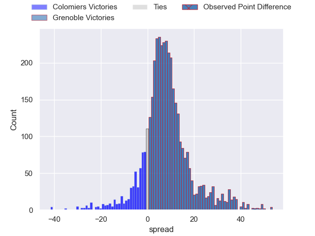
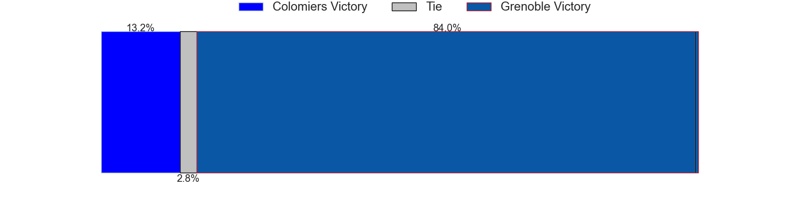
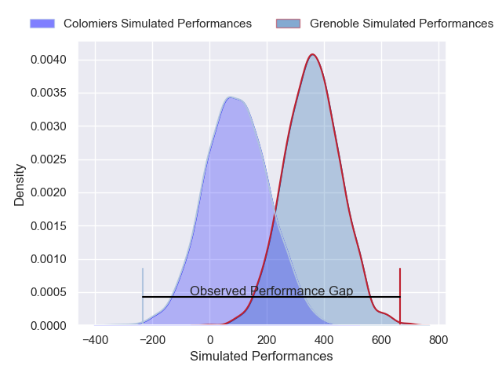
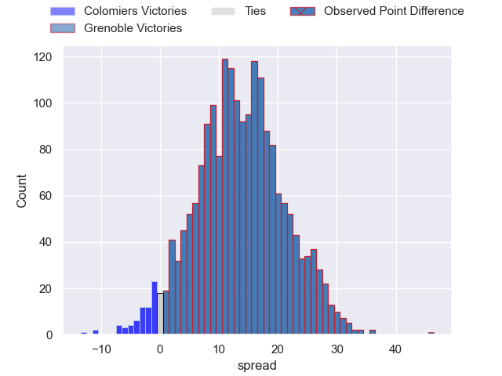
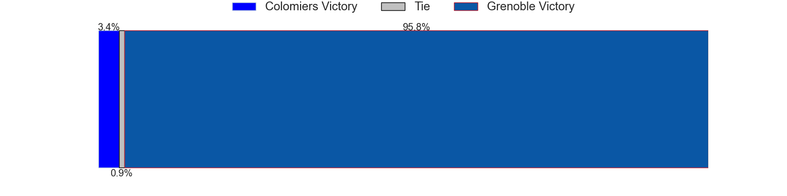

---  
layout: page  
title: Colomiers at Grenoble; 19-65  
date: 2024-11-29 18:00:00 -0500  
categories: "Pro D2 2024" match review  
---
# Colomiers at Grenoble; 19-65

# Club Level Predictions

The first set of predictions treats a club as the smallest object, as the club develops its members, organizes a gameplan, and deploys its players as needed for each match. This club model has a prediction of 0.69, which translates to predicting Grenoble to win by 7.1.

Our Over/Under is 50.5 - and combined with the spread above, we have a predicted scoreline of 22 to 29

Each club has a rating and a rating deviation (similar to a Glicko rating), and expected performances can be generated. This allows for simulated matches and spreads like the ones below.
## Projected Performances - Club Model

## Projected Spreads - Club Model

## Projected Results - Club Model

# Player Level Predictions

Treating teams instead as an entity made up of the currently active players, I have ratings for each player in an altogether different system. These can be combined to form team ratings once teamsheets are announced, weighting starters a bit higher than the reserves. After the match is played, players can be weighted by their minutes on the field, allowing for an accurate measure of the team's composition. With these compiled team ratings, we can make predictions, measure inaccuracy, and update the individual player ratings.
## Prediction without Player Minutes: Grenoble by 13.7

Grenoble by 0.6 on a neutral pitch

## Projected Performances - Player Model

## Projected Spreads - Player Model

## Projected Results - Player Model

|   Away Minutes | Away Player      |   Away Percentile |   Number |   Home Percentile | Home Player        |   Home Minutes |
|---------------:|:-----------------|------------------:|---------:|------------------:|:-------------------|---------------:|
|             40 | Eliès El Ansari  |             24.67 |        1 |             76.04 | Tommy Raynaud      |             50 |
|             62 | Pablo Dimcheff   |             20.32 |        2 |             51.4  | Mathis Sarragallet |             25 |
|             70 | Robin Bellemand  |             33.43 |        3 |             55.54 | Cody Thomas        |             80 |
|             25 | Jean Thomas      |             28.47 |        4 |             66.19 | Thomas Ployet      |             53 |
|             62 | Jack Whetton     |             26.27 |        5 |             64.41 | Pierce Phillips    |             66 |
|             42 | Anthony Coletta  |             27.36 |        6 |             61.74 | Antonin Berruyer   |             80 |
|             30 | Paolo Parpagiola |             44.17 |        7 |             58.78 | Victor Guillaumond |             24 |
|             27 | Jérémy Béchu     |             30.82 |        8 |             52.51 | Thibaut Martel     |             24 |
|             22 | Ugo Séguéla      |             38.88 |        9 |             60.19 | Barnabé Couilloud  |             40 |
|             68 | Brett Herron     |             29.82 |       10 |             52.83 | Sam Davies         |             30 |
|             25 | Martin Alonso    |             30.71 |       11 |             53.3  | Geoffrey Cros      |             30 |
|             25 | Baptiste Serrano |             38.8  |       12 |             42.96 | Romain Fusier      |              9 |
|             48 | Martin Dulon     |             20.56 |       13 |             76.76 | Gerswin Mouton     |             80 |
|             27 | Pablo Patilla    |             44.89 |       14 |             57.73 | Wilfried Hulleu    |             50 |
|             50 | Ugo Pacome       |             21.53 |       15 |             55.47 | Julien Farnoux     |             80 |
|             50 | Théo Lachaud     |            nan    |       16 |            nan    | Lilian Rossi       |             50 |
|             31 | Guillaume Tartas |             26.67 |       17 |             45.95 | Zack Gauthier      |             31 |
|             10 | Louis Descoux    |            nan    |       18 |             86.86 | Giorgi Javakhia    |             22 |
|             24 | Aldric Lescure   |            nan    |       19 |            nan    | Camille Baz-Marcos |             29 |
|             80 | Grégoire Bazin   |             30.91 |       20 |             55.99 | Eric Escande       |             22 |
|             80 | Arthur Diaz      |            nan    |       21 |            nan    | Marc Palmier       |             25 |
|             80 | Enzo Salles      |            nan    |       22 |            nan    | Romain Trouilloud  |             31 |
|             80 | Marco Fepulea'i  |             29.5  |       23 |             48.27 | Giorgi Pertaia     |             57 |

