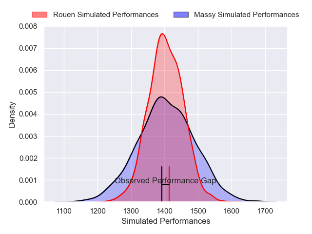
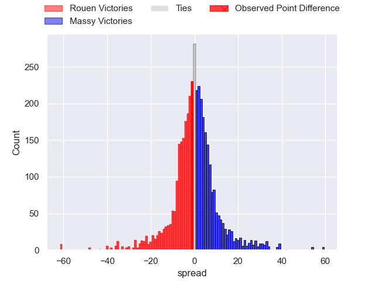
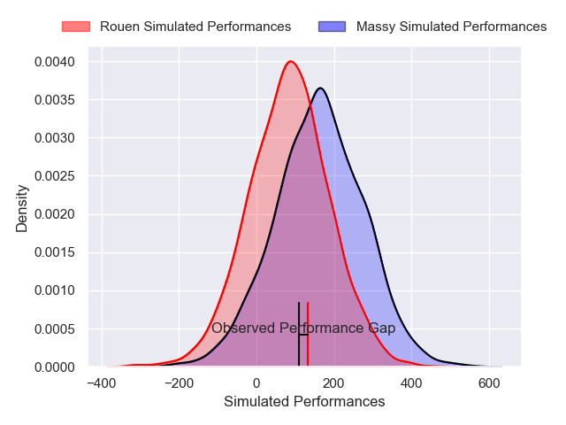
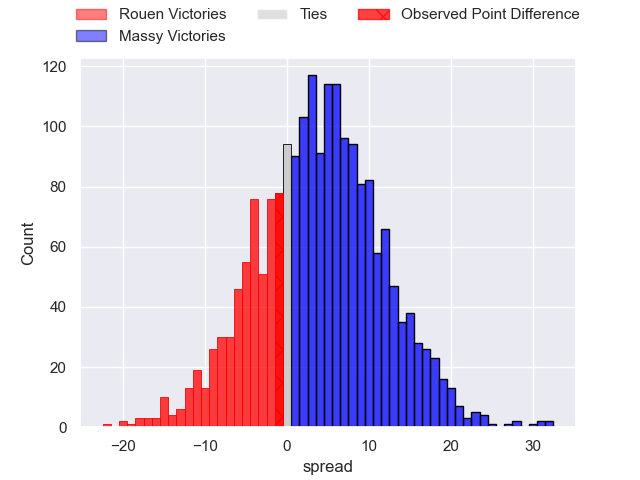
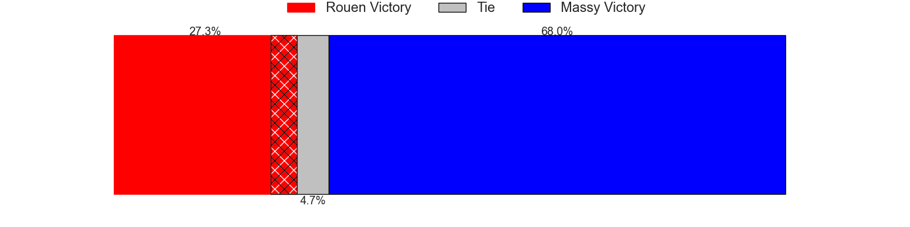

---  
layout: page  
title: Rouen at Massy; 20-19  
date: 2024-11-29 18:00:00 -0500  
categories: "Nationale 2024" match review  
---
# Rouen at Massy; 20-19

# Club Level Predictions

The first set of predictions treats a club as the smallest object, as the club develops its members, organizes a gameplan, and deploys its players as needed for each match. This club model has a prediction of 0.494, which translates to predicting Rouen to win by 0.2.

Our Over/Under is 47.5 - and combined with the spread above, we have a predicted scoreline of 24 to 23

Each club has a rating and a rating deviation (similar to a Glicko rating), and expected performances can be generated. This allows for simulated matches and spreads like the ones below.
## Projected Performances - Club Model

## Projected Spreads - Club Model

## Projected Results - Club Model

# Player Level Predictions

Treating teams instead as an entity made up of the currently active players, I have ratings for each player in an altogether different system. These can be combined to form team ratings once teamsheets are announced, weighting starters a bit higher than the reserves. After the match is played, players can be weighted by their minutes on the field, allowing for an accurate measure of the team's composition. With these compiled team ratings, we can make predictions, measure inaccuracy, and update the individual player ratings.
## Prediction without Player Minutes: Massy by 5.5

Rouen by 0.6 on a neutral pitch

## Projected Performances - Player Model

## Projected Spreads - Player Model

## Projected Results - Player Model

|   Away Minutes | Away Player           |   Away Percentile |   Number |   Home Percentile | Home Player            |   Home Minutes |
|---------------:|:----------------------|------------------:|---------:|------------------:|:-----------------------|---------------:|
|             30 | Alexis Decaux         |             65.6  |        1 |             45.27 | Fernandez Corréa       |             72 |
|             30 | German Kessler        |             53.9  |        2 |             51.99 | Pierre Trassoudaine    |             28 |
|             31 | Khvicha Tsopurashvili |             65.71 |        3 |             42.14 | Nicolas Ferrer         |             80 |
|             28 | Octave Leleu          |             52.17 |        4 |             43.23 | Saba Pesvianidze       |             80 |
|             11 | Will Witty            |             68.68 |        5 |             46.04 | Louis Bruinsma         |             70 |
|              0 | Ernest Eudier         |             51.35 |        6 |             54.22 | Tony Tissot            |              9 |
|             11 | Tienie Burger         |             55.31 |        7 |             54.47 | Hilan Delbois          |             17 |
|             49 | Soïg Mingant          |             45.6  |        8 |             47.71 | Alexandre Loubière     |             14 |
|             51 | Gauthier Lelong       |             53.01 |        9 |             49.77 | Julien Blanc           |             70 |
|             51 | Benjamin Péhau        |             62.09 |       10 |             44.68 | Christian Lacombe      |             17 |
|             26 | Benjamin Descamps     |             64.59 |       11 |             53.15 | Alex Preira            |             14 |
|             80 | Théo Dachary          |             51.44 |       12 |             40.65 | Luca Mignot            |             66 |
|             80 | Ope Peleseuma         |             60.37 |       13 |             49.95 | Arthur Seigneuret      |              8 |
|             56 | Axel Malaret          |             55.27 |       14 |             47.31 | Giorgi Gogoladze       |             61 |
|             32 | Benjamin Debetz       |             46.07 |       15 |             49.18 | Martin Carré           |             21 |
|             30 | Lucas Poisson         |            nan    |       16 |             49.34 | Adrien Sonzogni        |             40 |
|             24 | Noé Khier             |            nan    |       17 |             50.55 | Tijde Visser           |             80 |
|             52 | Oliver Cooper         |            nan    |       18 |             12.85 | Andrei Mahu            |             80 |
|             76 | Willy N'Diaye         |            nan    |       19 |            nan    | Clément Vidoni         |             52 |
|             66 | Florent Campeggia     |             59.97 |       20 |             49    | Lucas Rubio            |             37 |
|             80 | Aloïs Chayla          |            nan    |       21 |              1.74 | Gonzalo Lopez Bontempo |             80 |
|              0 | Sakiusa Bureitakiyaca |             60.8  |       22 |            nan    | Alexandre Borie        |             80 |
|             28 | Diego Arbelo          |             38.13 |       23 |            nan    | Nolan Pienaar          |             56 |

