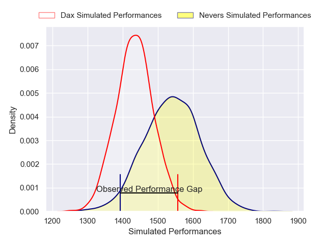
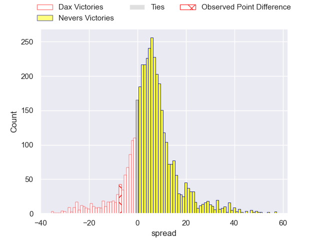
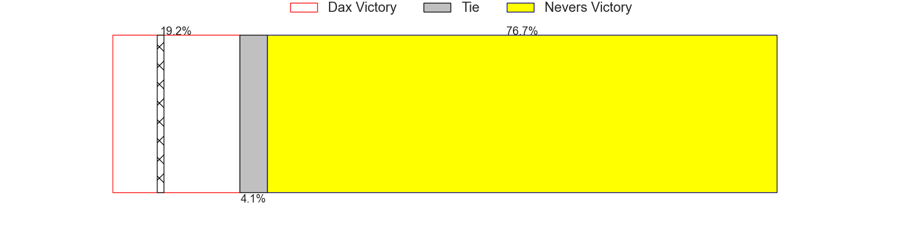
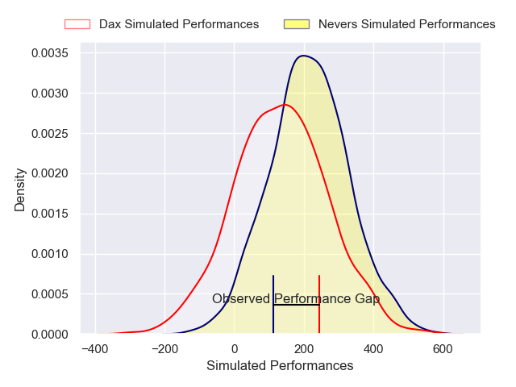
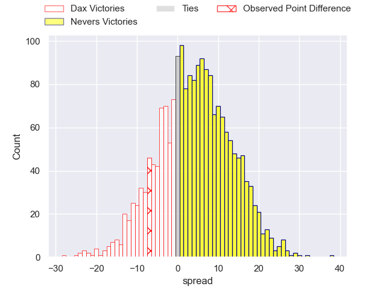
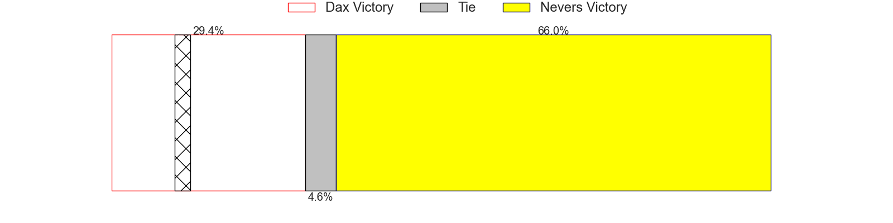

---  
layout: page  
title: Dax at Nevers; 31-24  
date: 2024-11-29 18:00:00 -0500  
categories: "Pro D2 2024" match review  
---
# Dax at Nevers; 31-24

# Club Level Predictions

The first set of predictions treats a club as the smallest object, as the club develops its members, organizes a gameplan, and deploys its players as needed for each match. This club model has a prediction of 0.642, which translates to predicting Nevers to win by 5.1.

Our Over/Under is 47.5 - and combined with the spread above, we have a predicted scoreline of 21 to 27

Each club has a rating and a rating deviation (similar to a Glicko rating), and expected performances can be generated. This allows for simulated matches and spreads like the ones below.
## Projected Performances - Club Model

## Projected Spreads - Club Model

## Projected Results - Club Model

# Player Level Predictions

Treating teams instead as an entity made up of the currently active players, I have ratings for each player in an altogether different system. These can be combined to form team ratings once teamsheets are announced, weighting starters a bit higher than the reserves. After the match is played, players can be weighted by their minutes on the field, allowing for an accurate measure of the team's composition. With these compiled team ratings, we can make predictions, measure inaccuracy, and update the individual player ratings.
## Prediction without Player Minutes: Nevers by 4.9

Dax by 0.2 on a neutral pitch

## Projected Performances - Player Model

## Projected Spreads - Player Model

## Projected Results - Player Model

|   Away Minutes | Away Player          |   Away Percentile |   Number |   Home Percentile | Home Player                |   Home Minutes |
|---------------:|:---------------------|------------------:|---------:|------------------:|:---------------------------|---------------:|
|             68 | Dino Casadeï         |             67.09 |        1 |             30    | Aitor Kitutu               |             80 |
|             26 | Louis Barrère        |             59.5  |        2 |             39.62 | Efi Ma'Afu                 |              0 |
|             66 | David Lolohea        |             70.77 |        3 |             30.66 | Cleopas Kundiona           |             80 |
|             80 | Brice Ferrer         |             63.49 |        4 |             33.28 | Maxence Barjaud            |             80 |
|             80 | Jean-Baptiste Singer |             67.91 |        5 |             37.19 | Chris Gabriel              |             32 |
|             55 | Arnaud Aletti        |             59.7  |        6 |             31.7  | Luka Plataret              |             50 |
|             39 | Paul Arnaud Ausset   |             59.11 |        7 |             40.98 | Kévin Noah                 |             23 |
|             23 | Sam Wasley           |             50.53 |        8 |             30.28 | Jason Fraser               |              7 |
|             39 | Sylvère Réteau       |             62.44 |        9 |             36.63 | Simon Tarel                |             19 |
|             23 | Romuald Séguy        |             53.77 |       10 |             28.05 | Shaun Reynolds             |             40 |
|             80 | Théo Gatelier        |             70.36 |       11 |             40.49 | Lucas Blanc                |             19 |
|             28 | Noah Nene            |             51.26 |       12 |             36.56 | Nicolas Ragoevi            |             30 |
|             54 | Benjamin Puntous     |             54.98 |       13 |             32.74 | Rudy Derrieux              |             11 |
|             45 | Maxime Oltmann       |             66.72 |       14 |             30.48 | Gabin Rocher               |             80 |
|             80 | Théo Duprat          |             63.07 |       15 |             23.58 | Dylan Jaminet              |             80 |
|             53 | Kito Falatea         |            nan    |       16 |            nan    | Jean-Maxence Jules-Rosette |             48 |
|             69 | Louis Mary           |            nan    |       17 |            nan    | Tornike Mataradze          |             59 |
|             80 | Ratu Nacika          |            nan    |       18 |             81.11 | Lasha Jaiani               |             79 |
|             64 | Théo Trémeau         |            nan    |       19 |             39.88 | Steven David               |             60 |
|             73 | Paul Ravier          |            nan    |       20 |            nan    | Julien Kazubek             |             80 |
|             80 | Hugo Cerisier        |            nan    |       21 |             39.1  | Hugo Bouyssou              |             30 |
|             50 | Hugo Fourquet        |            nan    |       22 |             42.38 | Arthur Mathiron            |             61 |
|             61 | Nephi Leatigaga      |             51.98 |       23 |            nan    | Lasha Pkhakadze (2)        |             66 |

