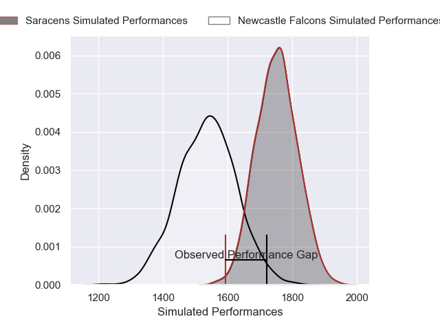
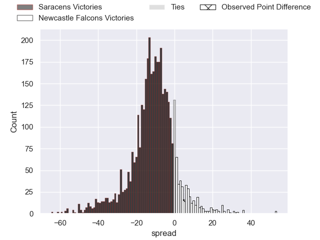
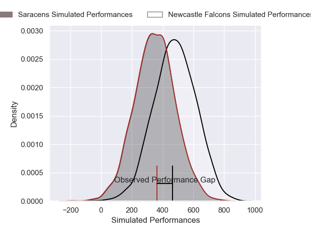
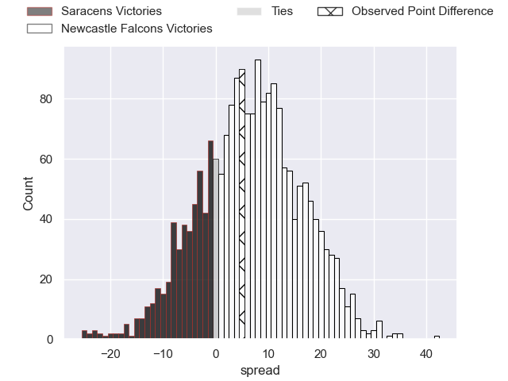

---  
layout: page  
title: Saracens at Newcastle Falcons; 12-17  
date: 2024-11-29 18:00:00 -0500  
categories: "Gallagher Premiership 2024" match review  
---
# Saracens at Newcastle Falcons; 12-17

# Club Level Predictions

The first set of predictions treats a club as the smallest object, as the club develops its members, organizes a gameplan, and deploys its players as needed for each match. This club model has a prediction of 0.232, which translates to predicting Saracens to win by 10.6.

Our Over/Under is 51.5 - and combined with the spread above, we have a predicted scoreline of 31 to 20

Each club has a rating and a rating deviation (similar to a Glicko rating), and expected performances can be generated. This allows for simulated matches and spreads like the ones below.
## Projected Performances - Club Model

## Projected Spreads - Club Model

## Projected Results - Club Model

# Player Level Predictions

Treating teams instead as an entity made up of the currently active players, I have ratings for each player in an altogether different system. These can be combined to form team ratings once teamsheets are announced, weighting starters a bit higher than the reserves. After the match is played, players can be weighted by their minutes on the field, allowing for an accurate measure of the team's composition. With these compiled team ratings, we can make predictions, measure inaccuracy, and update the individual player ratings.
## Prediction without Player Minutes: Newcastle Falcons by 7.0

Saracens by 6.6 on a neutral pitch

## Projected Performances - Player Model

## Projected Spreads - Player Model

## Projected Results - Player Model

|   Away Minutes | Away Player          |   Away Percentile |   Number |   Home Percentile | Home Player         |   Home Minutes |
|---------------:|:---------------------|------------------:|---------:|------------------:|:--------------------|---------------:|
|              0 | Rhys Carre           |             40.82 |        1 |             64.42 | Murray McCallum     |             62 |
|             84 | Theo Dan             |             79.23 |        2 |              3.09 | Jamie Blamire       |             13 |
|             79 | Fraser Balmain       |             16.27 |        3 |             66.27 | Richard Palframan   |             10 |
|              0 | Theo McFarland       |             26.69 |        4 |             12.88 | Philip van der Walt |             20 |
|             41 | Hugh Tizard          |             84.49 |        5 |              6.1  | Sebastian de Chaves |             84 |
|             72 | Juan Martin Gonzalez |             96.03 |        6 |             65.2  | Freddie Lockwood    |             20 |
|             84 | Toby Knight          |             64.53 |        7 |             98.73 | Tom Gordon          |             13 |
|             84 | Toby Knight          |             64.53 |        7 |             98.73 | Tom Gordon          |             49 |
|              5 | Tom Willis           |             54.12 |        8 |             78.85 | Callum Chick        |             33 |
|              5 | Tom Willis           |             54.12 |        8 |             78.85 | Callum Chick        |              0 |
|              5 | Tom Willis           |             54.12 |        8 |             78.85 | Callum Chick        |             84 |
|              5 | Ivan van Zyl         |             87.09 |        9 |              2.33 | Sam Stuart          |             82 |
|              0 | Fergus Burke         |             71.35 |       10 |              2.14 | Brett Connon        |             82 |
|             84 | Rotimi Segun         |             75.3  |       11 |             67.57 | Alex Hearle         |             82 |
|             84 | Nick Tompkins        |             99.07 |       12 |             74.35 | Cameron Hutchison   |             69 |
|             84 | Alex Lozowski        |             91.57 |       13 |             47.22 | Sammy Arnold        |             84 |
|             84 | Tobias Elliott       |             73.35 |       14 |             58.18 | Ben Stevenson       |             50 |
|             84 | Elliot Daly          |             91.06 |       15 |             81.75 | Ethan Grayson       |             32 |
|             58 | James Hadfield       |             82.77 |       16 |            nan    | Ollie Fletcher      |             84 |
|             84 | Eroni Mawi           |             88.86 |       17 |            nan    | Mike Rewcastle      |             68 |
|             16 | Marco Riccioni       |             76.4  |       18 |            nan    | Callum Hancock      |             79 |
|             84 | Harry Wilson         |             25.81 |       19 |             28.14 | Kiran McDonald      |             84 |
|             26 | Nathan Michelow      |            nan    |       20 |            nan    | Ollie Leatherbarrow |             84 |
|             84 | Gareth Simpson       |             28.3  |       21 |            nan    | Max Pepper          |             84 |
|             82 | Sam Spink            |             29.81 |       22 |             57.87 | Connor Doherty      |             62 |
|             59 | Tom Parton           |             85.04 |       23 |             25.23 | Adam Radwan         |             54 |

