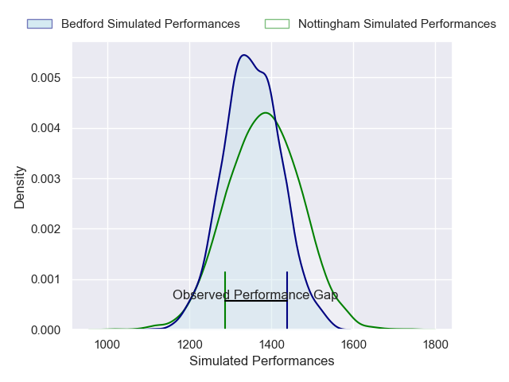
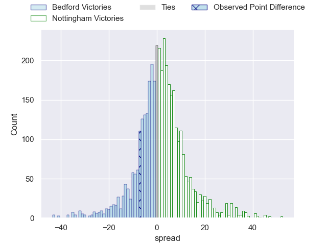
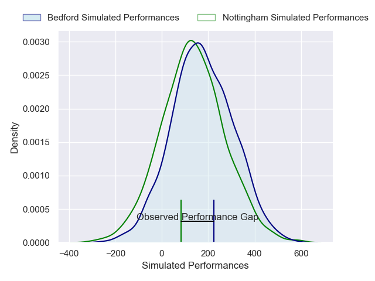
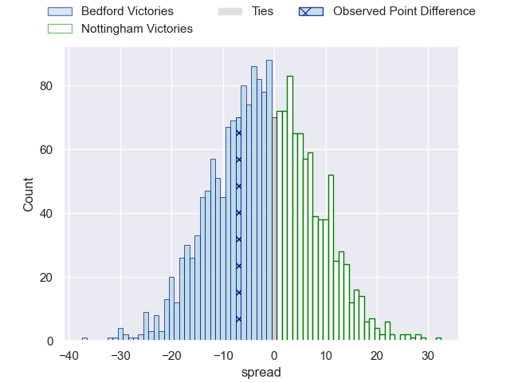

---  
layout: page  
title: Bedford at Nottingham; 17-10  
date: 2024-11-29 18:00:00 -0500  
categories: "RFU Championship 2024" match review  
---
# Bedford at Nottingham; 17-10

# Club Level Predictions

The first set of predictions treats a club as the smallest object, as the club develops its members, organizes a gameplan, and deploys its players as needed for each match. This club model has a prediction of 0.539, which translates to predicting Nottingham to win by 1.4.

Our Over/Under is 45.5 - and combined with the spread above, we have a predicted scoreline of 22 to 23

Each club has a rating and a rating deviation (similar to a Glicko rating), and expected performances can be generated. This allows for simulated matches and spreads like the ones below.
## Projected Performances - Club Model

## Projected Spreads - Club Model

## Projected Results - Club Model

# Player Level Predictions

Treating teams instead as an entity made up of the currently active players, I have ratings for each player in an altogether different system. These can be combined to form team ratings once teamsheets are announced, weighting starters a bit higher than the reserves. After the match is played, players can be weighted by their minutes on the field, allowing for an accurate measure of the team's composition. With these compiled team ratings, we can make predictions, measure inaccuracy, and update the individual player ratings.
## Prediction without Player Minutes: Bedford by 2.1

Bedford by 6.6 on a neutral pitch

## Projected Performances - Player Model

## Projected Spreads - Player Model

## Projected Results - Player Model

|   Away Minutes | Away Player             |   Away Percentile |   Number |   Home Percentile | Home Player          |   Home Minutes |
|---------------:|:------------------------|------------------:|---------:|------------------:|:---------------------|---------------:|
|             80 | Joey Conway             |             48.03 |        1 |             21.75 | Aniseko Sio          |             66 |
|             32 | Nathan Langdon          |             36.67 |        2 |             19.29 | Harry Clayton        |             66 |
|             80 | Oisin Heffernan         |             71.22 |        3 |             79.5  | Dan Richardson       |             66 |
|              0 | Will Spencer            |             49.15 |        4 |             12.2  | Sebastian Ferreira   |             66 |
|             80 | Rory Ward               |             48.39 |        5 |             38.39 | Jack Shine           |             66 |
|             80 | Luke Frost              |             60.64 |        6 |             41.68 | Kody Vereti          |             66 |
|             80 | Fyn Brown               |             58.19 |        7 |             41.68 | Sam Williams         |             66 |
|             80 | Joe Howard              |             60.93 |        8 |             23.84 | James Cherry         |             66 |
|              0 | Alex Day                |             34.84 |        9 |             14.62 | Will Yarnell         |             66 |
|             26 | Will Maisey             |             45.22 |       10 |             36.26 | Jai Johal            |             66 |
|             26 | Dean Adamson            |             66.44 |       11 |             17.64 | Harry Graham         |             66 |
|             64 | Michaël Le Bourgeois    |             64.07 |       12 |             37.41 | Kegan Christian-Goss |             51 |
|             31 | Lucas Titherington      |             58.52 |       13 |             25.19 | Charlie Myall        |             49 |
|             11 | Alfie Garside           |             33.11 |       14 |             25.08 | David Williams       |             11 |
|             11 | Louis James             |             76.64 |       15 |             20.44 | Jack Stapley         |             42 |
|             29 | Tommy Herman            |             35.2  |       16 |            nan    | Jack Dickinson       |             40 |
|             26 | Jamie Jack              |            nan    |       17 |            nan    | Kai Owen             |             67 |
|             80 | Beltus Nonleh           |             39.93 |       18 |            nan    | Ale Loman            |             80 |
|             40 | Shay Kerry              |            nan    |       19 |            nan    | Sam Green            |             80 |
|             80 | Cameron King            |            nan    |       20 |            nan    | Jacob Wright         |             80 |
|             80 | Jac Arthur              |            nan    |       21 |            nan    | Josh Goodwin         |             80 |
|             80 | James Lennon            |            nan    |       22 |            nan    | Gwyn Parks           |             80 |
|             80 | George Makepeace-Cubitt |             73.68 |       23 |            nan    | Levi Roper           |             80 |

