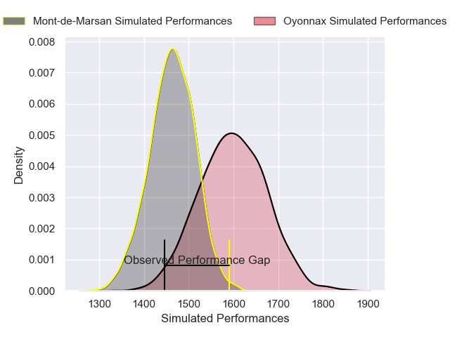
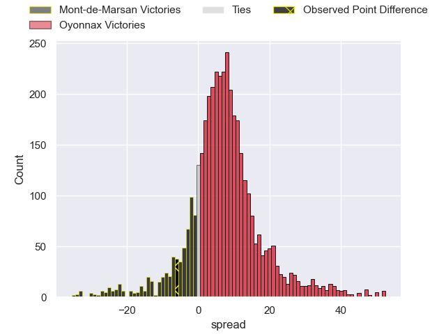
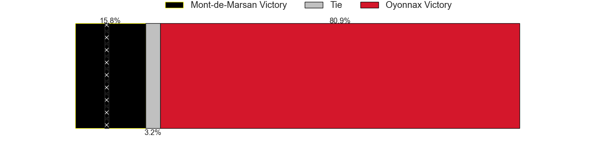
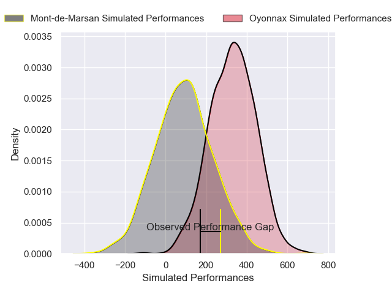
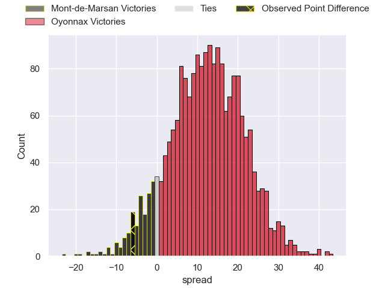
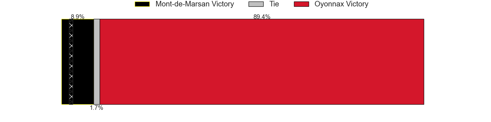

---  
layout: page  
title: Mont-de-Marsan at Oyonnax; 30-24  
date: 2024-11-29 18:00:00 -0500  
categories: "Pro D2 2024" match review  
---
# Mont-de-Marsan at Oyonnax; 30-24

# Club Level Predictions

The first set of predictions treats a club as the smallest object, as the club develops its members, organizes a gameplan, and deploys its players as needed for each match. This club model has a prediction of 0.681, which translates to predicting Oyonnax to win by 6.7.

Our Over/Under is 49.5 - and combined with the spread above, we have a predicted scoreline of 21 to 28

Each club has a rating and a rating deviation (similar to a Glicko rating), and expected performances can be generated. This allows for simulated matches and spreads like the ones below.
## Projected Performances - Club Model

## Projected Spreads - Club Model

## Projected Results - Club Model

# Player Level Predictions

Treating teams instead as an entity made up of the currently active players, I have ratings for each player in an altogether different system. These can be combined to form team ratings once teamsheets are announced, weighting starters a bit higher than the reserves. After the match is played, players can be weighted by their minutes on the field, allowing for an accurate measure of the team's composition. With these compiled team ratings, we can make predictions, measure inaccuracy, and update the individual player ratings.
## Prediction without Player Minutes: Oyonnax by 11.9

Mont-de-Marsan by 1.2 on a neutral pitch

## Projected Performances - Player Model

## Projected Spreads - Player Model

## Projected Results - Player Model

|   Away Minutes | Away Player           |   Away Percentile |   Number |   Home Percentile | Home Player         |   Home Minutes |
|---------------:|:----------------------|------------------:|---------:|------------------:|:--------------------|---------------:|
|             16 | Luka Goginava         |             42.31 |        1 |             55.42 | Antoine Abraham     |             66 |
|             80 | Florian Dufour        |             63.92 |        2 |             89.99 | Peniami Narisia     |             46 |
|             80 | Gheorghe Gajion       |             59.83 |        3 |             17.22 | Ali Oz              |             80 |
|             64 | Jules Dussutour       |             68.14 |        4 |              3.81 | Manuel Leindekar    |             80 |
|             80 | Myles Edwards         |             69.92 |        5 |             19.15 | Hugo Fabregue       |             80 |
|             80 | Aurélien Lafforgue    |             66.81 |        6 |             16.64 | Kevin Lebreton      |             61 |
|             23 | Raphaël Robic         |             54.65 |        7 |             54.22 | Antoine Miquel      |             56 |
|             14 | Michael Faleafa       |             46.06 |        8 |             24.91 | Rory Grice          |             16 |
|             28 | Baptiste Canut        |             56.3  |        9 |             11.66 | Vasil Lobzhanidze   |             64 |
|             80 | Willie Du Plessis     |             64.52 |       10 |             15.98 | Chris William Smith |             80 |
|             80 | Pierre Sayerse        |             71.1  |       11 |             20.35 | Maxime Salles       |             44 |
|             55 | Nacani Wakaya         |             56.11 |       12 |             22.13 | Lucas Mensa         |             49 |
|             80 | Gatien Massé          |             64.35 |       13 |              4.63 | Chris Farrell       |             38 |
|             64 | Simao Bento           |             14.26 |       14 |             71.25 | Daniel Ikpefan      |             49 |
|             70 | Yoann Laousse Azpiazu |             59.12 |       15 |             50.55 | Darren Sweetnam     |             40 |
|             60 | Luka Begic            |              6.48 |       16 |             24.74 | Benjamin Geledan    |             49 |
|             80 | Jean-Luc Innocente    |            nan    |       17 |            nan    | Rémi Di Pietro      |             49 |
|             55 | Ioane Iashagashvili   |             38.71 |       18 |             46.95 | Ewan Johnson        |             49 |
|             80 | Waël Ponpon           |            nan    |       19 |            nan    | David Odiase (2)    |              0 |
|             80 | Nicolas Darquier      |             37.17 |       20 |             48.99 | Yvan David          |             50 |
|             69 | Patricio Fernandez    |            nan    |       21 |             76.61 | Zack Holmes         |             65 |
|             80 | Alexandre de Nardi    |             37.16 |       22 |             44.63 | Eddie Sawailau      |             47 |
|             30 | Anthony Alves         |             10.79 |       23 |             72.94 | Paulo Tafili        |             80 |

