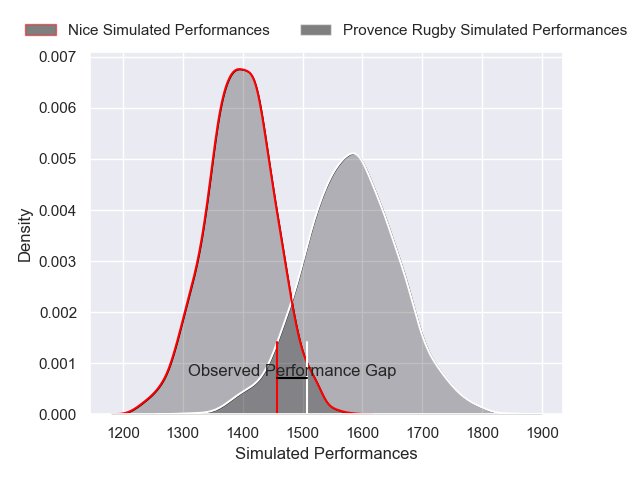
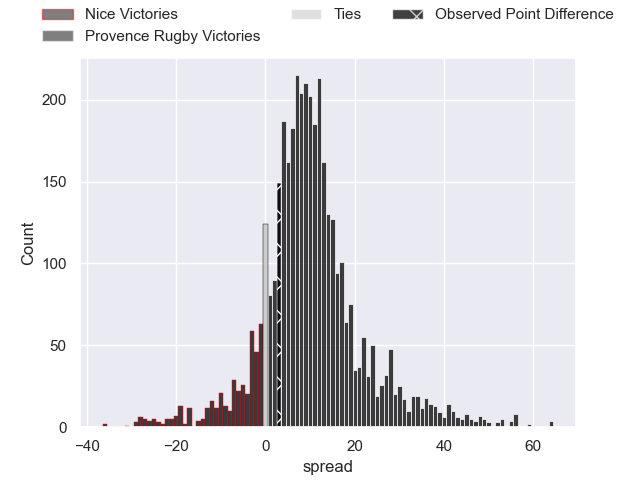
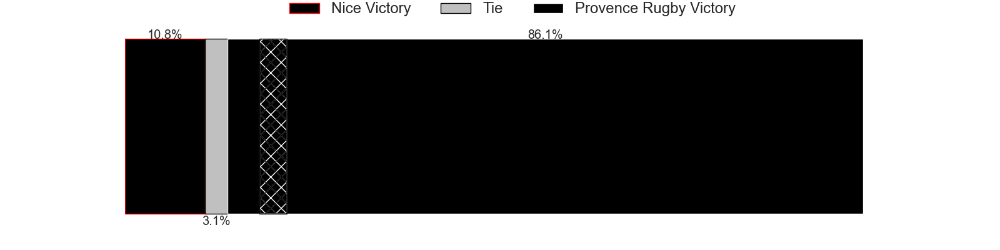
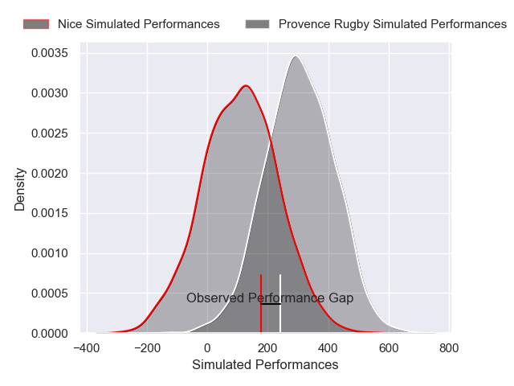
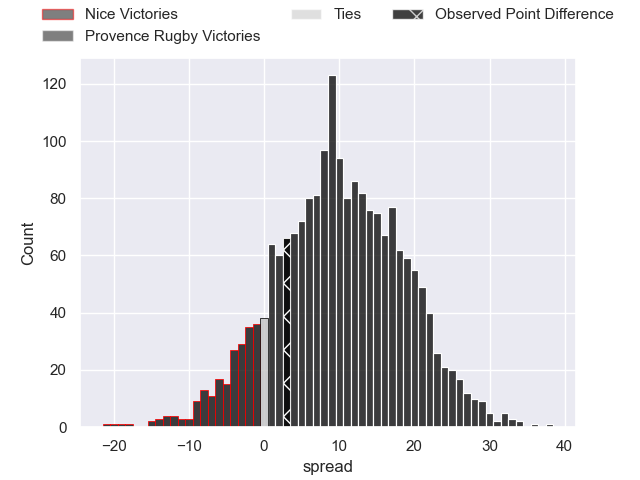
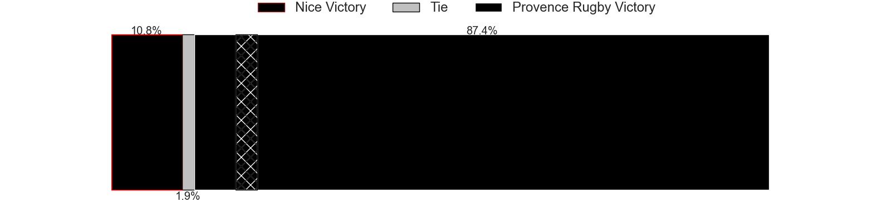

---  
layout: page  
title: Nice at Provence Rugby; 30-33  
date: 2024-11-29 18:00:00 -0500  
categories: "Pro D2 2024" match review  
---
# Nice at Provence Rugby; 30-33

# Club Level Predictions

The first set of predictions treats a club as the smallest object, as the club develops its members, organizes a gameplan, and deploys its players as needed for each match. This club model has a prediction of 0.741, which translates to predicting Provence Rugby to win by 9.3.

Our Over/Under is 50.5 - and combined with the spread above, we have a predicted scoreline of 21 to 30

Each club has a rating and a rating deviation (similar to a Glicko rating), and expected performances can be generated. This allows for simulated matches and spreads like the ones below.
## Projected Performances - Club Model

## Projected Spreads - Club Model

## Projected Results - Club Model

# Player Level Predictions

Treating teams instead as an entity made up of the currently active players, I have ratings for each player in an altogether different system. These can be combined to form team ratings once teamsheets are announced, weighting starters a bit higher than the reserves. After the match is played, players can be weighted by their minutes on the field, allowing for an accurate measure of the team's composition. With these compiled team ratings, we can make predictions, measure inaccuracy, and update the individual player ratings.
## Prediction without Player Minutes: Provence Rugby by 10.4

Provence Rugby by 0.7 on a neutral pitch

## Projected Performances - Player Model

## Projected Spreads - Player Model

## Projected Results - Player Model

|   Away Minutes | Away Player        |   Away Percentile |   Number |   Home Percentile | Home Player        |   Home Minutes |
|---------------:|:-------------------|------------------:|---------:|------------------:|:-------------------|---------------:|
|             80 | Julien Beaufils    |             56.48 |        1 |             37.36 | Julius Nostadt     |             80 |
|             68 | Pierre Strippoli   |             56.26 |        2 |             37.11 | Thomas Sauveterre  |             80 |
|             80 | Tom Ross           |             26.65 |        3 |             42.31 | Eliott Yemsi       |             38 |
|             68 | Thibaud Rey        |             57.62 |        4 |             38.64 | Andrés Zafra       |             80 |
|             55 | Clément Chartier   |             52    |        5 |             77.28 | Izack Rodda        |             80 |
|             22 | Joris Simon        |             51.77 |        6 |             43.76 | Guillaume Piazzoli |             23 |
|             13 | Louis Suaud        |             45.87 |        7 |             42.07 | Bilel Taieb        |             39 |
|             27 | Ramiha Smiler      |             44.01 |        8 |             34.51 | Teimana Harrison   |             29 |
|              0 | Jules Solinas      |             44.36 |        9 |             41.42 | Arthur Coville     |             29 |
|              0 | Romain Riguet      |             42.55 |       10 |             35.4  | Jules Plisson      |              8 |
|             15 | Andrzej Charlat    |             51.33 |       11 |             48.6  | Nadir Bouhedjeur   |             13 |
|             15 | Alban Conduché     |             36.47 |       12 |             39.63 | Inga Finau         |             23 |
|             23 | Baptiste Lafond    |             44.74 |       13 |             35.72 | Eto Bainivalu      |             53 |
|             57 | David Odiete       |             54.51 |       14 |             41.02 | Sione Tui          |             67 |
|             80 | Paul Auradou       |             43.14 |       15 |             35.47 | Mathias Colombet   |             56 |
|             80 | Sione Anga'Aelangi |             43.89 |       16 |            nan    | Joseph Laget       |             74 |
|             63 | Facundo Gigena     |             21.43 |       17 |            nan    | Nicolás Toth       |             40 |
|              0 | Tom Murday         |             44.34 |       18 |             39.26 | Josh Tyrell        |              7 |
|             80 | Martin Freytes     |            nan    |       19 |             71.15 | Charly Gambini     |             80 |
|             62 | Jordan Taufua      |             92.78 |       20 |            nan    | Joris Cazenave     |             14 |
|             80 | Thibault Dufau     |            nan    |       21 |             41.72 | Jimmy Gopperth     |             52 |
|             80 | Mathis Viard       |            nan    |       22 |             45.64 | Adrien Lapègue     |             80 |
|             80 | Nicolás Ciancio    |            nan    |       23 |             45.99 | Paul Mallez        |             59 |

