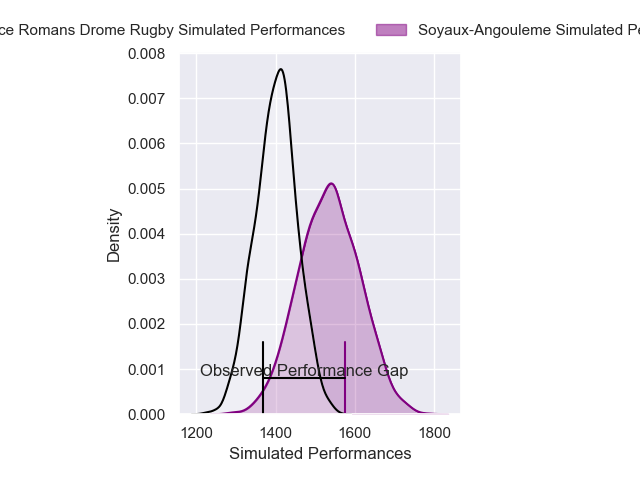
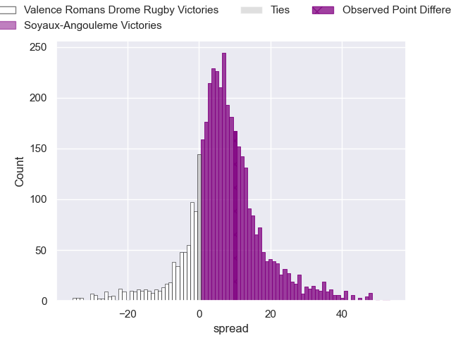
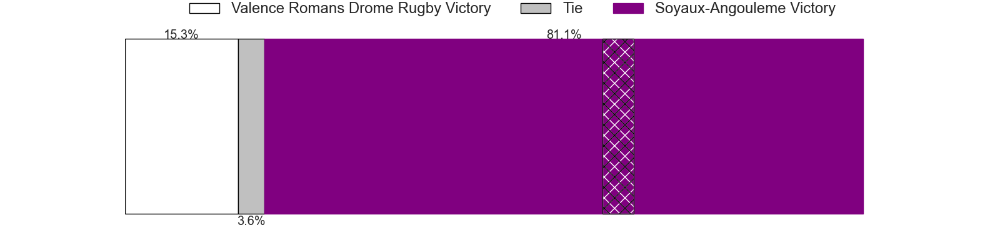
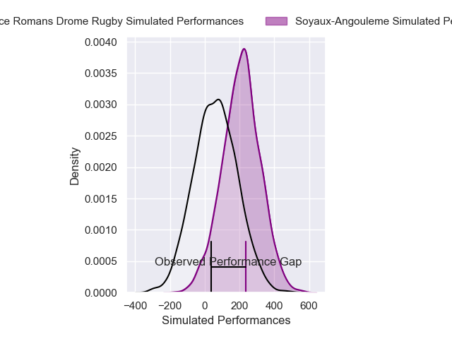
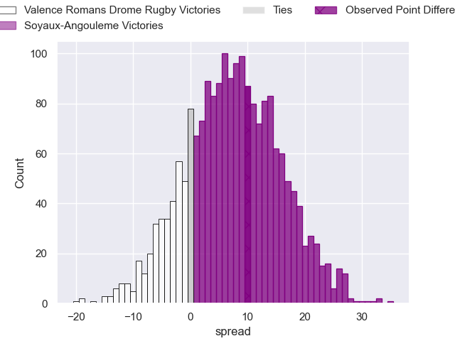

---  
layout: page  
title: Valence Romans Drome Rugby at Soyaux-Angouleme; 14-24  
date: 2024-11-29 18:00:00 -0500  
categories: "Pro D2 2024" match review  
---
# Valence Romans Drome Rugby at Soyaux-Angouleme; 14-24

# Club Level Predictions

The first set of predictions treats a club as the smallest object, as the club develops its members, organizes a gameplan, and deploys its players as needed for each match. This club model has a prediction of 0.678, which translates to predicting Soyaux-Angouleme to win by 6.6.

Our Over/Under is 45.5 - and combined with the spread above, we have a predicted scoreline of 19 to 26

Each club has a rating and a rating deviation (similar to a Glicko rating), and expected performances can be generated. This allows for simulated matches and spreads like the ones below.
## Projected Performances - Club Model

## Projected Spreads - Club Model

## Projected Results - Club Model

# Player Level Predictions

Treating teams instead as an entity made up of the currently active players, I have ratings for each player in an altogether different system. These can be combined to form team ratings once teamsheets are announced, weighting starters a bit higher than the reserves. After the match is played, players can be weighted by their minutes on the field, allowing for an accurate measure of the team's composition. With these compiled team ratings, we can make predictions, measure inaccuracy, and update the individual player ratings.
## Prediction without Player Minutes: Soyaux-Angouleme by 6.8

Soyaux-Angouleme by 1.1 on a neutral pitch

## Projected Performances - Player Model

## Projected Spreads - Player Model

## Projected Results - Player Model

|   Away Minutes | Away Player       |   Away Percentile |   Number |   Home Percentile | Home Player        |   Home Minutes |
|---------------:|:------------------|------------------:|---------:|------------------:|:-------------------|---------------:|
|             32 | Andréa Pontanier  |             46.43 |        1 |             51.7  | Sami Zouhaïr       |             72 |
|             67 | Cyril Deligny     |             36.82 |        2 |             43    | Patxi Bidart       |              0 |
|             80 | Vincent Vial      |             41.76 |        3 |             50.99 | Seydou Diakité     |             80 |
|             49 | Ryan Mccauley     |             41.87 |        4 |             54.13 | Maxence Lemardelet |             69 |
|             14 | Florian Goumat    |             41.45 |        5 |             49.02 | Sikeli Nabou       |             14 |
|             28 | Axel Bruchet      |             41.15 |        6 |             47.55 | Hubert Texier      |             26 |
|             66 | Loan Réal         |             45.36 |        7 |             51.01 | Clément Sentubéry  |             64 |
|             28 | Sven Girlando     |             32.22 |        8 |             42.08 | Samuel Nollet      |             26 |
|             21 | Mattéo Rodor      |             42.04 |        9 |             46.21 | Emmanuel Saubusse  |              0 |
|             12 | Joris De Moura    |             89.36 |       10 |             44.49 | Ben Botica         |             29 |
|             73 | Adam Vargas       |             41.7  |       11 |             47.76 | Ledua Mau          |             80 |
|             31 | Mathieu Guillomot |             36.28 |       12 |             42.79 | Mathis Lafon       |             11 |
|             80 | Anatole Pauvert   |             33.58 |       13 |             37.21 | Arthur Proult      |             21 |
|             80 | Owen Lane         |              9.17 |       14 |             45.11 | Jules Dubecq       |             26 |
|             66 | Thomas Roziere    |             23.77 |       15 |             48.45 | Peter Lydon        |             80 |
|             50 | Dorian Marco-Pena |            nan    |       16 |             45.36 | Motu Matu'U        |             56 |
|             57 | Julien Royer      |            nan    |       17 |            nan    | Georgy Balakarev   |             56 |
|             80 | Nathan Huguen     |            nan    |       18 |            nan    | Ian Kitwanga       |             80 |
|             32 | Philippe Laville  |            nan    |       19 |            nan    | Germain Burgaud    |             64 |
|             32 | Thomas Lhuséro    |             40.96 |       20 |             43.28 | Alexis Levron      |             40 |
|             80 | Esteban Tercq     |            nan    |       21 |            nan    | Alex Masibaka (2)  |             80 |
|             40 | Adrien Roux       |            nan    |       22 |             34.6  | George Tilsley     |             22 |
|             80 | Kévin Goze        |            nan    |       23 |             44.4  | Yassin Boutemanni  |             44 |

