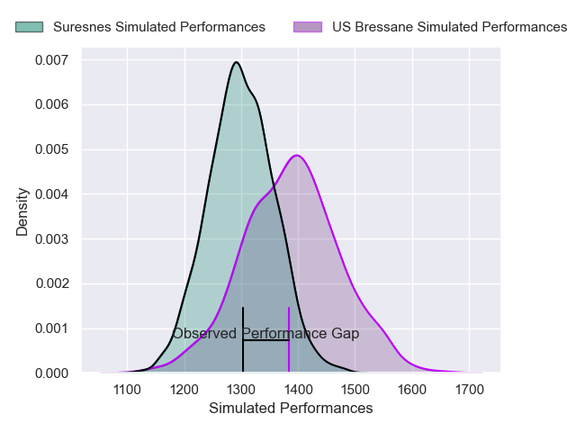
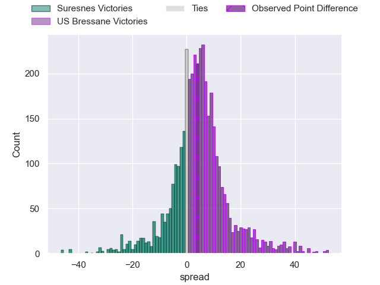
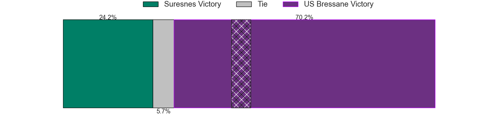
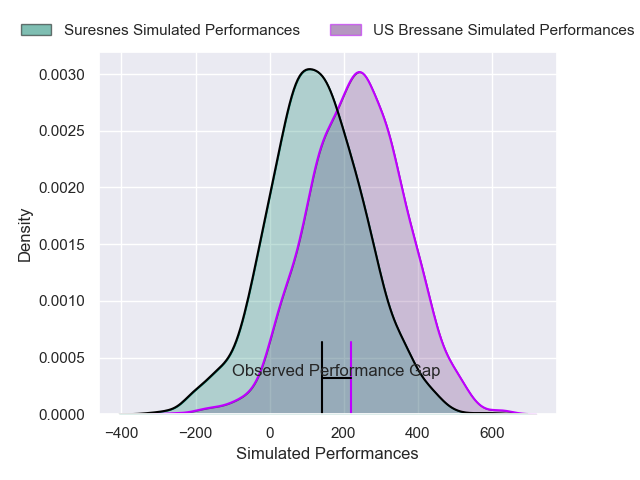
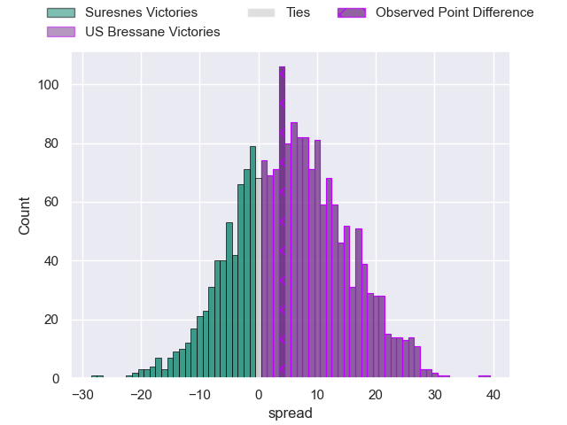
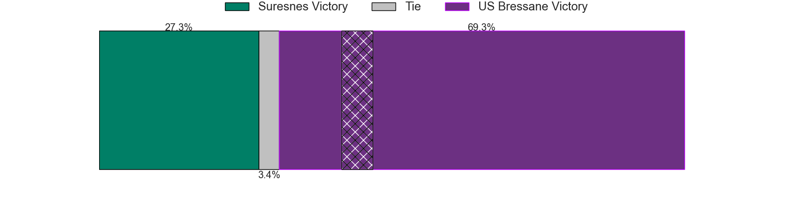

---  
layout: page  
title: Suresnes at US Bressane; 21-25  
date: 2024-11-29 18:00:00 -0500  
categories: "Nationale 2024" match review  
---
# Suresnes at US Bressane; 21-25

# Club Level Predictions

The first set of predictions treats a club as the smallest object, as the club develops its members, organizes a gameplan, and deploys its players as needed for each match. This club model has a prediction of 0.62, which translates to predicting US Bressane to win by 4.3.

Our Over/Under is 40.5 - and combined with the spread above, we have a predicted scoreline of 18 to 23

Each club has a rating and a rating deviation (similar to a Glicko rating), and expected performances can be generated. This allows for simulated matches and spreads like the ones below.
## Projected Performances - Club Model

## Projected Spreads - Club Model

## Projected Results - Club Model

# Player Level Predictions

Treating teams instead as an entity made up of the currently active players, I have ratings for each player in an altogether different system. These can be combined to form team ratings once teamsheets are announced, weighting starters a bit higher than the reserves. After the match is played, players can be weighted by their minutes on the field, allowing for an accurate measure of the team's composition. With these compiled team ratings, we can make predictions, measure inaccuracy, and update the individual player ratings.
## Prediction without Player Minutes: US Bressane by 5.4

US Bressane by 0.0 on a neutral pitch

## Projected Performances - Player Model

## Projected Spreads - Player Model

## Projected Results - Player Model

|   Away Minutes | Away Player          |   Away Percentile |   Number |   Home Percentile | Home Player          |   Home Minutes |
|---------------:|:---------------------|------------------:|---------:|------------------:|:---------------------|---------------:|
|             61 | Yanis Trabelsi       |             51.15 |        1 |             46.98 | Vazha Kapanadze      |             62 |
|             25 | Jean-Etienne Lesueur |             49.48 |        2 |             57.14 | Louis Dasalmartini   |             66 |
|             80 | Guiterembi Vickos    |             51.81 |        3 |             46.59 | Atonio Ulutuipalelei |             80 |
|             56 | Damien Bozic         |             51.4  |        4 |             52.09 | Quentin Witt         |             80 |
|             80 | Yakine Djebbari      |             52.6  |        5 |             49.53 | Victor Fromentèze    |             40 |
|             56 | Florian Desbordes    |             51.18 |        6 |             47.3  | Loic Baradel         |             52 |
|             80 | Wian Vosloo          |             52.53 |        7 |             52.28 | Thomas Déliance      |             26 |
|             69 | Laki Lee             |             43.66 |        8 |             51.06 | Waël May             |             51 |
|             24 | Théo Bachiri         |             47.45 |        9 |             57.5  | Jérémy Valençot      |             80 |
|             24 | Tanguy Lacoste       |             43.91 |       10 |             48.74 | Nathan Azaïs         |             66 |
|             28 | Faraj Fartass        |             51.02 |       11 |             57.47 | Elie De Fleurian     |             80 |
|             43 | Petero Tuwaï         |             43.81 |       12 |             53.67 | Fred Zeilinga        |             41 |
|             62 | Jj Taulagi           |             44.56 |       13 |             53.3  | Joe Margetts         |             80 |
|              8 | Yohan Fournier       |             49.81 |       14 |             58.61 | Thibaut Perrette     |             27 |
|             56 | Goulwen Gueho        |             45.34 |       15 |             53.02 | Florent Massip       |             54 |
|             67 | Ismaël Martin        |            nan    |       16 |            nan    | Clément Jullien      |             80 |
|             59 | Thibaud Sebire       |             48.52 |       17 |             57.42 | Téo Bordenave        |             27 |
|             80 | Marvin Woki          |            nan    |       18 |            nan    | Grégoire Demangel    |             80 |
|             80 | Simon Veyrac         |             48.4  |       19 |             47.98 | Nail Ait Naceur      |             80 |
|             80 | Thomas Lacroix       |            nan    |       20 |            nan    | Alexandre Badet      |             62 |
|             61 | Victor Barnier       |             42.6  |       21 |            nan    | Nicolas Faure        |             80 |
|             80 | Jean Chezeau         |            nan    |       22 |             54.14 | Nicolas Tachat       |             55 |
|             24 | Leandro Mario Assi   |            nan    |       23 |            nan    | Lasha Mchedlidze     |             66 |

