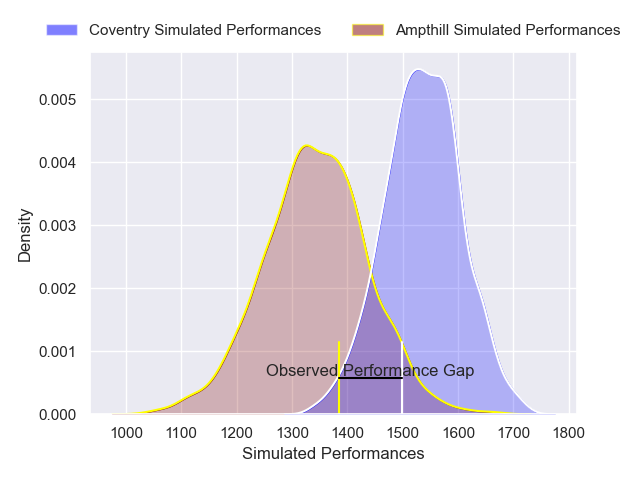
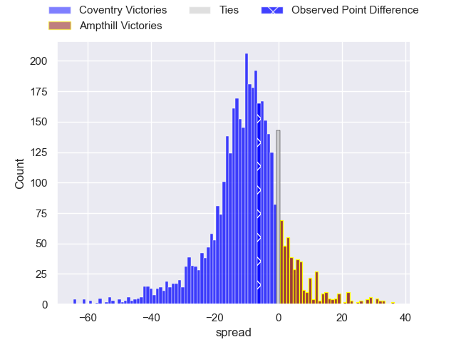
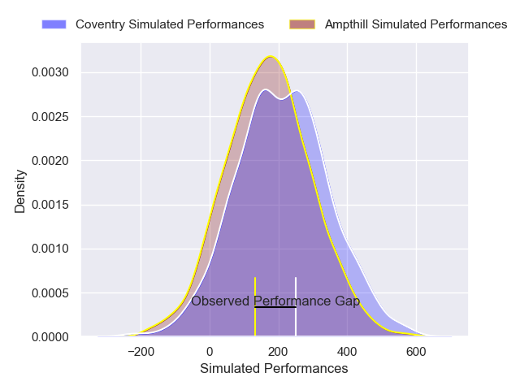
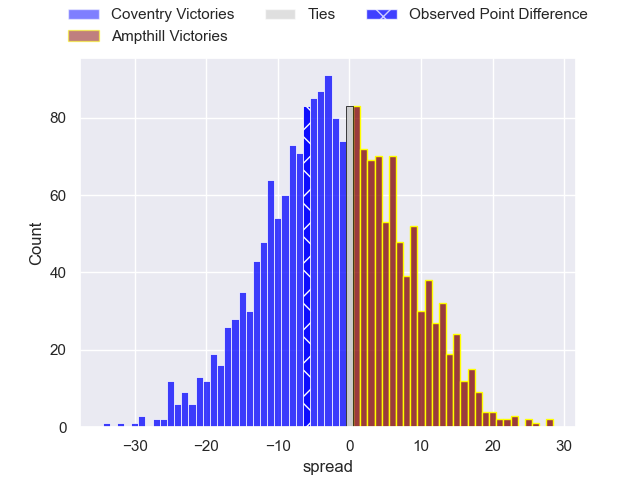

---  
layout: page  
title: Coventry at Ampthill; 27-21  
date: 2024-11-30 18:00:00 -0500  
categories: "RFU Championship 2024" match review  
---
# Coventry at Ampthill; 27-21

# Club Level Predictions

The first set of predictions treats a club as the smallest object, as the club develops its members, organizes a gameplan, and deploys its players as needed for each match. This club model has a prediction of 0.25, which translates to predicting Coventry to win by 9.8.

Our Over/Under is 53.5 - and combined with the spread above, we have a predicted scoreline of 31 to 22

Each club has a rating and a rating deviation (similar to a Glicko rating), and expected performances can be generated. This allows for simulated matches and spreads like the ones below.
## Projected Performances - Club Model

## Projected Spreads - Club Model

## Projected Results - Club Model

# Player Level Predictions

Treating teams instead as an entity made up of the currently active players, I have ratings for each player in an altogether different system. These can be combined to form team ratings once teamsheets are announced, weighting starters a bit higher than the reserves. After the match is played, players can be weighted by their minutes on the field, allowing for an accurate measure of the team's composition. With these compiled team ratings, we can make predictions, measure inaccuracy, and update the individual player ratings.
## Prediction without Player Minutes: Coventry by 2.2

Coventry by 5.6 on a neutral pitch

## Projected Performances - Player Model

## Projected Spreads - Player Model

## Projected Results - Player Model

|   Away Minutes | Away Player        |   Away Percentile |   Number |   Home Percentile | Home Player        |   Home Minutes |
|---------------:|:-------------------|------------------:|---------:|------------------:|:-------------------|---------------:|
|             54 | Toby Trinder       |             69.4  |        1 |             41.04 | Harrison Courtney  |              4 |
|             80 | Jordon Poole       |             77.91 |        2 |             32.55 | Luke Thompson      |             19 |
|             61 | Matt Johnson       |             73.9  |        3 |             36.54 | James Johnston     |             16 |
|             80 | James Tyas         |             83.83 |        4 |             40.77 | Kennedy Sylvester  |             19 |
|             80 | Senitiki Nayalo    |             74.21 |        5 |             41.11 | Aidan King         |             19 |
|             65 | Tom Ball           |             81.7  |        6 |             47.72 | Reggie Hammick     |              4 |
|             56 | Suva Ma'Asi        |             66.61 |        7 |             19.9  | Syd Blackmore      |             29 |
|             20 | Matt Kvesic        |             46.83 |        8 |             27.29 | Lekima Ravuvu      |             80 |
|             80 | Josh Barton        |             71.1  |        9 |             41.27 | Roan Frostwick     |             61 |
|             66 | Tommy Mathews      |             47.78 |       10 |             46.81 | Josh Barton        |             80 |
|             66 | Ryan Hutler        |             84.84 |       11 |             31.24 | Brandon Jackson    |             80 |
|             66 | Tom Hitchcock      |             50.7  |       12 |              9.49 | Fraser Strachan    |             65 |
|             66 | Dafydd-Rhys Tiueti |             28.93 |       13 |             29.21 | Olly Hartley       |             80 |
|             66 | David Opoku        |             52.69 |       14 |             39.8  | Sione Va'Enuku     |             60 |
|             66 | James Martin       |             65.45 |       15 |             37.84 | Oran Mcnulty       |             80 |
|             30 | Will Biggs         |            nan    |       16 |            nan    | James Isaacs       |             70 |
|             30 | Ralph Mceachran    |            nan    |       17 |            nan    | Richard Barrington |             80 |
|             30 | Eliot Salt         |            nan    |       18 |            nan    | James Flynn        |             60 |
|             30 | Obinna Nkwocha     |             55.83 |       19 |            nan    | Arthur Thomas      |             60 |
|             30 | Rhys Anstey        |            nan    |       20 |            nan    | Charlie West       |             54 |
|             30 | Fin Ogden          |            nan    |       21 |            nan    | Declan Murphy      |             80 |
|             30 | Charlie Robson     |             44.42 |       22 |            nan    | Evan Mitchell      |             80 |
|             80 | Chester Owen       |            nan    |       23 |            nan    | Max Clark          |             80 |

