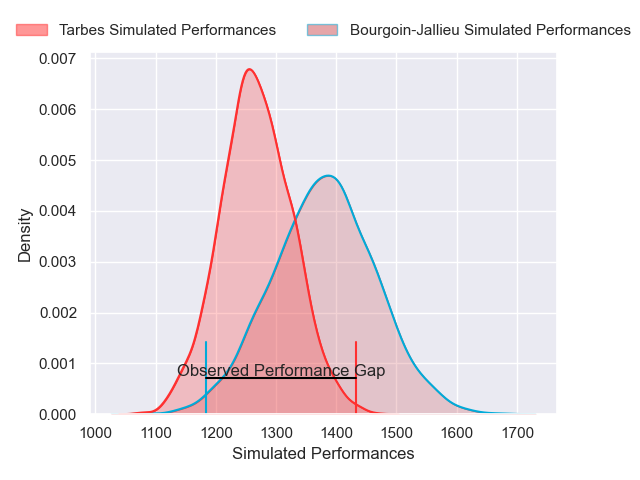
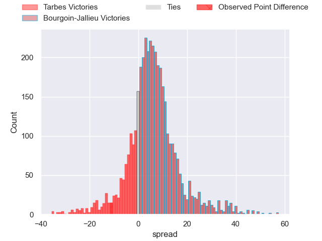
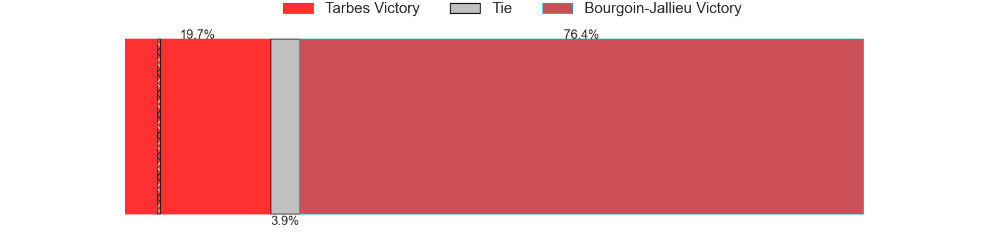
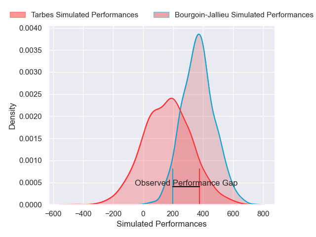
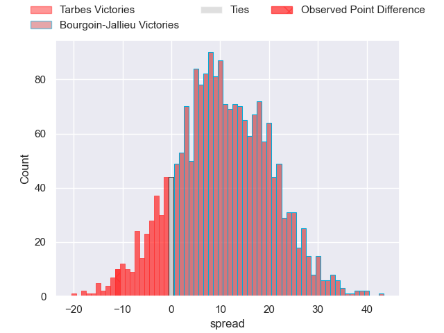
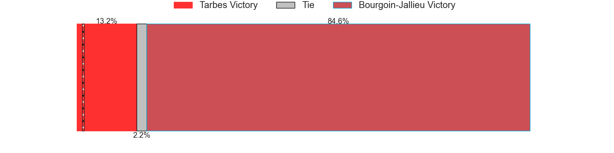

---  
layout: page  
title: Tarbes at Bourgoin-Jallieu; 32-21  
date: 2024-11-30 18:00:00 -0500  
categories: "Nationale 2024" match review  
---
# Tarbes at Bourgoin-Jallieu; 32-21

# Club Level Predictions

The first set of predictions treats a club as the smallest object, as the club develops its members, organizes a gameplan, and deploys its players as needed for each match. This club model has a prediction of 0.652, which translates to predicting Bourgoin-Jallieu to win by 5.5.

Our Over/Under is 52.5 - and combined with the spread above, we have a predicted scoreline of 24 to 29

Each club has a rating and a rating deviation (similar to a Glicko rating), and expected performances can be generated. This allows for simulated matches and spreads like the ones below.
## Projected Performances - Club Model

## Projected Spreads - Club Model

## Projected Results - Club Model

# Player Level Predictions

Treating teams instead as an entity made up of the currently active players, I have ratings for each player in an altogether different system. These can be combined to form team ratings once teamsheets are announced, weighting starters a bit higher than the reserves. After the match is played, players can be weighted by their minutes on the field, allowing for an accurate measure of the team's composition. With these compiled team ratings, we can make predictions, measure inaccuracy, and update the individual player ratings.
## Prediction without Player Minutes: Bourgoin-Jallieu by 13.7

Bourgoin-Jallieu by 0.7 on a neutral pitch

## Projected Performances - Player Model

## Projected Spreads - Player Model

## Projected Results - Player Model

|   Away Minutes | Away Player         |   Away Percentile |   Number |   Home Percentile | Home Player       |   Home Minutes |
|---------------:|:--------------------|------------------:|---------:|------------------:|:------------------|---------------:|
|             62 | Ximun Bessonart     |             70.99 |        1 |             29.84 | Lucas Dycke       |           33   |
|             10 | Vincent Dolier      |             48.75 |        2 |             18.41 | Julien Ratajczak  |           80   |
|              5 | Luka Véa            |             45.38 |        3 |             44.95 | Dimitri Tchapnga  |            9   |
|             28 | Léo Saint-Guilhem   |             60    |        4 |             34.55 | Robin Gascou      |            7.5 |
|             80 | Baptiste Peytavi    |             70.21 |        5 |             27.49 | Morgan Eames      |           40   |
|             18 | Alexis Armary       |             49.58 |        6 |             29.43 | Kévin Chaudouard  |           19   |
|             19 | Spike Salman        |             64    |        7 |             27.91 | Sam Daly          |           14   |
|             59 | Joeli Matalaweru    |             56.51 |        8 |             29.93 | Poutasi Luafutu   |           28   |
|             80 | Thomas Millet       |             66.15 |        9 |             17.93 | Martin Doan       |           65   |
|             65 | Alexandre Perez     |             57.06 |       10 |             23.21 | Nicolas Vuillemin |           66   |
|             62 | Osea Waqaninavatu   |             62.85 |       11 |             84.69 | Joe Ravouvou      |           64   |
|             61 | Savenaca Rawaca     |             57.21 |       12 |             16    | Aviata Silago     |           80   |
|             80 | Clément Latorre     |             66.79 |       13 |             28.37 | Pierre Mignot     |           49   |
|             52 | Jone Tuva           |             64.52 |       14 |             24.94 | Paul Champ        |           53   |
|             27 | Amona Artaud        |             49.54 |       15 |             24.13 | Antoine Renaud    |           60   |
|             80 | Florian Lamothe     |            nan    |       16 |            nan    | Maxime Castant    |           62   |
|             70 | Lasha Mirtskhulava  |            nan    |       17 |            nan    | Adrien Mallet     |           15   |
|             80 | Lasha Mirtskhulava  |            nan    |       17 |            nan    | Adrien Mallet     |           15   |
|             61 | Mathieu Soufflet    |             46.55 |       18 |            nan    | Léandre Cotte     |           47   |
|             80 | Jean Guicherd       |            nan    |       19 |            nan    | Thomas Adélaïde   |           67   |
|             62 | Mickael Thébault    |            nan    |       20 |            nan    | Louis Giamarchi   |           40   |
|             80 | Johan Paulet        |             34    |       21 |             32.28 | Christopher Bosch |           72   |
|             80 | Maile Mamao         |             34    |       22 |            nan    | Adrian Fugit      |           56   |
|             80 | Irakli Mirtskhulava |            nan    |       23 |             42.47 | Keynan Knox       |           80   |
|             48 | Irakli Mirtskhulava |            nan    |       23 |             42.47 | Keynan Knox       |           80   |

