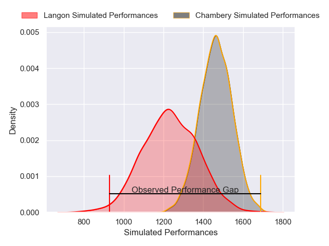
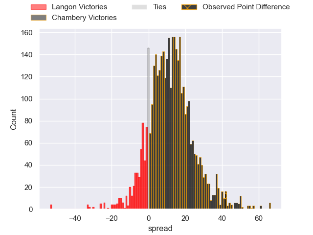
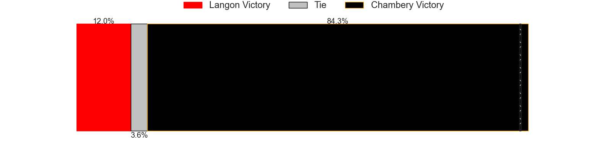
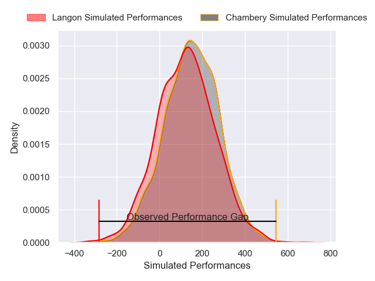
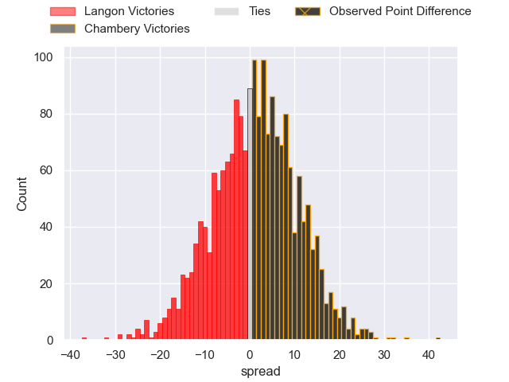
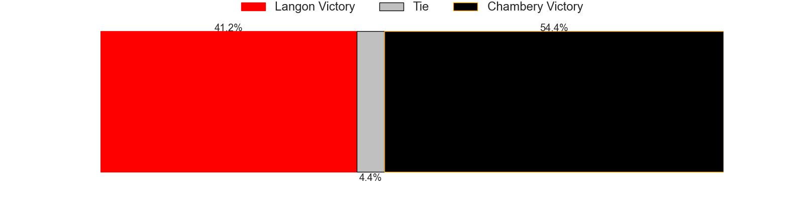

---  
layout: page  
title: Langon at Chambery; 3-45  
date: 2024-11-30 18:00:00 -0500  
categories: "Nationale 2024" match review  
---
# Langon at Chambery; 3-45

# Club Level Predictions

The first set of predictions treats a club as the smallest object, as the club develops its members, organizes a gameplan, and deploys its players as needed for each match. This club model has a prediction of 0.767, which translates to predicting Chambery to win by 11.3.

Our Over/Under is 43.5 - and combined with the spread above, we have a predicted scoreline of 16 to 27

Each club has a rating and a rating deviation (similar to a Glicko rating), and expected performances can be generated. This allows for simulated matches and spreads like the ones below.
## Projected Performances - Club Model

## Projected Spreads - Club Model

## Projected Results - Club Model

# Player Level Predictions

Treating teams instead as an entity made up of the currently active players, I have ratings for each player in an altogether different system. These can be combined to form team ratings once teamsheets are announced, weighting starters a bit higher than the reserves. After the match is played, players can be weighted by their minutes on the field, allowing for an accurate measure of the team's composition. With these compiled team ratings, we can make predictions, measure inaccuracy, and update the individual player ratings.
## Prediction without Player Minutes: Chambery by 1.8

Langon by 1.6 on a neutral pitch

## Projected Performances - Player Model

## Projected Spreads - Player Model

## Projected Results - Player Model

|   Away Minutes | Away Player               |   Away Percentile |   Number |   Home Percentile | Home Player          |   Home Minutes |
|---------------:|:--------------------------|------------------:|---------:|------------------:|:---------------------|---------------:|
|           70   | Tunaï Ratu Vatubua        |             35.58 |        1 |             60.13 | Nugzar Somkhishvili  |             52 |
|           80   | Clément Renaud            |             24.01 |        2 |             45.36 | Quentin Beaudaux     |              0 |
|           71   | Emiliano Coria Marchetti  |             34.21 |        3 |             55.78 | Lasha Tabidze        |             33 |
|           80   | Guillaume Marin           |             29.83 |        4 |             64.15 | Ahmed Kane           |             46 |
|           80   | Helmi Mimouna             |             31.27 |        5 |             65.85 | Corentin Astier      |             53 |
|           80   | Jules Depoortère          |             28.29 |        6 |             47.93 | Jean-Baptiste Grenod |              0 |
|           76   | Thomas Bishop             |             29.65 |        7 |             47.93 | Colin Lebian         |              0 |
|           80   | Thomas De Molder          |             33.87 |        8 |             63.44 | Taniela Matakaiongo  |             80 |
|           20   | Bastien Cazale-Debat      |             39.5  |        9 |             11.35 | Sonatane Takulua     |             80 |
|           80   | Christel Bertrand         |             26.12 |       10 |             62.38 | Thibaut Moréno       |             80 |
|            9   | Quentin Lefort            |             48.42 |       11 |             70.35 | Arthur Nennig        |             80 |
|            9   | Aurélien Tamagnan         |             39.07 |       12 |             64.21 | Mickaël Blanc        |             80 |
|            7.5 | Guillaume Christophe      |             39.54 |       13 |             64.21 | Maewen Sao           |             80 |
|           41   | Jean-Baptiste Bretagnolle |             39.04 |       14 |             50.75 | Souleymane Coulibaly |             80 |
|           80   | Nathan Gagnac             |             29.93 |       15 |             62.04 | Enzo Marzocca        |             80 |
|           80   | Maxime Lançon             |            nan    |       16 |            nan    | Yan Tabarot          |             80 |
|           54   | Julien Graffouillère      |            nan    |       17 |            nan    | Gela Murusidze       |             80 |
|           53   | Isikeli Davetawalu        |            nan    |       18 |            nan    | Fabien Witz          |             33 |
|           51   | Kemueli Lavetanakoroi     |            nan    |       19 |            nan    | Pierre-Nicolas Dance |              0 |
|           80   | Baptiste Tisné            |             54.12 |       20 |            nan    | Matéo Guerret        |              0 |
|           66   | Vincent Debladis          |            nan    |       21 |            nan    | Bastien Reymond      |             65 |
|           34   | Meryll Ech-Chalkha        |             51.44 |       22 |            nan    | Va'A Apelu Maliko    |             40 |
|           33   | Loïc Clavé                |             48.45 |       23 |            nan    | Osman Dimen          |             80 |

