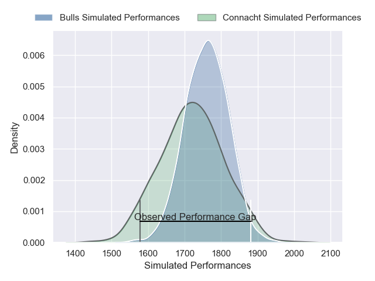
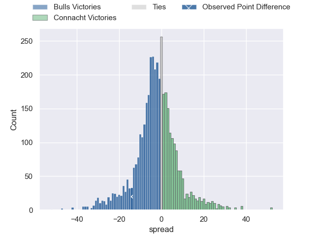
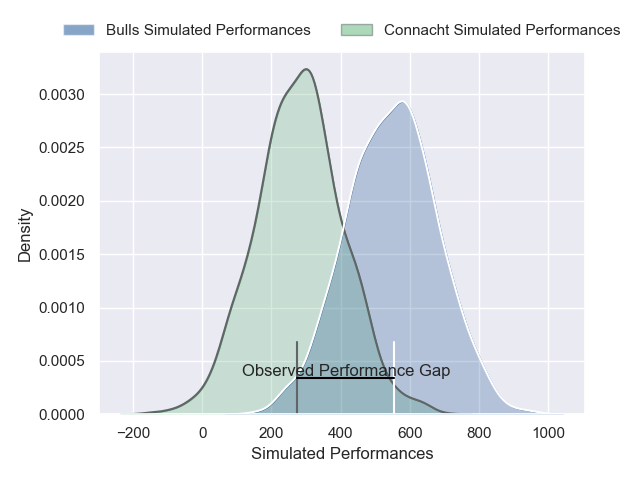
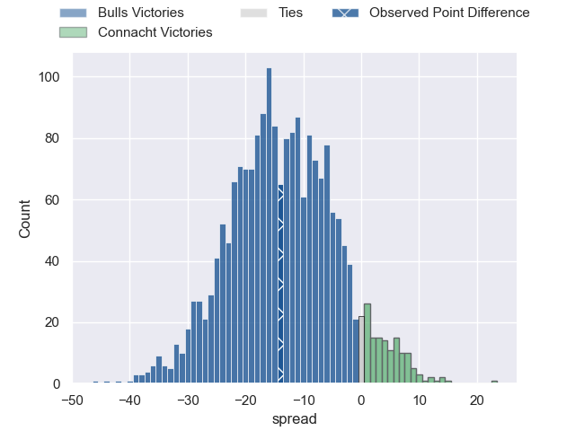

---  
layout: page  
title: Bulls at Connacht; 28-14  
date: 2024-11-30 18:00:00 -0500  
categories: "United Rugby Championship 2024" match review  
---
# Bulls at Connacht; 28-14

# Club Level Predictions

The first set of predictions treats a club as the smallest object, as the club develops its members, organizes a gameplan, and deploys its players as needed for each match. This club model has a prediction of 0.443, which translates to predicting Bulls to win by 2.0.

Our Over/Under is 60.5 - and combined with the spread above, we have a predicted scoreline of 31 to 29

Each club has a rating and a rating deviation (similar to a Glicko rating), and expected performances can be generated. This allows for simulated matches and spreads like the ones below.
## Projected Performances - Club Model

## Projected Spreads - Club Model

## Projected Results - Club Model

# Player Level Predictions

Treating teams instead as an entity made up of the currently active players, I have ratings for each player in an altogether different system. These can be combined to form team ratings once teamsheets are announced, weighting starters a bit higher than the reserves. After the match is played, players can be weighted by their minutes on the field, allowing for an accurate measure of the team's composition. With these compiled team ratings, we can make predictions, measure inaccuracy, and update the individual player ratings.
## Prediction without Player Minutes: Bulls by 11.0

Bulls by 19.4 on a neutral pitch

## Projected Performances - Player Model

## Projected Spreads - Player Model

## Projected Results - Player Model

|   Away Minutes | Away Player         |   Away Percentile |   Number |   Home Percentile | Home Player           |   Home Minutes |
|---------------:|:--------------------|------------------:|---------:|------------------:|:----------------------|---------------:|
|             49 | Alulutho Tshakweni  |             73.92 |        1 |             64.65 | Denis Buckley         |             14 |
|             49 | Akker van der Merwe |             96.12 |        2 |             11.16 | Dave Heffernan        |             84 |
|             84 | Francois Klopper    |             60.52 |        3 |             27.65 | Jack Aungier          |             21 |
|             49 | Ruan Vermaak        |             14.82 |        4 |             70    | Joe Joyce             |             30 |
|             49 | Ruan Vermaak        |             14.82 |        4 |             70    | Joe Joyce             |             56 |
|             53 | JF van Heerden      |             32.28 |        5 |             73.16 | Niall Murray          |             24 |
|             84 | Marcell Coetzee     |             96.12 |        6 |             90.78 | Josh Murphy           |             84 |
|             53 | Cobus Wiese         |             96.38 |        7 |             87.76 | Conor Oliver          |             21 |
|             35 | Mpilo Gumede        |             52.62 |        8 |             11.21 | Sean Jansen           |             15 |
|             63 | Embrose Papier      |             93.76 |        9 |             57.47 | Ben Murphy            |             14 |
|             53 | Johan Goosen        |             70.6  |       10 |             93.4  | Jack Carty            |             84 |
|             24 | Sebastian de Klerk  |             96.17 |       11 |             96.33 | Santiago Cordero      |             14 |
|             14 | Harold Vorster      |             94.08 |       12 |              2.04 | Cathal Forde          |             24 |
|             84 | David Kriel         |             94.18 |       13 |              3.78 | Piers O'Conor         |             80 |
|             84 | David Kriel         |             94.18 |       13 |              3.78 | Piers O'Conor         |             24 |
|             84 | Canan Moodie        |             99.92 |       14 |             70.29 | Shayne Bolton         |             84 |
|             84 | Willie le Roux      |             98.46 |       15 |             62.5  | Shane Jennings        |             84 |
|             84 | Johan Grobbelaar    |             91.63 |       16 |             14.73 | Dylan Tierney-Martin  |             74 |
|             21 | Gerhard Steenekamp  |             85.2  |       17 |             43.3  | Jordan Duggan         |             84 |
|             84 | Mornay Smith        |             78.71 |       18 |            nan    | Sam Illo              |             74 |
|             10 | Jannes Kirsten      |             93.79 |       19 |             32.37 | Darragh Murray        |             41 |
|             63 | Cameron Hanekom     |             70.16 |       20 |              8.32 | Paul Boyle            |             84 |
|             73 | Keagan Johannes     |             56.8  |       21 |             33.5  | Caolin Blade          |             84 |
|             84 | Stedman Gans        |             86.23 |       22 |             44.23 | David Hawkshaw        |             52 |
|             84 | Aphiwe Dyantyi      |             28.69 |       23 |             58.1  | Shamus Hurley-Langton |             84 |

