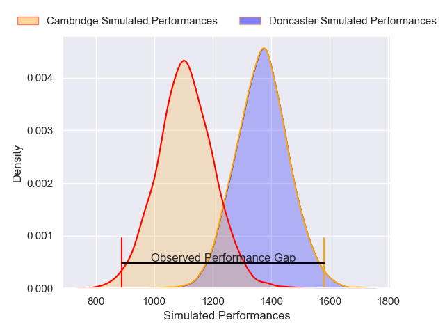
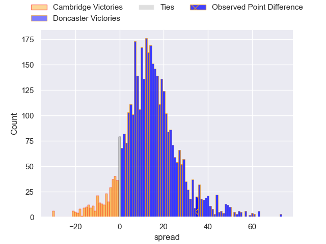
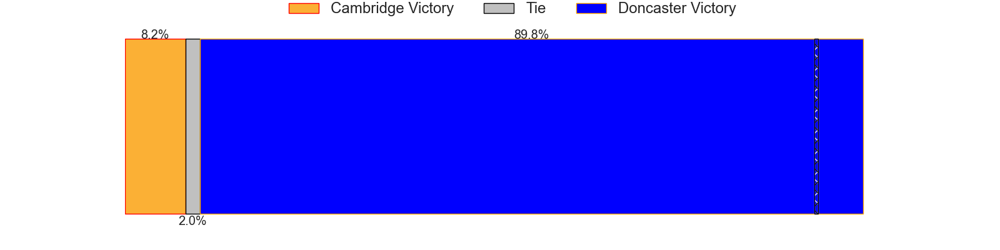
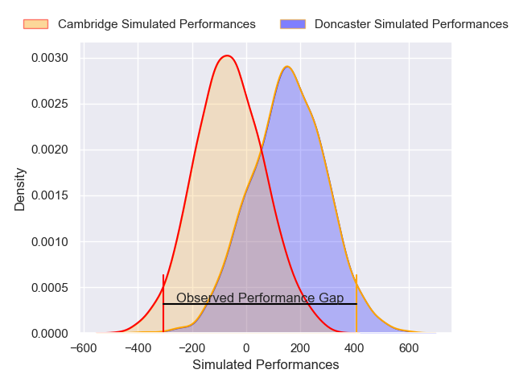
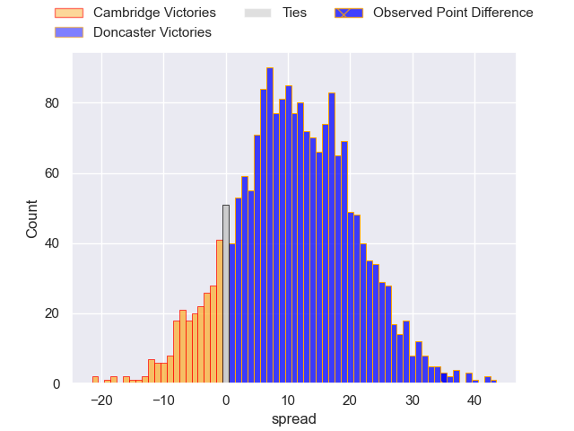
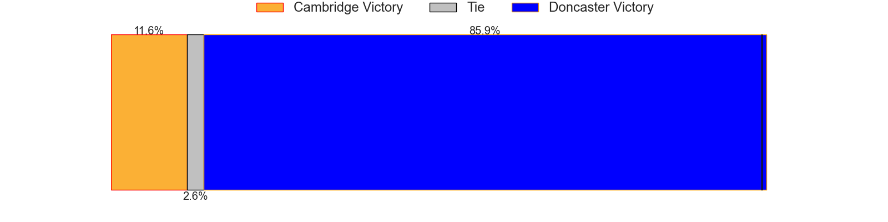

---  
layout: page  
title: Cambridge at Doncaster; 17-52  
date: 2024-11-30 18:00:00 -0500  
categories: "RFU Championship 2024" match review  
---
# Cambridge at Doncaster; 17-52

# Club Level Predictions

The first set of predictions treats a club as the smallest object, as the club develops its members, organizes a gameplan, and deploys its players as needed for each match. This club model has a prediction of 0.813, which translates to predicting Doncaster to win by 13.3.

Our Over/Under is 60.5 - and combined with the spread above, we have a predicted scoreline of 24 to 37

Each club has a rating and a rating deviation (similar to a Glicko rating), and expected performances can be generated. This allows for simulated matches and spreads like the ones below.
## Projected Performances - Club Model

## Projected Spreads - Club Model

## Projected Results - Club Model

# Player Level Predictions

Treating teams instead as an entity made up of the currently active players, I have ratings for each player in an altogether different system. These can be combined to form team ratings once teamsheets are announced, weighting starters a bit higher than the reserves. After the match is played, players can be weighted by their minutes on the field, allowing for an accurate measure of the team's composition. With these compiled team ratings, we can make predictions, measure inaccuracy, and update the individual player ratings.
## Prediction without Player Minutes: Doncaster by 10.9

Doncaster by 6.2 on a neutral pitch

## Projected Performances - Player Model

## Projected Spreads - Player Model

## Projected Results - Player Model

|   Away Minutes | Away Player          |   Away Percentile |   Number |   Home Percentile | Home Player       |   Home Minutes |
|---------------:|:---------------------|------------------:|---------:|------------------:|:------------------|---------------:|
|             65 | Jake Elwood          |             15.46 |        1 |             50.45 | Andrew Turner     |             70 |
|             80 | Benjamin Brownlie    |             14.57 |        2 |             17.36 | George Roberts    |             80 |
|             80 | Billy Walker         |             13.46 |        3 |             42.27 | Joe Jones         |             20 |
|             82 | George Bretag-Norris |             16.93 |        4 |             79.04 | Josh Williams     |             60 |
|             80 | Kayde Sylvester      |             51.32 |        5 |              6.32 | Ben Murphy        |             70 |
|             25 | Iestyn Rees          |             30.09 |        6 |              8.36 | Thom Smith        |             80 |
|             14 | Jared Cardew         |             10.52 |        7 |             60.17 | Rhys Tait         |             80 |
|             80 | Jack Bartlett        |             19.17 |        8 |             78.66 | Morgan Strong     |             56 |
|             25 | Ruaridh Dawson       |             69.62 |        9 |             73.73 | Alex Dolly        |             80 |
|             80 | Louis Grimoldby      |             14.8  |       10 |             92.4  | Russell Bennett   |             80 |
|             20 | Josef Green          |             36.28 |       11 |             26.74 | Jordan Olowofela  |             80 |
|             58 | Ollie Betteridge     |             62.75 |       12 |              6.5  | Connor Edwards    |             58 |
|             56 | Sam Hanks            |              1.26 |       13 |             24.35 | Zach Kerr         |             63 |
|             41 | Matthew Hema         |             21.81 |       14 |             94.14 | Semesa Rokoduguni |             56 |
|             65 | Joseph Tarrant       |             15.38 |       15 |             98.85 | Telusa Veainu     |             80 |
|             60 | Sebastian Brownhill  |            nan    |       16 |             25.34 | Archie Smeaton    |             80 |
|             80 | William Glister      |             42.3  |       17 |             16.28 | Fred Davies       |             48 |
|             60 | Gareth Baxter        |             18.25 |       18 |              1.94 | George Wacokecoke |             71 |
|             47 | Morgan Veness        |              7.6  |       19 |              3.45 | Ollie Fox         |             80 |
|             70 | Elias Caven          |             12.2  |       20 |             80.72 | Logovi'i Mulipola |             61 |
|             80 | Ben Adams            |             13.02 |       21 |             28.2  | Jasper McGuire    |             80 |
|             20 | Jake Bridges         |             22.56 |       22 |             20.4  | Morgan Bunting    |             60 |
|             57 | Jimmy Thompson       |            nan    |       23 |             45.21 | Arthur Green      |             80 |

