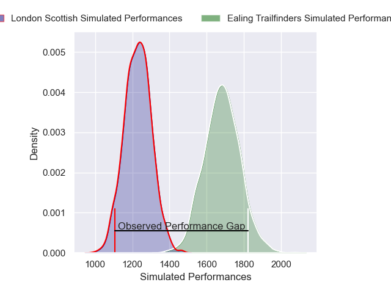
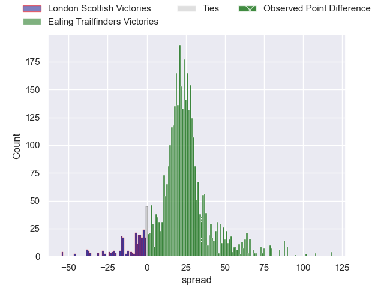
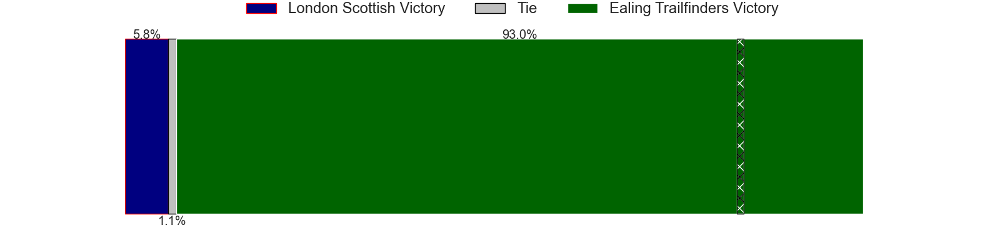
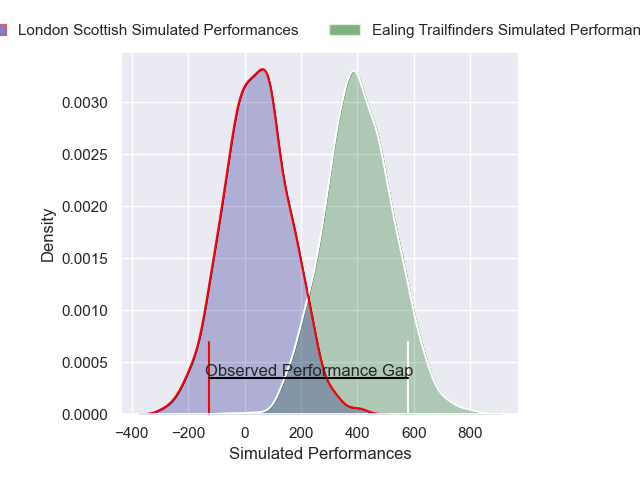
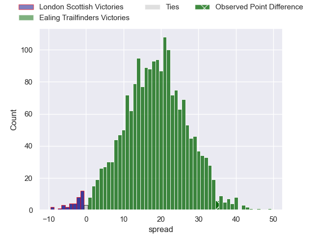
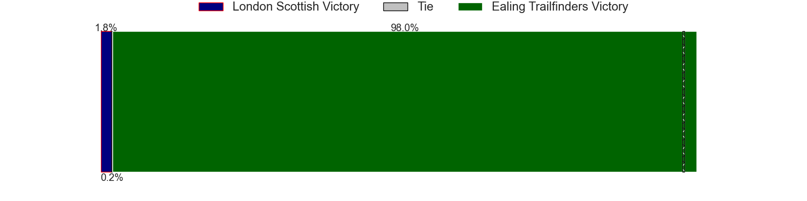

---  
layout: page  
title: London Scottish at Ealing Trailfinders; 28-63  
date: 2024-11-30 18:00:00 -0500  
categories: "RFU Championship 2024" match review  
---
# London Scottish at Ealing Trailfinders; 28-63

# Club Level Predictions

The first set of predictions treats a club as the smallest object, as the club develops its members, organizes a gameplan, and deploys its players as needed for each match. This club model has a prediction of 0.928, which translates to predicting Ealing Trailfinders to win by 22.8.

Our Over/Under is 65.5 - and combined with the spread above, we have a predicted scoreline of 21 to 44

Each club has a rating and a rating deviation (similar to a Glicko rating), and expected performances can be generated. This allows for simulated matches and spreads like the ones below.
## Projected Performances - Club Model

## Projected Spreads - Club Model

## Projected Results - Club Model

# Player Level Predictions

Treating teams instead as an entity made up of the currently active players, I have ratings for each player in an altogether different system. These can be combined to form team ratings once teamsheets are announced, weighting starters a bit higher than the reserves. After the match is played, players can be weighted by their minutes on the field, allowing for an accurate measure of the team's composition. With these compiled team ratings, we can make predictions, measure inaccuracy, and update the individual player ratings.
## Prediction without Player Minutes: Ealing Trailfinders by 19.2

Ealing Trailfinders by 15.0 on a neutral pitch

## Projected Performances - Player Model

## Projected Spreads - Player Model

## Projected Results - Player Model

|   Away Minutes | Away Player           |   Away Percentile |   Number |   Home Percentile | Home Player          |   Home Minutes |
|---------------:|:----------------------|------------------:|---------:|------------------:|:---------------------|---------------:|
|             61 | Tom Osborne           |             32.63 |        1 |             82.35 | Lefty Zigiriadis     |             21 |
|             34 | Austin Wallis         |             57.98 |        2 |             76.74 | Matthew Cornish      |             82 |
|              8 | William Hobson        |             77.93 |        3 |             72.41 | George Davis         |             52 |
|             13 | Matt Wilkinson        |             35.53 |        4 |             95.18 | Bobby de Wee         |             61 |
|             28 | Harry Browne          |             79.39 |        5 |             91.67 | Daniel Cutmore       |             82 |
|             82 | Will Trenholm         |             19.4  |        6 |             84.66 | Rob Farrar           |             82 |
|             21 | Bailey Ransom         |             47.33 |        7 |             72.16 | Jordy Reid           |             82 |
|             61 | Zach Carr             |             38.7  |        8 |             41.95 | Callum Chick         |             32 |
|             50 | Stephen Kerins        |              8.21 |        9 |             88.83 | Lloyd Williams       |             55 |
|             46 | Josh Bellamy          |             45.2  |       10 |             97.8  | Craig Willis         |             80 |
|             53 | Noah Ferdinand        |             10.56 |       11 |             48.48 | Ben Harris           |             50 |
|             80 | Robert David McCallum |              3.88 |       12 |             74.1  | Reuben Bird-Tulloch  |              8 |
|             19 | Hayden Hyde           |             58    |       13 |             40.54 | Francis Moore        |             72 |
|             80 | Roma Zheng            |             71.85 |       14 |             93.12 | Angus Kernohan       |             65 |
|             80 | William Talbot-Davies |             53.85 |       15 |             77.31 | Tobi Wilson          |             80 |
|             15 | Daniel Nutton         |             16.42 |       16 |             37.02 | Sean Lonsdale        |             24 |
|             46 | Alex Wardell          |             24.91 |       17 |            nan    | Kabous Bezuidenhout  |             80 |
|             80 | Will Simonds          |             11.64 |       18 |            nan    | Henry Walker         |             52 |
|             24 | Jack Musk             |             20    |       19 |             98.83 | Tom Collins          |             24 |
|             56 | Ioan Rhys Davies      |             13.88 |       20 |             71.8  | Dan Jones            |             10 |
|             80 | Alexander Lloyd-Seed  |             59    |       21 |             45.97 | Elliott Chilvers     |             80 |
|             82 | Ashley Challenger     |             15.4  |       22 |             20.09 | David Douglas Bridge |             80 |
|             67 | Caleb Ashworth        |             32.75 |       23 |             77.5  | Craig Hampson        |             46 |

