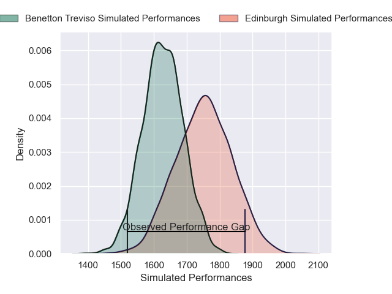
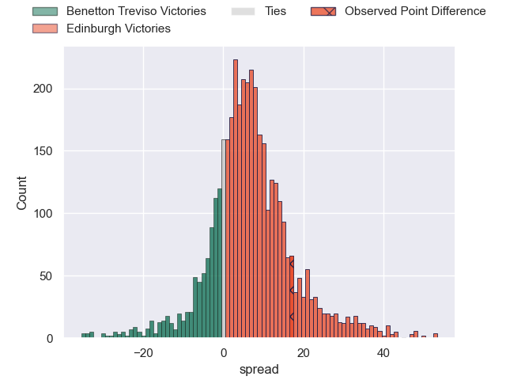
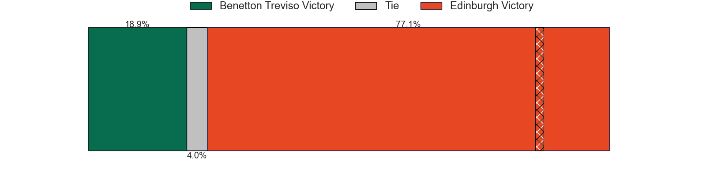
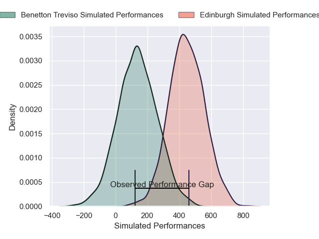
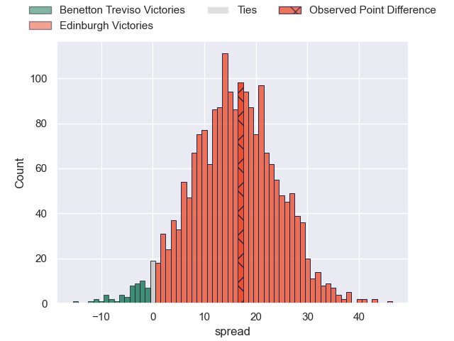
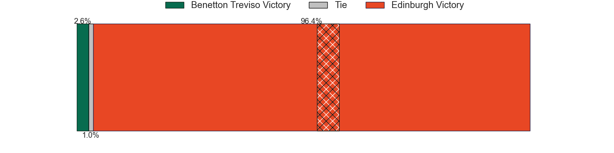

---  
layout: page  
title: Benetton Treviso at Edinburgh; 33-50  
date: 2024-11-30 18:00:00 -0500  
categories: "United Rugby Championship 2024" match review  
---
# Benetton Treviso at Edinburgh; 33-50

# Club Level Predictions

The first set of predictions treats a club as the smallest object, as the club develops its members, organizes a gameplan, and deploys its players as needed for each match. This club model has a prediction of 0.664, which translates to predicting Edinburgh to win by 6.0.

Our Over/Under is 53.5 - and combined with the spread above, we have a predicted scoreline of 24 to 30

Each club has a rating and a rating deviation (similar to a Glicko rating), and expected performances can be generated. This allows for simulated matches and spreads like the ones below.
## Projected Performances - Club Model

## Projected Spreads - Club Model

## Projected Results - Club Model

# Player Level Predictions

Treating teams instead as an entity made up of the currently active players, I have ratings for each player in an altogether different system. These can be combined to form team ratings once teamsheets are announced, weighting starters a bit higher than the reserves. After the match is played, players can be weighted by their minutes on the field, allowing for an accurate measure of the team's composition. With these compiled team ratings, we can make predictions, measure inaccuracy, and update the individual player ratings.
## Prediction without Player Minutes: Edinburgh by 23.9

Edinburgh by 13.4 on a neutral pitch

## Projected Performances - Player Model

## Projected Spreads - Player Model

## Projected Results - Player Model

|   Away Minutes | Away Player           |   Away Percentile |   Number |   Home Percentile | Home Player         |   Home Minutes |
|---------------:|:----------------------|------------------:|---------:|------------------:|:--------------------|---------------:|
|             69 | Nahuel Tetaz Chaparro |             45.54 |        1 |             81.44 | Pierre Schoeman     |             82 |
|             82 | Marco Manfredi        |              6.98 |        2 |             83.72 | Ewan Ashman         |             12 |
|             14 | Enzo Avaca            |             40.21 |        3 |             89.33 | Paul Hill           |             24 |
|             26 | Scott Scrafton        |             35.35 |        4 |             86.05 | Marshall Sykes      |             51 |
|             13 | Eli Snyman            |             78.33 |        5 |             93.77 | Grant Gilchrist     |             34 |
|             82 | Alessandro Izekor     |             47.84 |        6 |             99.14 | Jamie Ritchie       |             22 |
|             17 | Toa Halafihi          |             79.74 |        7 |             44.83 | Ben Muncaster       |             17 |
|             62 | Riccardo Favretto     |             18.26 |        8 |             63.47 | Magnus Bradbury     |             70 |
|             82 | Andy Uren             |             18.06 |        9 |             87.68 | Ali Price           |             12 |
|             74 | Jacob Umaga           |             63.8  |       10 |             79.4  | Ross Thompson       |             28 |
|             41 | Paolo Odogwu          |             50.2  |       11 |             82.96 | Duhan van der Merwe |             82 |
|              8 | Marco Zanon           |             59.94 |       12 |             21.24 | Mosese Tuipulotu    |             52 |
|             61 | Malakai Fekitoa       |             71.97 |       13 |             82.74 | Matt Currie         |             62 |
|             80 | Ignacio Mendy         |             45.97 |       14 |             44.18 | Darcy Graham        |             56 |
|             59 | Rhyno Smith           |             87.5  |       15 |             91.73 | Wes Goosen          |             26 |
|             27 | Agustin Creevy        |             90.39 |       16 |             15.66 | Patrick Harrison    |             41 |
|             46 | Destiny Aminu         |            nan    |       17 |             24.86 | Boan Venter         |             70 |
|             80 | Tiziano Pasquali      |             77.8  |       18 |             53.55 | D'Arcy Rae          |             82 |
|             72 | Jadin Kingi           |             22.24 |       19 |             82.11 | Sam Skinner         |             23 |
|             80 | Simon Koroiyadi       |            nan    |       20 |             43.1  | Freddy Douglas      |             82 |
|             34 | Lautaro Bazan Velez   |             65.85 |       21 |             83.25 | Ben Vellacott       |             23 |
|             28 | Leonardo Marin        |             72.2  |       22 |             80    | Ben Healy           |             80 |
|             44 | Louis Lynagh          |             53.71 |       23 |            nan    | Ross McCann         |             80 |

