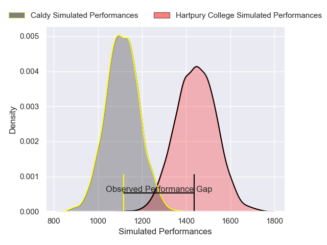
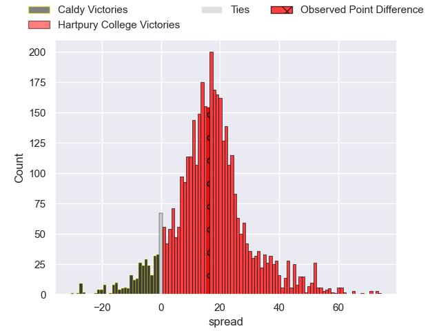
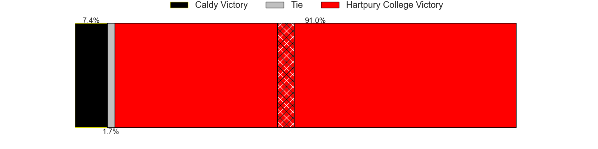
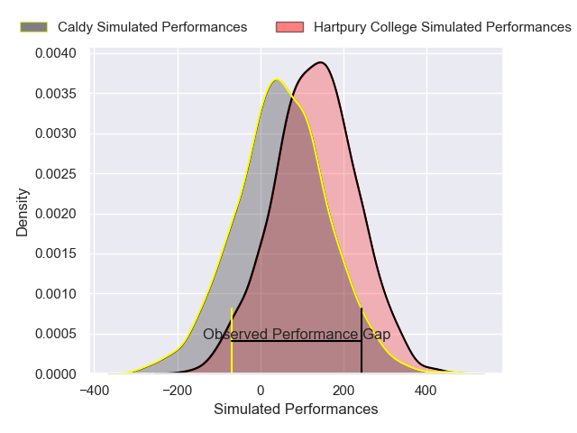
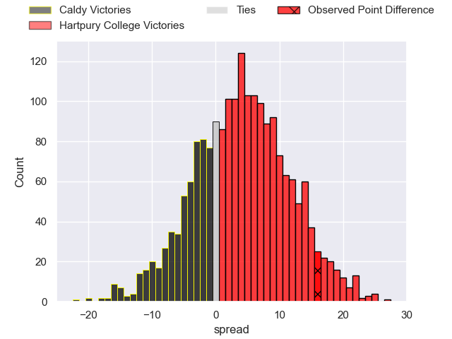
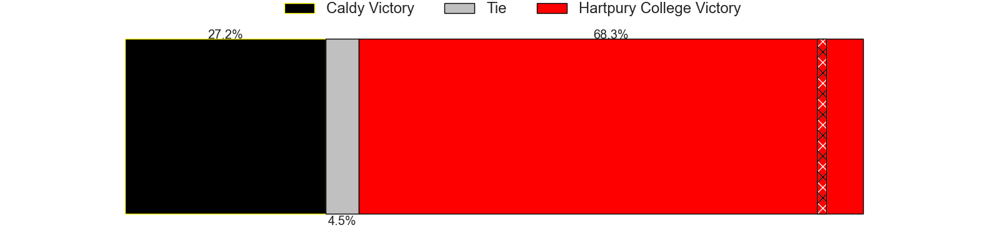

---  
layout: page  
title: Caldy at Hartpury College; 24-40  
date: 2024-11-30 18:00:00 -0500  
categories: "RFU Championship 2024" match review  
---
# Caldy at Hartpury College; 24-40

# Club Level Predictions

The first set of predictions treats a club as the smallest object, as the club develops its members, organizes a gameplan, and deploys its players as needed for each match. This club model has a prediction of 0.865, which translates to predicting Hartpury College to win by 16.6.

Our Over/Under is 53.5 - and combined with the spread above, we have a predicted scoreline of 18 to 35

Each club has a rating and a rating deviation (similar to a Glicko rating), and expected performances can be generated. This allows for simulated matches and spreads like the ones below.
## Projected Performances - Club Model

## Projected Spreads - Club Model

## Projected Results - Club Model

# Player Level Predictions

Treating teams instead as an entity made up of the currently active players, I have ratings for each player in an altogether different system. These can be combined to form team ratings once teamsheets are announced, weighting starters a bit higher than the reserves. After the match is played, players can be weighted by their minutes on the field, allowing for an accurate measure of the team's composition. With these compiled team ratings, we can make predictions, measure inaccuracy, and update the individual player ratings.
## Prediction without Player Minutes: Hartpury College by 2.1

Caldy by 2.1 on a neutral pitch

## Projected Performances - Player Model

## Projected Spreads - Player Model

## Projected Results - Player Model

|   Away Minutes | Away Player       |   Away Percentile |   Number |   Home Percentile | Home Player           |   Home Minutes |
|---------------:|:------------------|------------------:|---------:|------------------:|:----------------------|---------------:|
|             26 | Monty Weatherby   |             26.98 |        1 |             81.26 | Archie Mcarthur       |             80 |
|             29 | Ollie Hearn       |             16.49 |        2 |             56.11 | Ethan Hunt            |             20 |
|             80 | Nathan Rushton    |             21.92 |        3 |             46.54 | Jono Benz-Salomon     |             10 |
|             71 | Freddie Stevenson |             29.19 |        4 |             16.6  | Cameron Cobbett       |             20 |
|             29 | Joe Sproston      |             21.19 |        5 |             27.15 | Jack Davies           |             10 |
|             61 | Sam Olyott        |             27.99 |        6 |             24.62 | Sam Lewis             |             66 |
|             46 | Tristan Woodman   |             32.21 |        7 |             16.36 | Harry Short           |             15 |
|             57 | Jj Dickinson      |             11.44 |        8 |             19.72 | Jarrard Hayler        |             24 |
|             23 | Ollie Wynn        |             21.95 |        9 |             54.56 | Mike Austin           |             15 |
|             20 | Lewis Barker      |             26.5  |       10 |             41.2  | Harry Bazalgette      |             55 |
|             20 | Michael Cartmill  |             28.28 |       11 |             73.16 | Ollie Holliday        |             55 |
|             33 | Mike Barlow       |             24.56 |       12 |             20.93 | Robbie Smith          |             55 |
|             14 | Connor Wilkinson  |             25.3  |       13 |             64.93 | Josiah Edwards-Giraud |             70 |
|             20 | Nick Royle        |             44.12 |       14 |             61.79 | Jack Johnson          |             26 |
|             14 | Alex Wills        |             25.78 |       15 |             56.67 | Alex Morgan           |             80 |
|             80 | Matt Gallagher    |             17.53 |       16 |             14.87 | Will Crane            |             19 |
|             23 | Ryan Higginson    |            nan    |       17 |            nan    | James Gibbons         |             51 |
|             51 | Adam Aigbokhae    |            nan    |       18 |            nan    | Joe Rees              |             80 |
|             80 | Will Riley        |            nan    |       19 |            nan    | Carn Richards-Farr    |             80 |
|             80 | Callum Ridgway    |            nan    |       20 |            nan    | Evan Minto            |              9 |
|             25 | Joe Murray        |            nan    |       21 |            nan    | Matty Jones           |             19 |
|             80 | Matt Kilcourse    |             37.66 |       22 |             33.74 | Bradley Denty         |             31 |
|             63 | Joe Bedlow        |            nan    |       23 |            nan    | Morgan Adderly-Jones  |             26 |

