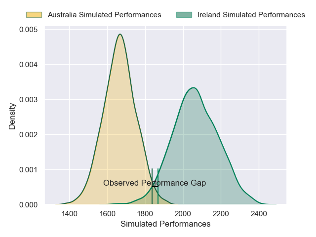
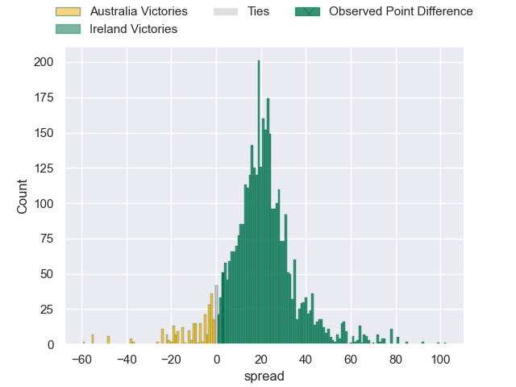
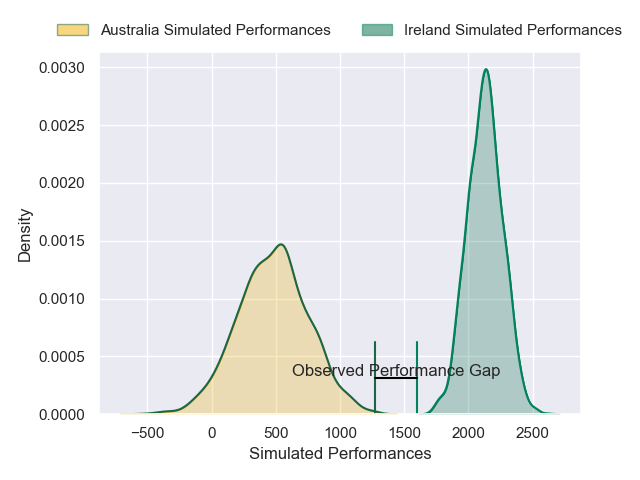
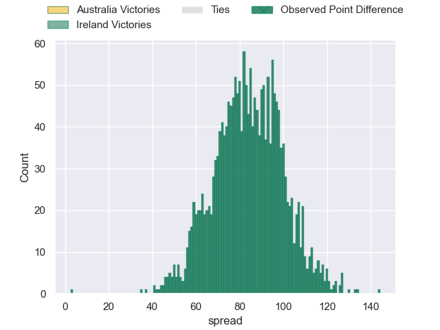

---  
layout: page  
title: Australia at Ireland; 19-22  
date: 2024-11-30 18:00:00 -0500  
categories: "International Test Match 2024" match review  
---
# Australia at Ireland; 19-22

# Club Level Predictions

The first set of predictions treats a club as the smallest object, as the club develops its members, organizes a gameplan, and deploys its players as needed for each match. This club model has a prediction of 0.902, which translates to predicting Ireland to win by 20.0.

Our Over/Under is 57.5 - and combined with the spread above, we have a predicted scoreline of 19 to 39

Each club has a rating and a rating deviation (similar to a Glicko rating), and expected performances can be generated. This allows for simulated matches and spreads like the ones below.
## Projected Performances - Club Model

## Projected Spreads - Club Model

## Projected Results - Club Model

# Player Level Predictions

Treating teams instead as an entity made up of the currently active players, I have ratings for each player in an altogether different system. These can be combined to form team ratings once teamsheets are announced, weighting starters a bit higher than the reserves. After the match is played, players can be weighted by their minutes on the field, allowing for an accurate measure of the team's composition. With these compiled team ratings, we can make predictions, measure inaccuracy, and update the individual player ratings.
## Prediction without Player Minutes: Ireland by 56.1

Ireland by 50.6 on a neutral pitch

## Projected Performances - Player Model

## Projected Spreads - Player Model

## Projected Results - Player Model

|   Away Minutes | Away Player           |   Away Percentile |   Number |   Home Percentile | Home Player         |   Home Minutes |
|---------------:|:----------------------|------------------:|---------:|------------------:|:--------------------|---------------:|
|             81 | James Slipper         |            100    |        1 |             84.03 | Andrew Porter       |             14 |
|             24 | James Slipper         |            100    |        1 |             84.03 | Andrew Porter       |             14 |
|             57 | James Slipper         |            100    |        1 |             84.03 | Andrew Porter       |             14 |
|             46 | James Slipper         |            100    |        1 |             84.03 | Andrew Porter       |             14 |
|             50 | James Slipper         |            100    |        1 |             84.03 | Andrew Porter       |             14 |
|             60 | James Slipper         |            100    |        1 |             84.03 | Andrew Porter       |             14 |
|             21 | James Slipper         |            100    |        1 |             84.03 | Andrew Porter       |             14 |
|             79 | James Slipper         |            100    |        1 |             84.03 | Andrew Porter       |             14 |
|             31 | James Slipper         |            100    |        1 |             84.03 | Andrew Porter       |             14 |
|             20 | James Slipper         |            100    |        1 |             84.03 | Andrew Porter       |             14 |
|              3 | James Slipper         |            100    |        1 |             84.03 | Andrew Porter       |             14 |
|             74 | Brandon Paenga-Amosa  |             85.57 |        2 |             84.98 | Ronan Kelleher      |             14 |
|              7 | Taniela Tupou         |             84.21 |        3 |             49.52 | Finlay Bealham      |             81 |
|             26 | Nick Frost            |             85.08 |        4 |             30.42 | Joe McCarthy        |             50 |
|             83 | Jeremy Williams       |             28.31 |        5 |             97.46 | James Ryan          |             66 |
|             81 | Rob Valetini          |             98.14 |        6 |             90.88 | Tadhg Beirne        |             50 |
|             50 | Fraser McReight       |             94.34 |        7 |             95.69 | Josh van der Flier  |             81 |
|             81 | Harry Wilson          |             25.81 |        8 |             88.53 | Caelan Doris        |             35 |
|             50 | Jake Gordon           |             61.28 |        9 |             95.33 | Jamison Gibson-Park |             14 |
|             50 | Noah Lolesio          |             91.23 |       10 |             10.72 | Sam Prendergast     |             50 |
|             50 | Max Jorgensen         |             79.73 |       11 |             99.77 | James Lowe          |             15 |
|             50 | Max Jorgensen         |             79.73 |       11 |             99.77 | James Lowe          |             14 |
|             50 | Max Jorgensen         |             79.73 |       11 |             99.77 | James Lowe          |             27 |
|             50 | Len Ikitau            |             77.13 |       12 |             97.41 | Bundee Aki          |             14 |
|             83 | Joseph-Aukuso Suaalii |             84.17 |       13 |             87.78 | Robbie Henshaw      |             50 |
|             49 | Andrew Kellaway       |             56.68 |       14 |             58.93 | Mack Hansen         |             37 |
|             81 | Tom Wright            |             95.26 |       15 |             99.09 | Hugo Keenan         |             75 |
|             27 | Tom Wright            |             95.26 |       15 |             99.09 | Hugo Keenan         |             75 |
|             81 | Billy Pollard         |             81.74 |       16 |            100    | Gus McCarthy        |             25 |
|             81 | Billy Pollard         |             81.74 |       16 |            100    | Gus McCarthy        |             54 |
|             81 | Billy Pollard         |             81.74 |       16 |            100    | Gus McCarthy        |              2 |
|             81 | Billy Pollard         |             81.74 |       16 |            100    | Gus McCarthy        |             81 |
|             39 | Isaac Kailea          |             45.05 |       17 |             84.45 | Cian Healy          |             81 |
|             50 | Allan Alaalatoa       |             88.97 |       18 |             55.84 | Tom O'Toole         |             61 |
|             81 | Lukhan Salakaia-Loto  |             15.76 |       19 |             94.49 | Iain Henderson      |             50 |
|             81 | Langi Gleeson         |             62.37 |       20 |             97.04 | Peter O'Mahony      |             81 |
|             83 | Tate McDermott        |             82.12 |       21 |              9.64 | Craig Casey         |             50 |
|             69 | Tane Edmed            |              7.21 |       22 |              1.56 | Jack Crowley        |             78 |
|             50 | Harry Potter          |             53.6  |       23 |             99.17 | Garry Ringrose      |             50 |

