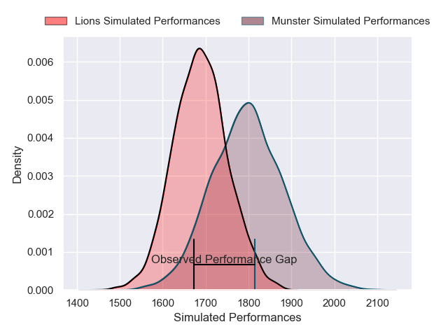
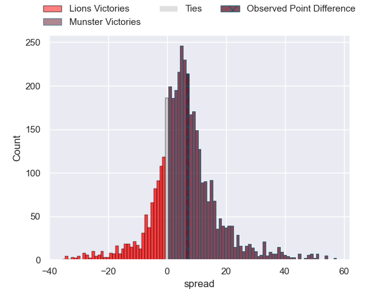
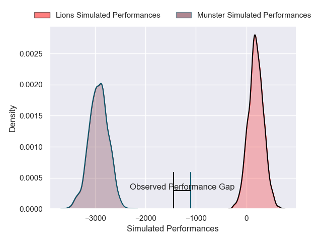
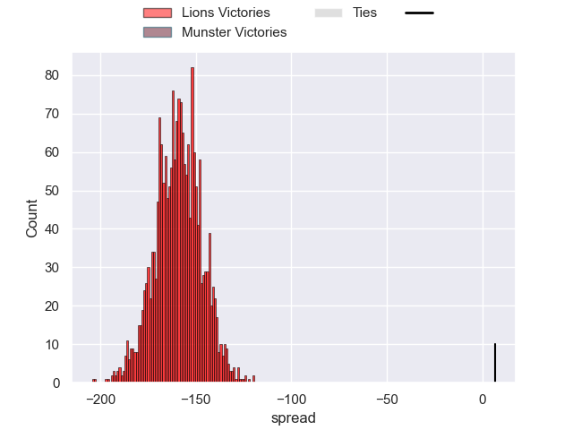

---  
layout: page  
title: Lions at Munster; 10-17  
date: 2024-11-30 18:00:00 -0500  
categories: "United Rugby Championship 2024" match review  
---
# Lions at Munster; 10-17

# Club Level Predictions

The first set of predictions treats a club as the smallest object, as the club develops its members, organizes a gameplan, and deploys its players as needed for each match. This club model has a prediction of 0.638, which translates to predicting Munster to win by 5.0.

Our Over/Under is 48.5 - and combined with the spread above, we have a predicted scoreline of 22 to 27

Each club has a rating and a rating deviation (similar to a Glicko rating), and expected performances can be generated. This allows for simulated matches and spreads like the ones below.
## Projected Performances - Club Model

## Projected Spreads - Club Model

## Projected Results - Club Model

# Player Level Predictions

Treating teams instead as an entity made up of the currently active players, I have ratings for each player in an altogether different system. These can be combined to form team ratings once teamsheets are announced, weighting starters a bit higher than the reserves. After the match is played, players can be weighted by their minutes on the field, allowing for an accurate measure of the team's composition. With these compiled team ratings, we can make predictions, measure inaccuracy, and update the individual player ratings.
## Prediction without Player Minutes: Lions by 58.3

Lions by 68.1 on a neutral pitch

## Projected Performances - Player Model

## Projected Spreads - Player Model

## Projected Results - Player Model

|   Away Minutes | Away Player          |   Away Percentile |   Number |   Home Percentile | Home Player      |   Home Minutes |
|---------------:|:---------------------|------------------:|---------:|------------------:|:-----------------|---------------:|
|             41 | Juan Schoeman        |             19.04 |        1 |             89.51 | Dian Bleuler     |             82 |
|             41 | Juan Schoeman        |             19.04 |        1 |             89.51 | Dian Bleuler     |             58 |
|             41 | Juan Schoeman        |             19.04 |        1 |             89.51 | Dian Bleuler     |             56 |
|             65 | PJ Botha             |             28.99 |        2 |             72.25 | Diarmuid Barron  |             56 |
|             23 | Asenathi Ntlabakanye |             38.99 |        3 |             10.79 | John Ryan        |             41 |
|             23 | Asenathi Ntlabakanye |             38.99 |        3 |             10.79 | John Ryan        |             59 |
|             23 | Asenathi Ntlabakanye |             38.99 |        3 |             10.79 | John Ryan        |             72 |
|             23 | Asenathi Ntlabakanye |             38.99 |        3 |             10.79 | John Ryan        |             21 |
|             59 | Ruben Schoeman       |             25.61 |        4 |             72.11 | Evan O'Connell   |             68 |
|             50 | Ruben Schoeman       |             25.61 |        4 |             72.11 | Evan O'Connell   |             68 |
|             82 | Ruben Schoeman       |             25.61 |        4 |             72.11 | Evan O'Connell   |             68 |
|             68 | Ruan Delport         |             21.4  |        5 |             23.68 | Fineen Wycherley |             54 |
|             20 | Jarod Cairns         |             39.01 |        6 |             43.88 | Jack O'Donoghue  |             82 |
|             20 | WJ Steenkamp         |             39.01 |        7 |             79.4  | Alex Kendellen   |             82 |
|             15 | Francke Horn         |             96.93 |        8 |             20.07 | Gavin Coombes    |             41 |
|             82 | Morne van den Berg   |              5.25 |        9 |             37.93 | Ethan Coughlan   |             56 |
|             24 | Morne van den Berg   |              5.25 |        9 |             37.93 | Ethan Coughlan   |             56 |
|             21 | Morne van den Berg   |              5.25 |        9 |             37.93 | Ethan Coughlan   |             56 |
|             26 | Kade Wolhuter        |              4.2  |       10 |             22.4  | Billy Burns      |             56 |
|             68 | Edwill van der Merwe |             86.08 |       11 |             28.62 | Thaakir Abrahams |             82 |
|             65 | Marius Louw          |             83.41 |       12 |             88.26 | Alex Nankivell   |             82 |
|             52 | Henco van Wyk        |             21.63 |       13 |             20.27 | Tom Farrell      |             82 |
|             38 | Richard Kriel        |             26.11 |       14 |             18.06 | Shay McCarthy    |             82 |
|             30 | Quan Horn            |             94.81 |       15 |             25.58 | Mike Haley       |             82 |
|             82 | Franco Marais        |            nan    |       16 |             18.76 | Niall Scannell   |             11 |
|             20 | Morgan Naude         |             68.34 |       17 |            nan    | Kieran Ryan      |             82 |
|             82 | RF Schoeman          |            nan    |       18 |             84.78 | Stephen Archer   |             82 |
|             67 | Reinhard Nothnagel   |             92.98 |       19 |             51.21 | Ruadhan Quinn    |             82 |
|             26 | JC Pretorius         |             80.43 |       20 |             10.86 | John Hodnett     |             13 |
|             26 | Sanele Nohamba       |             91.8  |       21 |            nan    | Paddy Patterson  |             41 |
|             82 | Tapiwa Mafura        |             88.51 |       22 |             11.6  | Tony Butler      |             62 |
|             38 | Erich Cronje         |             27.35 |       23 |             84.28 | Shane Daly       |             82 |
|             38 | Erich Cronje         |             27.35 |       23 |             84.28 | Shane Daly       |             69 |
|             38 | Erich Cronje         |             27.35 |       23 |             84.28 | Shane Daly       |             41 |

