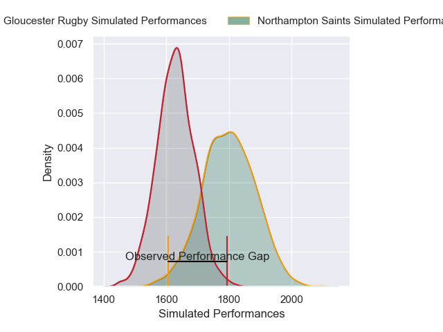
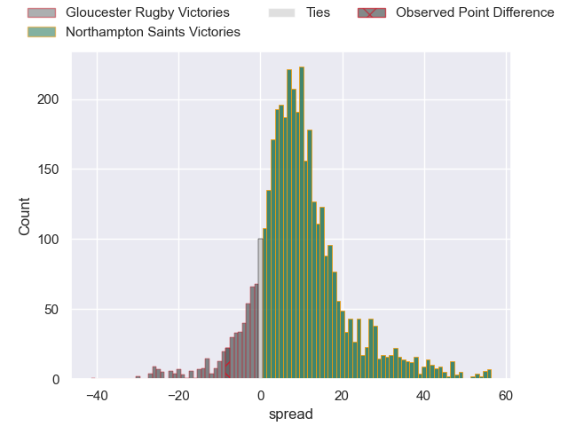
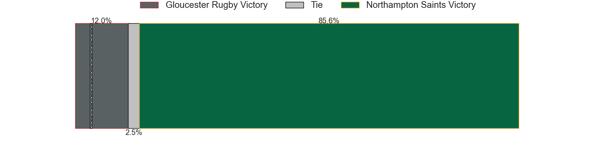
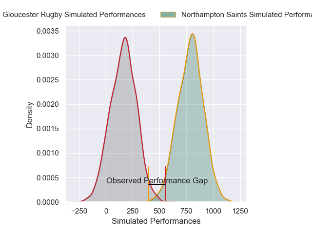
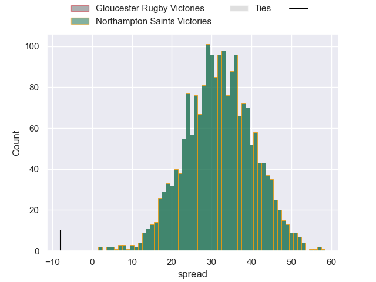

---  
layout: page  
title: Gloucester Rugby at Northampton Saints; 25-17  
date: 2024-11-30 18:00:00 -0500  
categories: "Gallagher Premiership 2024" match review  
---
# Gloucester Rugby at Northampton Saints; 25-17

# Club Level Predictions

The first set of predictions treats a club as the smallest object, as the club develops its members, organizes a gameplan, and deploys its players as needed for each match. This club model has a prediction of 0.726, which translates to predicting Northampton Saints to win by 8.6.

Our Over/Under is 57.5 - and combined with the spread above, we have a predicted scoreline of 25 to 33

Each club has a rating and a rating deviation (similar to a Glicko rating), and expected performances can be generated. This allows for simulated matches and spreads like the ones below.
## Projected Performances - Club Model

## Projected Spreads - Club Model

## Projected Results - Club Model

# Player Level Predictions

Treating teams instead as an entity made up of the currently active players, I have ratings for each player in an altogether different system. These can be combined to form team ratings once teamsheets are announced, weighting starters a bit higher than the reserves. After the match is played, players can be weighted by their minutes on the field, allowing for an accurate measure of the team's composition. With these compiled team ratings, we can make predictions, measure inaccuracy, and update the individual player ratings.
## Prediction without Player Minutes: Northampton Saints by 30.0

Northampton Saints by 15.0 on a neutral pitch

## Projected Performances - Player Model

## Projected Spreads - Player Model

## Projected Results - Player Model

|   Away Minutes | Away Player        |   Away Percentile |   Number |   Home Percentile | Home Player        |   Home Minutes |
|---------------:|:-------------------|------------------:|---------:|------------------:|:-------------------|---------------:|
|             40 | Val Rapava-Ruskin  |             82.6  |        1 |             55.43 | Tom West           |              7 |
|             18 | Jack Singleton     |             89.61 |        2 |             91.94 | Curtis Langdon     |             80 |
|             18 | Afolabi Fasogban   |             83.63 |        3 |             89.75 | Trevor Davison     |             56 |
|             80 | Arthur Clark       |             57.28 |        4 |             76.49 | Chunya Munga       |             80 |
|              9 | Freddie Thomas     |             30.09 |        5 |             16.32 | Alex Coles         |             58 |
|             24 | Jack Clement       |             21.9  |        6 |             45.6  | Angus Scott-Young  |             80 |
|             80 | Lewis Ludlow       |             36.21 |        7 |             95.6  | Tom Pearson        |             58 |
|             80 | Zach Mercer        |             23.15 |        8 |             39.96 | Juarno Augustus    |             80 |
|             40 | Caolan Englefield  |             75.21 |        9 |              6.57 | Tom James          |             24 |
|             34 | Gareth Anscombe    |             78.8  |       10 |             75.8  | Fin Smith          |             40 |
|             80 | Ollie Thorley      |             48.71 |       11 |             90.77 | Ollie Sleightholme |             80 |
|             80 | Sebastien Atkinson |             40.45 |       12 |             80.02 | Rory Hutchinson    |             64 |
|             41 | Max Llewellyn      |             82.15 |       13 |             72.26 | Tom Litchfield     |             80 |
|             62 | Christian Wade     |             97.11 |       14 |             95.62 | George Hendy       |             28 |
|             40 | Santiago Carreras  |             84.62 |       15 |             93.27 | George Furbank     |             80 |
|             71 | Ciaran Knight      |             18.92 |       16 |             50.03 | Emmanuel Iyogun    |             40 |
|             33 | Sebastian Blake    |             54.73 |       17 |             69.68 | Luke Green         |             80 |
|             80 | Kirill Gotovtsev   |             76.35 |       18 |             29.56 | Tom Lockett        |             16 |
|             35 | Matias Alemanno    |             78.86 |       19 |             95.43 | Henry Pollock      |             80 |
|             54 | Ruan Ackermann     |             69.4  |       20 |             97.87 | Alex Mitchell      |             22 |
|             22 | Charlie Chapman    |             56.81 |       21 |             87.41 | James Ramm         |             80 |
|             80 | Chris Harris       |             44.42 |       22 |             84.77 | Fraser Dingwall    |             24 |
|             29 | Josh Hathaway      |             79.98 |       23 |            nan    | nan                |            nan |

