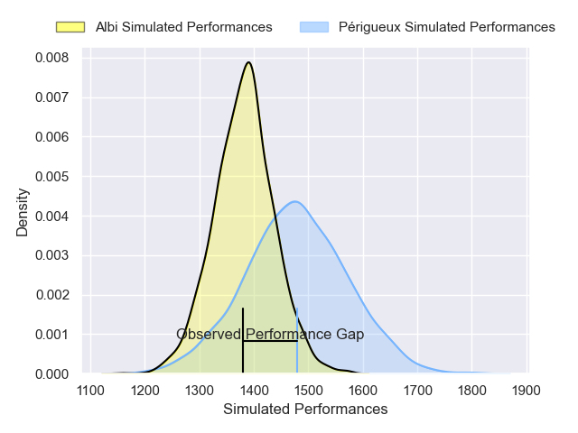
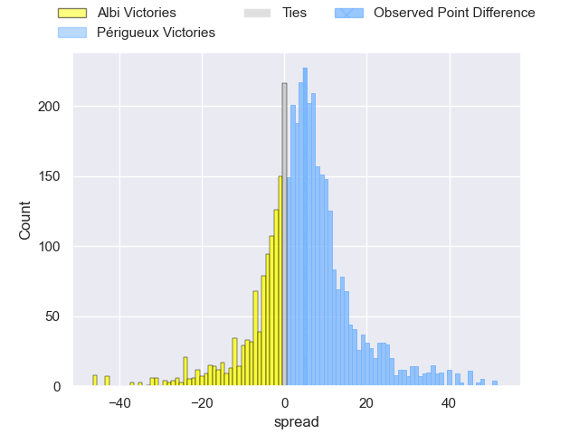
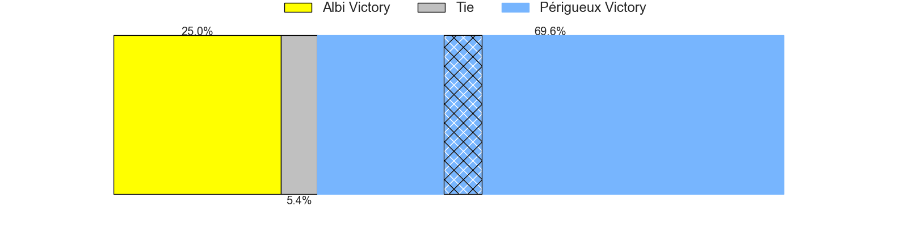
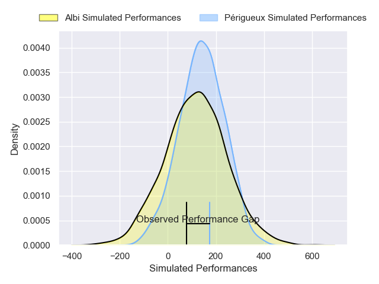
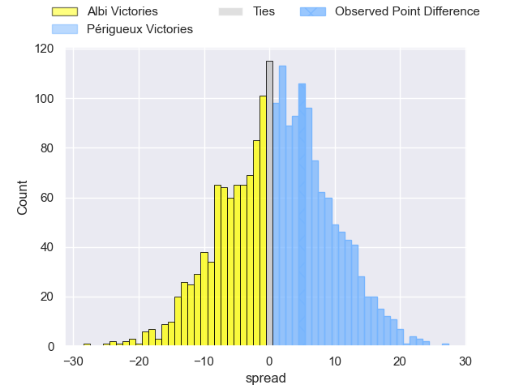
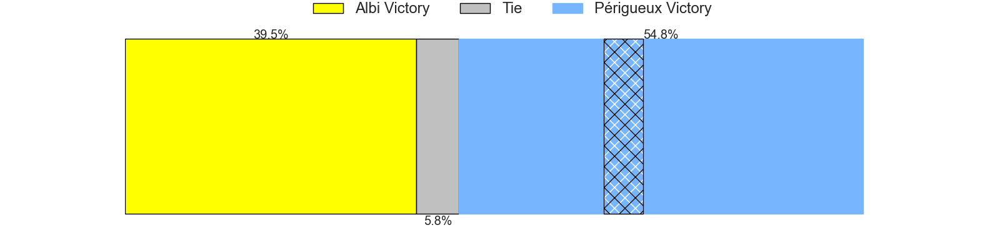

---  
layout: page  
title: Albi at Perigueux; 16-21  
date: 2024-11-30 18:00:00 -0500  
categories: "Nationale 2024" match review  
---
# Albi at Perigueux; 16-21

# Club Level Predictions

The first set of predictions treats a club as the smallest object, as the club develops its members, organizes a gameplan, and deploys its players as needed for each match. This club model has a prediction of 0.628, which translates to predicting Périgueux to win by 4.6.

Our Over/Under is 43.5 - and combined with the spread above, we have a predicted scoreline of 20 to 24

Each club has a rating and a rating deviation (similar to a Glicko rating), and expected performances can be generated. This allows for simulated matches and spreads like the ones below.
## Projected Performances - Club Model

## Projected Spreads - Club Model

## Projected Results - Club Model

# Player Level Predictions

Treating teams instead as an entity made up of the currently active players, I have ratings for each player in an altogether different system. These can be combined to form team ratings once teamsheets are announced, weighting starters a bit higher than the reserves. After the match is played, players can be weighted by their minutes on the field, allowing for an accurate measure of the team's composition. With these compiled team ratings, we can make predictions, measure inaccuracy, and update the individual player ratings.
## Prediction without Player Minutes: Périgueux by 3.3

Périgueux by 0.4 on a neutral pitch

## Projected Performances - Player Model

## Projected Spreads - Player Model

## Projected Results - Player Model

|   Away Minutes | Away Player             |   Away Percentile |   Number |   Home Percentile | Home Player         |   Home Minutes |
|---------------:|:------------------------|------------------:|---------:|------------------:|:--------------------|---------------:|
|             10 | Lucas Pindor            |             43.63 |        1 |             54.78 | Thomas Vidal        |           80   |
|             41 | Arthur Castant          |             37.41 |        2 |             49.04 | Manu Leiataua       |           20   |
|             46 | Esteban Talalua         |             45.6  |        3 |             51.1  | Kalivati Tawake     |           32   |
|             29 | Vincent Mutel           |             41.53 |        4 |             54.98 | Clément Lanen       |           65   |
|             80 | Evrard Dion Oulai       |             42.3  |        5 |             51.15 | Mathieu Pace        |           27   |
|             48 | Mattéo Coustalat        |             40.89 |        6 |             52.19 | Madioké Konaté      |           15   |
|             32 | Simon Meka              |             44.18 |        7 |             50.08 | Afa Amosa           |           20   |
|             33 | Guillem Calmon          |             38.91 |        8 |             41.9  | Karl Lambert        |           20   |
|             80 | Théo Vidal              |             40.19 |        9 |             81.14 | Max Green           |           24   |
|             47 | Thibault Olender        |             38.3  |       10 |             45.07 | Anderson Neisen     |           20   |
|             46 | Kaminieli Raivono       |             47.16 |       11 |             55.12 | Vincent Fouillade   |           60   |
|             47 | Léo Treilles            |             35.63 |       12 |             49.4  | Frederick Hickes    |           63   |
|             80 | Victorien Jacomme       |             38.05 |       13 |             48.37 | Nicolas Piaton      |           53   |
|             20 | Simon Hartmann          |             44.28 |       14 |             58.07 | Axel Muller         |           80   |
|             80 | Téo Dospital            |             36.2  |       15 |             45.52 | Yon Camou           |           24   |
|             60 | Reinach Venter          |             41.97 |       16 |             48.31 | Louis Martin        |            7.5 |
|             80 | Kévin Tougne            |            nan    |       17 |            nan    | Émilien Borges      |            9   |
|             56 | Jonathan Kpoku          |             47.49 |       18 |             48.77 | Damien Lavergne     |           52   |
|             18 | Nasoni Naqiri           |            nan    |       19 |            nan    | Raphaël Vieilledent |           24   |
|             80 | Gilen Queheille         |            nan    |       20 |             56.34 | Nahum Merigan       |           80   |
|             80 | Victor Pisano           |             37.33 |       21 |            nan    | Mattéo Bordenave    |            8   |
|             80 | Camille Jarreau         |             39.79 |       22 |            nan    | Dorian Lavernhe     |           19   |
|             26 | Jean-Baptiste De Clercq |             45.66 |       23 |            nan    | Anthony Pelmard     |           29   |

