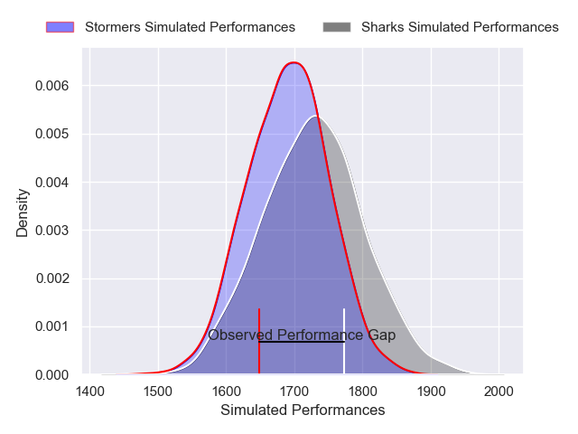
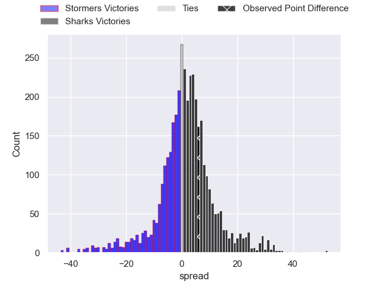
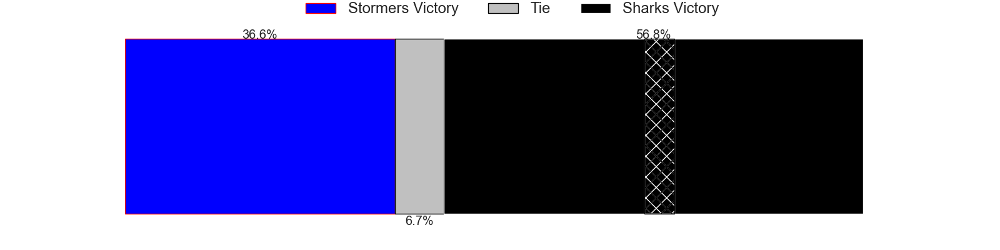
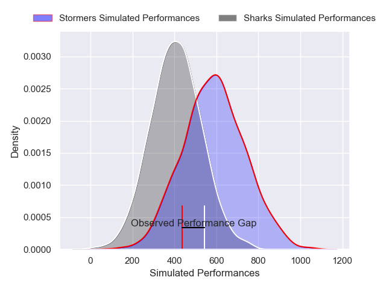
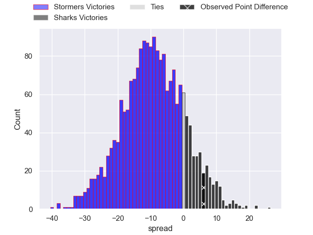
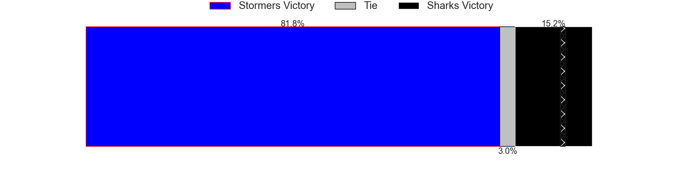

---  
layout: page  
title: Stormers at Sharks; 15-21  
date: 2024-11-30 18:00:00 -0500  
categories: "United Rugby Championship 2024" match review  
---
# Stormers at Sharks; 15-21

# Club Level Predictions

The first set of predictions treats a club as the smallest object, as the club develops its members, organizes a gameplan, and deploys its players as needed for each match. This club model has a prediction of 0.548, which translates to predicting Sharks to win by 1.7.

Our Over/Under is 49.5 - and combined with the spread above, we have a predicted scoreline of 24 to 26

Each club has a rating and a rating deviation (similar to a Glicko rating), and expected performances can be generated. This allows for simulated matches and spreads like the ones below.
## Projected Performances - Club Model

## Projected Spreads - Club Model

## Projected Results - Club Model

# Player Level Predictions

Treating teams instead as an entity made up of the currently active players, I have ratings for each player in an altogether different system. These can be combined to form team ratings once teamsheets are announced, weighting starters a bit higher than the reserves. After the match is played, players can be weighted by their minutes on the field, allowing for an accurate measure of the team's composition. With these compiled team ratings, we can make predictions, measure inaccuracy, and update the individual player ratings.
## Prediction without Player Minutes: Sharks by 8.0

Stormers by 0.1 on a neutral pitch

## Projected Performances - Player Model

## Projected Spreads - Player Model

## Projected Results - Player Model

|   Away Minutes | Away Player               |   Away Percentile |   Number |   Home Percentile | Home Player       |   Home Minutes |
|---------------:|:--------------------------|------------------:|---------:|------------------:|:------------------|---------------:|
|             82 | Alistair Vermaak          |             74.97 |        1 |             91.42 | Ox Nche           |             19 |
|             82 | Joseph Dweba              |             82.47 |        2 |             53.76 | Dylan Richardson  |             33 |
|             82 | Neethling Fouche          |             78.49 |        3 |             82.9  | Vincent Koch      |             33 |
|             82 | JD Schickerling           |             34.41 |        4 |             77.97 | Jason Jenkins     |             64 |
|             50 | Ruben van Heerden         |             93.81 |        5 |             11.78 | Gerbrandt Grobler |             71 |
|             83 | Dave Ewers                |             97.3  |        6 |             74.32 | James Venter      |             52 |
|             25 | Ben-Jason Dixon           |             88.85 |        7 |             89.95 | Vincent Tshituka  |             48 |
|             26 | Marcel Theunissen         |             56.45 |        8 |             93.37 | Siya Kolisi       |             24 |
|             82 | Herschel Jantjies         |             92.38 |        9 |             94.87 | Jaden Hendrikse   |             19 |
|             82 | Sacha Feinberg-Mngomezulu |             76.02 |       10 |             77.97 | Siya Masuku       |             59 |
|             82 | Leolin Zas                |             85.96 |       11 |             99.92 | Makazole Mapimpi  |             23 |
|             83 | Daniel du Plessis         |             86.57 |       12 |             98.7  | Andre Esterhuizen |             57 |
|             58 | Ruhan Nel                 |             31.85 |       13 |             93.33 | Lukhanyo Am       |             62 |
|             72 | Suleiman Hartzenberg      |             75.75 |       14 |             73.72 | Ethan Hooker      |             61 |
|             50 | Warrick Gelant            |             99.27 |       15 |             95.62 | Aphelele Fassi    |             34 |
|             64 | Andre-Hugo Venter         |             87.19 |       16 |            nan    | Ethan Bester      |             57 |
|             83 | Brok Harris               |             91.18 |       17 |             38.56 | Ntuthuko Mchunu   |             82 |
|             83 | Brok Harris               |             91.18 |       17 |             38.56 | Ntuthuko Mchunu   |             60 |
|             83 | Brok Harris               |             91.18 |       17 |             38.56 | Ntuthuko Mchunu   |             57 |
|             69 | Sazi Sandi                |             22.23 |       18 |             80.93 | Trevor Nyakane    |             83 |
|             83 | Adre Smith                |             86.1  |       19 |             17.2  | Corne Rahl        |             57 |
|             30 | Keketso Morabe            |             39.78 |       20 |             35.84 | Phepsi Buthelezi  |             75 |
|             83 | Louw Nel                  |            nan    |       21 |             66.13 | Emmanuel Tshituka |             82 |
|              4 | Stefan Ungerer            |             28.46 |       22 |             85.54 | Grant Williams    |             48 |
|             65 | Manie Libbok              |             87.13 |       23 |             85.19 | Jordan Hendrikse  |              0 |

