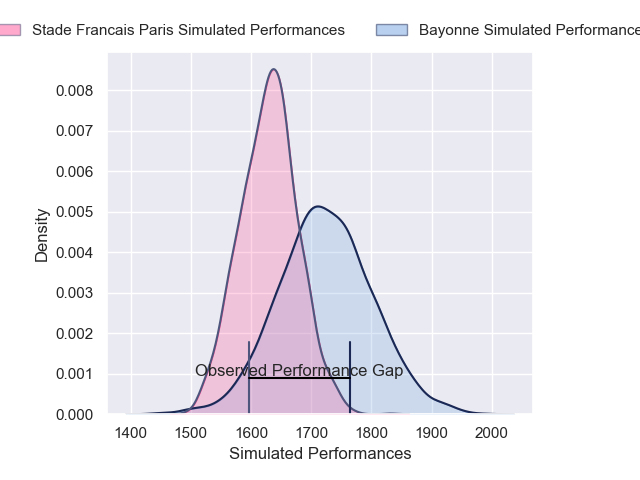
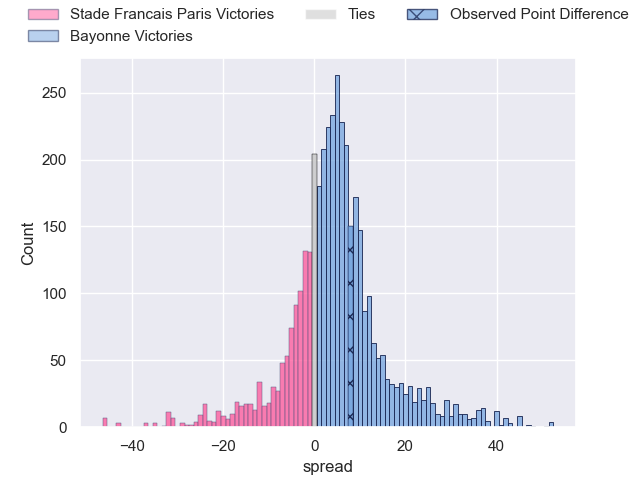
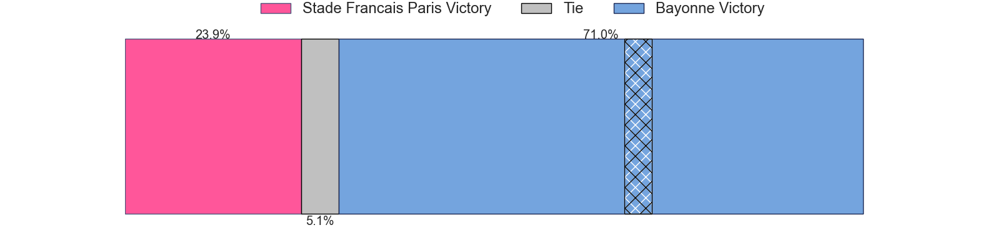
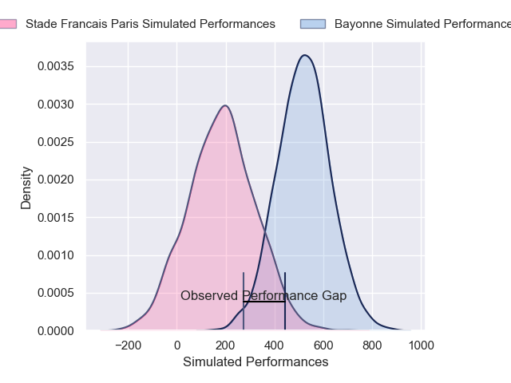
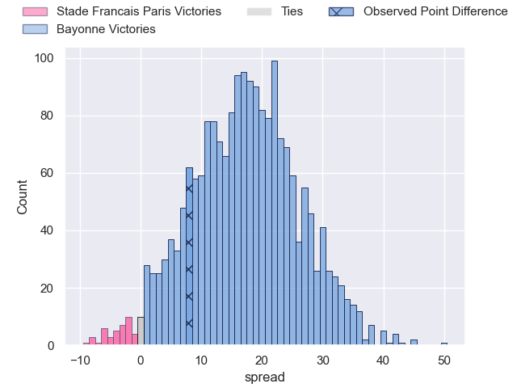
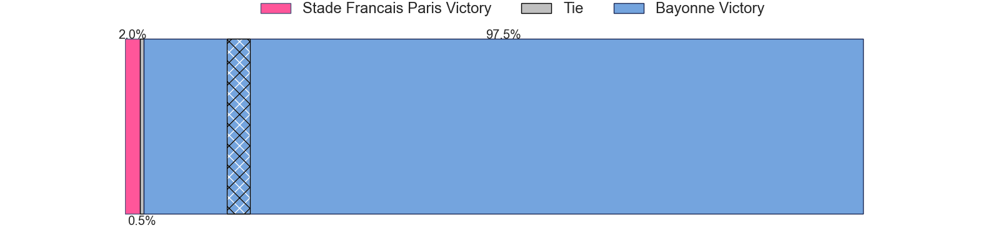

---  
layout: page  
title: Stade Francais Paris at Bayonne; 13-21  
date: 2024-12-01 18:00:00 -0500  
categories: "Top 14 Orange 2024" match review  
---
# Stade Francais Paris at Bayonne; 13-21

# Club Level Predictions

The first set of predictions treats a club as the smallest object, as the club develops its members, organizes a gameplan, and deploys its players as needed for each match. This club model has a prediction of 0.627, which translates to predicting Bayonne to win by 4.6.

Our Over/Under is 56.5 - and combined with the spread above, we have a predicted scoreline of 26 to 30

Each club has a rating and a rating deviation (similar to a Glicko rating), and expected performances can be generated. This allows for simulated matches and spreads like the ones below.
## Projected Performances - Club Model

## Projected Spreads - Club Model

## Projected Results - Club Model

# Player Level Predictions

Treating teams instead as an entity made up of the currently active players, I have ratings for each player in an altogether different system. These can be combined to form team ratings once teamsheets are announced, weighting starters a bit higher than the reserves. After the match is played, players can be weighted by their minutes on the field, allowing for an accurate measure of the team's composition. With these compiled team ratings, we can make predictions, measure inaccuracy, and update the individual player ratings.
## Prediction without Player Minutes: Bayonne by 21.9

Bayonne by 8.4 on a neutral pitch

## Projected Performances - Player Model

## Projected Spreads - Player Model

## Projected Results - Player Model

|   Away Minutes | Away Player            |   Away Percentile |   Number |   Home Percentile | Home Player             |   Home Minutes |
|---------------:|:-----------------------|------------------:|---------:|------------------:|:------------------------|---------------:|
|             60 | Moses Alo-Emile        |             40.33 |        1 |             73.32 | Swan Cormenier          |             54 |
|             80 | Giacomo Nicotera       |             95.5  |        2 |             89.92 | Facundo Bosch           |             82 |
|             80 | Paul Alo-Emile         |             74.23 |        3 |             43.91 | Pascal Cotet            |             28 |
|             80 | Paul Gabrillagues      |              8.77 |        4 |             94.65 | Baptiste Chouzenoux     |             34 |
|             82 | Setareki Turagacoke    |             63.86 |        5 |             16.4  | Lucas Paulos            |             82 |
|             80 | Pierre Huguet          |             22.5  |        6 |             90.26 | Giovanni Habel-Kueffner |             72 |
|             59 | Ryan Chapuis           |             63.02 |        7 |             23.28 | Esteban Capilla         |             16 |
|             55 | Romain Briatte         |             20.43 |        8 |             68.72 | Uzair Cassiem           |             16 |
|             22 | Brad Weber             |             96.88 |        9 |             96.39 | Maxime Machenaud        |             66 |
|              4 | Louis Carbonel         |             54.4  |       10 |             71.2  | Joris Segonds           |             82 |
|             78 | Samuel Ezeala          |             25.96 |       11 |             83.66 | Mateo Carreras          |             23 |
|             13 | Lester Etien           |             71.19 |       12 |             98.55 | Manu Tuilagi            |             17 |
|             28 | Joe Marchant           |             50.34 |       13 |             51.99 | Sireli Maqala           |             72 |
|             67 | Peniasi Dakuwaqa       |             77.48 |       14 |             72.79 | Nadir Megdoud           |             23 |
|             14 | Joe Jonas              |             51.54 |       15 |             22.69 | Cheikh Tiberghien       |             51 |
|             74 | Lucas Peyresblanques   |             21.4  |       16 |             93.02 | Lucas Martin            |             82 |
|             66 | Sergo Abramishvili     |             61.98 |       17 |            nan    | Martin Villar           |             82 |
|             29 | Sergo Abramishvili     |             61.98 |       17 |            nan    | Martin Villar           |             82 |
|             40 | Pierre-Henri Azagoh    |             87.46 |       18 |             12.81 | Veikoso Poloniati       |             39 |
|             80 | Andy Timo              |             18.1  |       19 |             84.4  | Baptiste Heguy          |             82 |
|             80 | Sekou Macalou          |             82.16 |       20 |             27.26 | Guillaume Rouet         |             10 |
|             53 | Thibaut Motassi        |            nan    |       21 |             89.4  | Camille Lopez           |              4 |
|             80 | Leo Barre              |             70.19 |       22 |             56.74 | Guillaume Martocq       |             48 |
|             28 | Francisco Gomez Kodela |             75.99 |       23 |             13.22 | Pieter Scholtz          |             65 |

